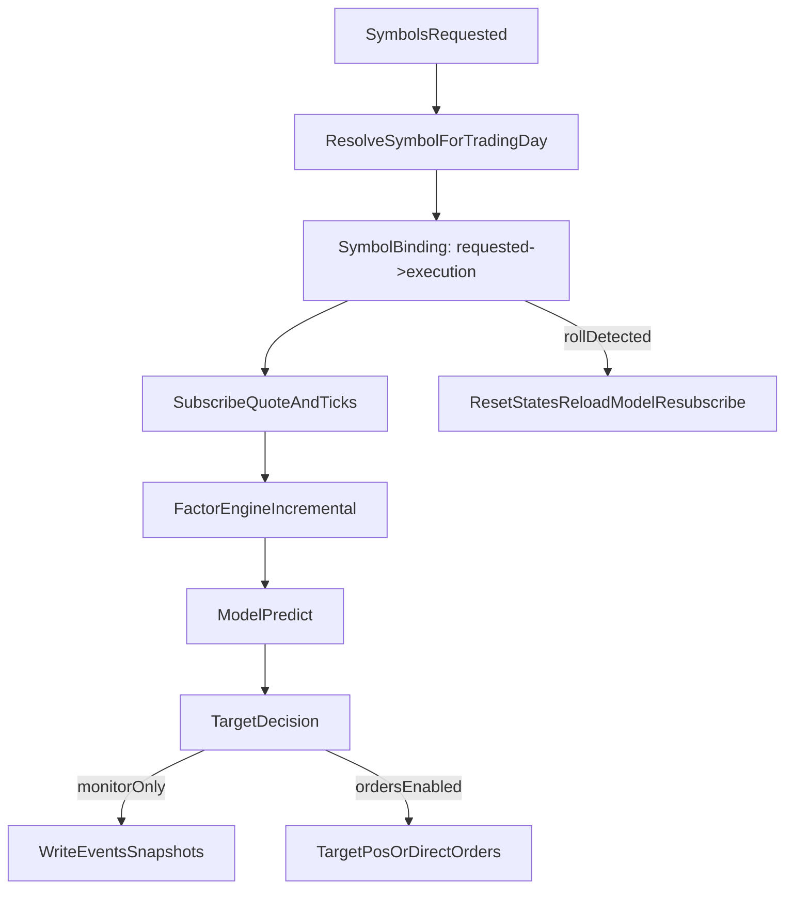

# Account management + TqSdk trading polish (monitor-only + roll-aware continuous aliases)

## Current state (what we have)

- Account creation lives in [src/ghtrader/tq_runtime.py](/home/ops/ghTrader/src/ghtrader/tq_runtime.py): `TqSim`/`TqKq` for paper/sim; `TqAccount` for live; gated by `GHTRADER_LIVE_ENABLED`.
- The trading runner is [src/ghtrader/trade.py](/home/ops/ghTrader/src/ghtrader/trade.py): subscribes to ticks/quotes, computes incremental factors via `FactorEngine`, runs `model.predict_proba`, and uses `TargetPosTask` or direct orders.
- Continuous aliases are currently resolved **once at startup** via [src/ghtrader/symbol_resolver.py](/home/ops/ghTrader/src/ghtrader/symbol_resolver.py), and there is no roll re-resolution/state reset.
- Live gating requires `--confirm-live I_UNDERSTAND` whenever `--mode live` is used.

## Key issues found (need polish before real-account order routing)

- **No “monitor-only” live mode**: can’t safely validate credentials/connectivity/snapshots on a real account without the live confirm gate.
- **Continuous alias roll handling**: `KQ.m@...` must resolve to a specific contract for trading and must re-resolve across trading-day boundaries; current runner does not.
- **Feature/model contract drift risk**: online factors are currently computed from `FactorEngine()` defaults, not explicitly tied to the model’s feature spec.
- **Deep model online inference**: current buffer length equals `seq_len`, but `DeepLOBModel.predict_proba` only produces non-NaN outputs after `seq_len`—so deep models would never emit a valid signal in the live loop.

## Goals

- Enable **real-account monitor-only** testing (no orders ever) while data is still downloading.
- Support **continuous alias** usage with correct resolution to underlying and safe state resets on roll.
- Ensure feature order/count used online is consistent with the model’s expectations.
- Keep “live orders” as an explicit, gated step after monitor-only passes.

## Design sketch

## Implementation plan

### 1) Update PRD (source of truth)

- Update [PRD.md](/home/ops/ghTrader/PRD.md) `§5.12 Account + trading` to specify:
  - `monitor-only` real-account mode (connect/subscribe/snapshot; no orders)
  - continuous-alias roll re-resolution + required state reset behavior
  - fail-safe behavior on disconnect/errors (flatten/cancel then exit)
  - feature-spec correctness requirement for live trading

### 2) Add monitor-only mode (safe real-account validation)

- Extend `TradeConfig` in [src/ghtrader/trade.py](/home/ops/ghTrader/src/ghtrader/trade.py) with `monitor_only: bool`.
- Update CLI `ghtrader trade` in [src/ghtrader/cli.py](/home/ops/ghTrader/src/ghtrader/cli.py): add `--monitor-only/--no-monitor-only`.
- Update dashboard trading form [src/ghtrader/control/templates/ops_trading.html](/home/ops/ghTrader/src/ghtrader/control/templates/ops_trading.html) + handler [src/ghtrader/control/views.py](/home/ops/ghTrader/src/ghtrader/control/views.py) to pass it.
- Change live gating logic so that:
  - `--mode live --monitor-only` does **not** require `--confirm-live`.
  - `--mode live --no-monitor-only` still requires `--confirm-live I_UNDERSTAND` + `GHTRADER_LIVE_ENABLED=true`.

### 3) Continuous alias roll-aware symbol binding

- Introduce a small internal structure in [src/ghtrader/trade.py](/home/ops/ghTrader/src/ghtrader/trade.py) to track `requested_symbol` vs current `execution_symbol`.
- Determine trading day using tick timestamps (prefer `tq_runtime.trading_day_from_ts_ns` with calendar cache when available).
- On trading-day change:
  - re-run `resolve_trading_symbol()` for any continuous alias
  - if underlying changes:
    - log an event (old->new)
    - reset `FactorEngine` states and feature buffer
    - refresh subscriptions (quote/tick_serial/position) to the new underlying
    - in order-enabled modes: flatten old contract before switching

### 4) Feature-spec correctness in the live loop

- For each requested symbol, load the enabled factor list deterministically:
  - Prefer reading `data/features/symbol=<strategy_symbol>/manifest.json` (enabled_factors ordering)
  - Fall back to current `DEFAULT_FACTORS` only if no manifest exists
- Instantiate `FactorEngine(enabled_factors=...)` so online ordering matches training.
- Add runtime checks:
  - if model expects `n_features` (deep models), ensure factor count matches; otherwise fail fast.

### 5) Fix deep-model online inference (streaming correctness)

- Use model’s configured `seq_len` (loaded from model config) instead of hard-coded 100.
- Maintain a buffer of `seq_len + 1` ticks.
- Add a small “latest-window” path for deep models so each tick computes only one forward pass (not O(n) history scans).

### 6) Account preflight + fail-safe behaviors

- On startup (especially for live): snapshot account state and log it as an event.
- Add optional safety flags (default conservative for order-enabled live mode):
  - require no ALIVE orders before starting
  - require net position within limits (optionally require flat)
- On `wait_update()` exceptions / disconnect symptoms:
  - if orders enabled: cancel/flatten best-effort then exit
  - if monitor-only: optionally reinitialize API and resubscribe (or exit; we’ll document which)

### 7) Tests

- Add unit tests that do **not** require tqsdk:
  - roll-aware resolution logic with synthetic schedules
  - monitor-only ensures no executor/order path is invoked
  - deep-model buffer logic (using a small fake model stub)

### 8) Real-account test checklist (monitor-only first)

- Run `--mode live --monitor-only` during trading hours and verify:
  - snapshots populate under `runs/trading/<run_id>/snapshots.jsonl`
  - no order placement occurs (`orders_alive` stays empty)
  - roll re-resolution events appear when trading day changes