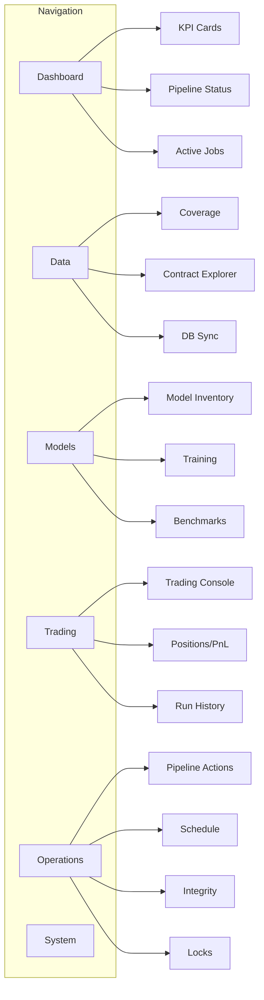

# ghTrader Dashboard UI Overhaul

## Current State Analysis

The existing dashboard has 6 pages (Home, Jobs, Ops, Data, Explorer, System) with the Ops page being overloaded (~10 sections) and lacking visual cohesion for a trading-focused workflow.

**Key Issues:**

- No unified command center view
- Ops page is a wall of forms with no visual hierarchy
- No real-time trading dashboard
- No model performance visualization
- Data coverage and contract explorer are mixed
- No pipeline status overview

## New Information Architecture

## Implementation Plan

### Phase 1: Enhanced Base Template and Design System

**File:** [`src/ghtrader/control/templates/base.html`](src/ghtrader/control/templates/base.html)

- Add secondary navigation for sub-pages (tabs within sections)
- Improve topbar with status indicators (QuestDB, GPU, running jobs badge)
- Add a collapsible sidebar for sub-navigation on larger screens
- Support for page-specific action buttons in header

**File:** [`src/ghtrader/control/static/app.css`](src/ghtrader/control/static/app.css)

- Add new component styles:
  - `.status-indicator` (red/yellow/green dots)
  - `.kpi-grid` (enhanced KPI cards with sparklines placeholder)
  - `.timeline-bar` (for data coverage visualization)
  - `.tab-nav` (horizontal tab navigation within pages)
  - `.action-bar` (sticky action buttons)
  - `.split-pane` (for side-by-side layouts)
  - `.metric-card` (compact metric display)
  - `.alert-banner` (for warnings/notifications)

### Phase 2: Command Center Dashboard (Home)

**File:** [`src/ghtrader/control/templates/index.html`](src/ghtrader/control/templates/index.html)

Transform into a command center with:

- **System Status Bar**: QuestDB, GPU, CPU/Mem in compact pills
- **KPI Grid** (4-6 cards):
  - Running/Queued jobs count with links
  - Data freshness (days behind, staleness)
  - Active trading mode (paper/sim/live or "idle")
  - Model count + last trained
- **Pipeline Status Section**: Visual pipeline flow showing:
  - Ingest → QuestDB → Schedule → main_l5 → Build → Train
  - Each step shows status (OK, stale, missing)
- **Active Jobs Table**: Running jobs with progress bars
- **Quick Actions**: Start common workflows (sync, build, train)

**File:** [`src/ghtrader/control/views.py`](src/ghtrader/control/views.py)

- Add helper to compute pipeline status for each symbol
- Add quick stats API endpoint for dashboard KPIs

### Phase 3: Enhanced Data Hub

**File:** [`src/ghtrader/control/templates/data.html`](src/ghtrader/control/templates/data.html)

Split into tabbed sections:

- **Tab 1: Coverage Overview**
  - Visual timeline/heatmap showing data coverage per symbol
  - Summary stats (total symbols, date range, gaps)

- **Tab 2: Contract Explorer** (move from current mixed view)
  - Enhanced table with better filtering
  - Batch actions toolbar
  - Status legend

- **Tab 3: DB Sync Status**
  - QuestDB table status
  - Sync jobs list
  - One-click sync actions

### Phase 4: Model Lab Page (New)

**New File:** `src/ghtrader/control/templates/models.html`

Dedicated page for ML workflow:

- **Model Inventory**: Table of trained models with:
  - Model type, symbol, horizon
  - Training date, metrics snapshot
  - Actions (benchmark, deploy, delete)

- **Training Section**: Simplified train form + active training jobs

- **Benchmarks Section**:
  - Recent benchmark results
  - Comparison table (model vs model)
  - Link to detailed reports

**Backend:** Add `/models` route and `/api/models` endpoint

### Phase 5: Trading Console (New)

**New File:** `src/ghtrader/control/templates/trading.html`

Dedicated trading page replacing the trading section in ops:

- **Status Header**: Mode (paper/sim/live), account, P&L summary
- **Positions Panel**: Current positions with unrealized P&L
- **Signal Log**: Recent model signals with timestamps
- **Order/Trade History**: From snapshots.jsonl
- **Risk Metrics**: Max position, daily loss, order rate
- **Start/Stop Controls**: Trading form (simplified from ops)

**Backend:** Add `/trading` route and `/api/trading/status` endpoint

### Phase 6: Streamlined Operations Page

**File:** [`src/ghtrader/control/templates/ops.html`](src/ghtrader/control/templates/ops.html)

Reorganize with tabs instead of scrolling:

- **Tab 1: Pipeline** - Happy path workflow buttons with status
- **Tab 2: Ingest** - Download/record forms
- **Tab 3: Schedule/Build** - Schedule + main_l5 + features/labels
- **Tab 4: Integrity** - Audit forms + reports
- **Tab 5: Locks** - Active locks table

Remove model/train/eval (moved to Models) and trading (moved to Trading).

### Phase 7: API Enhancements

**File:** [`src/ghtrader/control/app.py`](src/ghtrader/control/app.py)

Add new endpoints:

- `GET /api/dashboard/summary` - Aggregated KPIs for home page
- `GET /api/models/inventory` - List trained models from artifacts/
- `GET /api/trading/status` - Current trading run status
- `GET /api/pipeline/status` - Pipeline step status per symbol

### Phase 8: Interactive Improvements

- Add auto-refresh with configurable interval
- Add toast notifications for job completion
- Add keyboard shortcuts for common actions
- Improve mobile responsiveness

## File Changes Summary

| File | Action |

|------|--------|

| `templates/base.html` | Modify - enhanced nav, status bar |

| `templates/index.html` | Modify - command center redesign |

| `templates/data.html` | Modify - tabbed layout, coverage viz |

| `templates/ops.html` | Modify - streamlined with tabs |

| `templates/models.html` | Create - new model lab page |

| `templates/trading.html` | Create - new trading console |

| `templates/ops_build.html` | Delete - consolidated into ops |

| `templates/ops_eval.html` | Delete - moved to models |

| `templates/ops_trading.html` | Delete - moved to trading |

| `static/app.css` | Modify - new components |

| `views.py` | Modify - new routes |

| `app.py` | Modify - new API endpoints |

## Key Design Principles

1. **Glanceable**: Critical info visible without scrolling
2. **Action-oriented**: Common tasks are one click away
3. **Contextual**: Related information grouped together
4. **Responsive**: Works on various screen sizes
5. **Real-time**: Auto-refresh for live data
6. **Consistent**: Unified visual language across pages