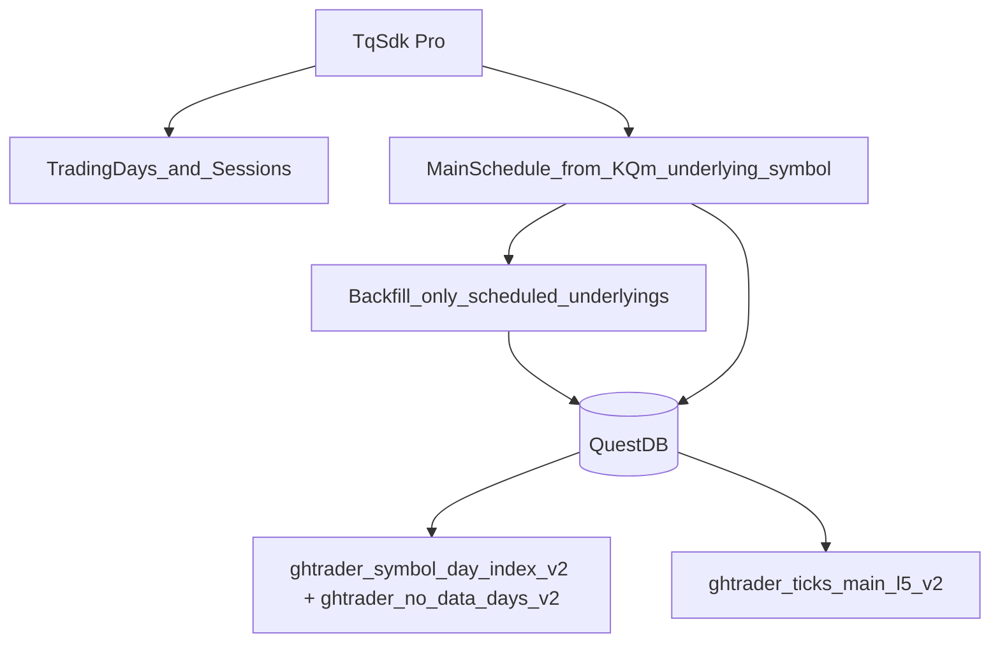

# Data System Rebuild (QuestDB canonical + TqSdk主力映射)

## Context + what’s broken today

- **目标**：得到一份“连续主链 L5 原始 tick 数据”（每个品种一份，例如 `KQ.m@SHFE.cu`），可扩展到更多品种。
- **关键痛点（你描述的失败点）**：按“一个品种→所有合约→所有历史→再组装”的思路，数据量/下载次数/重试路径都会爆炸，系统自然变成几万行且很难落地。
- **重要发现（PRD 已经写到了，但实现/落地成本过高）**：`PRD.md` 当前把 ingest/diagnose/repair/feature/model/dashboard 全都绑定在一起，导致数据系统被过度工程化。

## Decision (from your answers)

- **Canonical store**：继续使用 **QuestDB** 作为唯一权威存储。
- **主链/主力合约来源**：使用 **TqSdk**（`KQ.m@EXCHANGE.var` 的 `quote.underlying_symbol`）生成每日主力映射，而不是“先把所有合约 ticks 全下载下来再用 OI 算”。

## Target architecture (new minimal path)

- **交易日数据**：继续用现有节假日缓存逻辑（见 [`/home/ops/ghTrader/src/ghtrader/data/trading_calendar.py`](/home/ops/ghTrader/src/ghtrader/data/trading_calendar.py)），再补一个“交易时段/夜盘时段”元数据（来自 TqSdk `quote.trading_time`）。
- **主链合约数据**：用 TqSdk 回测模式在历史区间跑 `KQ.m@...`，捕捉 `quote.underlying_symbol` 的变更点（官方文档示例：`api.is_changing(quote, "underlying_symbol")`），生成**逐交易日**映射表，写入 QuestDB `ghtrader_main_schedule_v2`。
- **第一次下载 + 校对**：只对 schedule 中出现的 underlying 合约、它们对应的交易日区间做 backfill；每个 `(symbol, trading_day)` 写 `ghtrader_symbol_day_index_v2`（rows/first/last/row_hash 聚合）+ `no_data_days`。
- **连续主链 L5 数据**：materialize 到 `ghtrader_ticks_main_l5_v2`（或统一 ticks 表但 `ticks_kind='main_l5'`），并写入 `underlying_contract/segment_id/schedule_hash`。
- **长期更新**：增量扩展 schedule + 增量 backfill（只下载缺口天）。
- **长期校对**：先保留“日粒度完整性 + row_hash 聚合”；更重的 field_quality/gap_detection/diagnose 先降级到 Phase-1/2（PRD 里已有 Roadmap，可以把这些挪到后面）。

## Repo map (what each area does, so you know what to delete/keep)

- **Spec**：[`/home/ops/ghTrader/PRD.md`](/home/ops/ghTrader/PRD.md)（当前把系统全链路都写了；我们会先把数据系统重写成“最小闭环”）
- **Config**：[`/home/ops/ghTrader/src/ghtrader/config.py`](/home/ops/ghTrader/src/ghtrader/config.py)（`.env`/env vars + QuestDB + TqSdk auth）
- **TqSdk 集成**：[`/home/ops/ghTrader/src/ghtrader/tq/`](/home/ops/ghTrader/src/ghtrader/tq/)（唯一允许直接 import tqsdk 的地方）
  - `ingest.py`: 历史 ticks 下载 + 写 QuestDB
  - `catalog.py`: 合约列表/缓存
  - `runtime.py`: trading_day 映射、交易时段判断、账户/模式封装
  - `l5_probe.py`: L5 可用性探测（可复用到“找 L5 起始日”）
- **数据生命周期（数据系统核心）**：[`/home/ops/ghTrader/src/ghtrader/data/`](/home/ops/ghTrader/src/ghtrader/data/)
  - `trading_calendar.py`: 交易日（节假日缓存）
  - `main_schedule.py`: 目前是 OI 规则（我们会改成/补充 TqSdk 主力映射生成）
  - `main_l5.py`: 目前从 raw→main_l5 的 QuestDB 物化
  - `ticks_schema.py`: L5 字段 + row_hash
  - `manifest.py`: data/manifests 写 manifest
  - 其它（diagnose/repair/field_quality/gap_detection/completeness/contract_status/update/audit）属于“治理/运维闭环”，会在 PRD 里降级到后续阶段，代码可以大幅删减或重写。
- **QuestDB 接入**：[`/home/ops/ghTrader/src/ghtrader/questdb/`](/home/ops/ghTrader/src/ghtrader/questdb/)
  - `serving_db.py`: ILP 写入 + 建表
  - `client.py`: PGWire 连接/重试
  - `index.py`: `symbol_day_index` / `no_data_days` 表 + 读写
  - `main_schedule.py`: `ghtrader_main_schedule_v2` 表 + resolve
  - `queries.py`: 查询 helper（按日取 ticks、coverage 等）
- **UI/训练/交易**：`control/`, `datasets/`, `research/`, `trading/` 现在都依赖“数据系统可用”；我们会先保证数据系统闭环，再决定这些模块删/留。

## PRD-first edits (do this before touching code)

Update [`/home/ops/ghTrader/PRD.md`](/home/ops/ghTrader/PRD.md) to match the new direction:

- **Rewrite §4.2 Data workflow Step 3**：从“OI-based roll schedule”改为“**TqSdk 主力映射**（`KQ.m@...` → `quote.underlying_symbol`）”。
- **Replace §5.3.2**（主链规则）：
  - 把当前 OI 规则保留为“可选/备用（optional）”，但把 **默认**定义为“使用 TqSdk 主力映射（官方规则：下一交易日开盘切换）”。
  - 写清楚我们如何生成 **逐交易日** mapping（回测模式跑一遍，记录 underlying_symbol 变化点，然后扩展到每天）。
- **Add trading sessions metadata**：新增一小节说明“交易时段来自 `quote.trading_time`（含 `night`/`day`，可能出现 `25:00:00` 这样的跨日表示）”，并规定存储位置（QuestDB 表或 data_dir cache）。
- **De-scope**：把 `diagnose/repair/field_quality/gap_detection` 从“现在必须”改成“Phase-1/2”，只保留 **日粒度**完整性（index/no-data + row_hash aggregates）作为 Phase-0 必须交付。

## Implementation plan (after PRD updated)

- **Main schedule (TqSdk-based)**
  - Add `src/ghtrader/tq/main_schedule.py`: 用 `TqBacktest` 跑 `KQ.m@{exchange}.{var}`，捕捉 `quote.underlying_symbol` 变更事件（参考 TqSdk 文档示例）。
  - Update `src/ghtrader/data/main_schedule.py`: 提供纯函数把“事件列表→逐交易日 schedule（含 segment_id）”。
  - Keep using `src/ghtrader/questdb/main_schedule.py` to persist/resolve (`ghtrader_main_schedule_v2`).

- **Trading day + sessions**
  - Keep `src/ghtrader/data/trading_calendar.py`（交易日）
  - Add a small module (e.g. `src/ghtrader/data/trading_sessions.py`) to parse/store `quote.trading_time` per variety.

- **Backfill only what’s needed**
  - Add an orchestrator (either in `src/ghtrader/data/main_l5.py` or new `src/ghtrader/data/backfill.py`) that:
    - loads schedule for a variety
    - groups by segment (underlying contract + date range)
    - calls historical download for that underlying range
    - materializes/writes `main_l5` rows and updates `symbol_day_index`.
  - Modify `src/ghtrader/tq/ingest.py` so download can be driven by **explicit trading-day set** or by schedule segments (to avoid downloading days outside schedule).

- **Validation + snapshot semantics**
  - Keep “first build = 截止某天的完整数据” by writing:
    - `data/manifests/*.json` (already in `src/ghtrader/data/manifest.py`)
    - plus QuestDB day index rows as the authoritative completeness ledger.

- **Delete/Rewrite (to cut thousands of lines)**
  - After the minimal pipeline works, delete or rewrite these heavy modules to match the new PRD scope:
    - `src/ghtrader/data/diagnose.py`, `repair.py`, `field_quality.py`, `gap_detection.py`, `audit.py`, `completeness.py`, `contract_status.py`, `update.py`
  - Then update CLI/UI to only expose the minimal pipeline commands.

- **Tests**
  - Add offline unit tests for: “event-list → daily schedule → segment_id”（不依赖网络/QuestDB）。
  - Keep existing small unit tests that still apply (`test_trading_calendar.py`, `_compute_missing_dates`, `_questdb_df_for_ticks`).
  - Remove/adjust OI-rule schedule tests if that becomes non-default.

## Operational backfill procedure (how you’ll run it)

- For each variety (start with `SHFE.cu`):
  - Build/refresh trading days cache
  - Build schedule from `KQ.m@SHFE.cu` underlying mapping for the full desired window
  - Backfill scheduled underlyings only
  - Materialize `KQ.m@SHFE.cu` main_l5 ticks in QuestDB
  - Validate coverage via `ghtrader_symbol_day_index_v2` + `ghtrader_no_data_days_v2`

## Risks + mitigations

- **TqSdk 主力映射需要跑回测**：实现时把“抓事件”与“生成 schedule”分层，保证离线可测。
- **夜盘跨日与 trading_day**：统一使用 `tqsdk.datetime._get_trading_day_from_timestamp`（已有封装：`src/ghtrader/tq/runtime.py::trading_day_from_ts_ns`）+ `quote.trading_time` 作为 session 元数据来源。