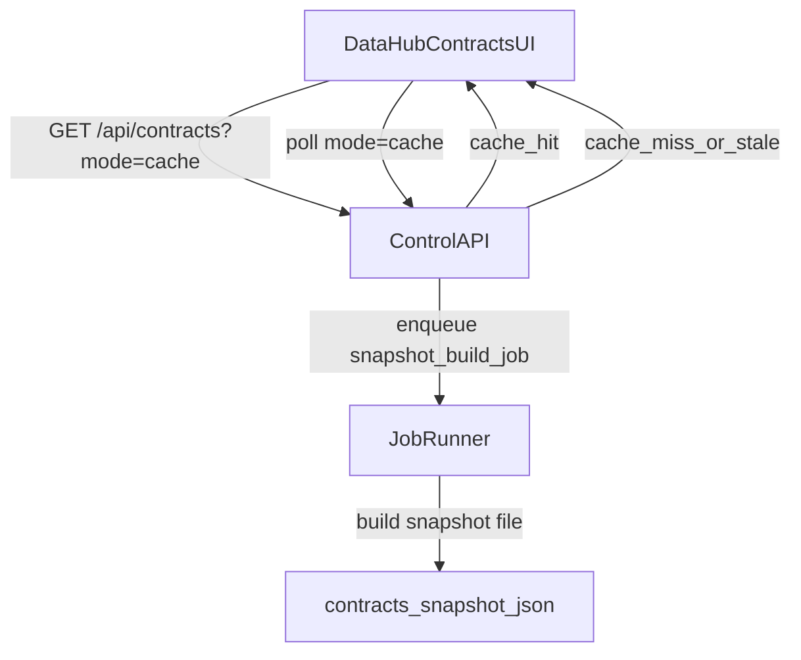

# Fix Data Hub Contracts timeouts + remove tab-switch workflow

## Diagnosis (from current code)

- **Client timeouts are real**: Contracts uses `AbortController` with **15s** for cache-load and **30s** for refresh (`data.html` → `fetchContracts()`), so any slow request becomes a client-side timeout.
- **Server keeps working after client abort**: `/api/contracts` is a **sync** FastAPI handler (`def api_contracts`), so the work runs in a worker thread; when the browser aborts, the server can still finish and write caches, but the UI will **not retry**, so you only see the new data after navigating away/back.
- **Two slow paths**
  - **Local scan is O(total date partitions)**: `compute_contract_statuses()` calls `_scan_date_dirs()` for every symbol, which does `symbol_dir.iterdir()` and parses every `date=YYYY-MM-DD` directory (can be huge with multi-year data).
  - **Refresh path blocks on live catalog**: `/api/contracts?refresh=1` calls `get_contract_catalog(..., refresh=True)` which can exceed 30s; when the client aborts, the server may still update the catalog cache, but the UI remains stuck on the timeout message.
- **UX bug**: background refresh failures overwrite the status line (`setStatus("Error: ... — still showing cached results")`) and there’s no automatic recovery/poll.

## Target behavior

- **Default Contracts view never blocks on long work**.
- **Refresh is async**: it starts a background job and the UI polls cache/status until updated.
- **Local coverage is cached** so recomputes don’t rescan millions of directories.

## Implementation plan

### 1) PRD alignment

Update [`PRD.md`](PRD.md) to explicitly state:

- Contracts explorer data is served from a **short-TTL cached snapshot**.
- “Refresh” triggers a **background job** (no blocking request path).
- Local coverage scanning must use **persistent caches** (per symbol and per exchange/var snapshot).

### 2) Add persistent local date-dir scan cache (biggest CPU/IO win)

Edit [`src/ghtrader/control/contract_status.py`](src/ghtrader/control/contract_status.py):

- Replace `_scan_date_dirs()` with a cached version:
  - Cache file under `runs/control/cache/` keyed by `(lake_version, symbol)`.
  - Validate by `symbol_dir.stat().st_mtime_ns` (directory mtime changes when new partitions appear).
  - Store: `mtime_ns`, `n_dates`, `min_date`, `max_date`, and the `dates` list.
  - Use `os.scandir()` instead of `Path.iterdir()` for speed.
- Use the cached dates to build the in-memory set needed for:
  - `downloaded_in_range` counting
  - `compute_local_l5_summary(downloaded_dates=...)`

### 3) Serve Contracts from a cached snapshot (no long work on request path)

Edit [`src/ghtrader/control/app.py`](src/ghtrader/control/app.py):

- Add a contracts snapshot cache file, e.g. `runs/control/cache/contracts_snapshot_<ex>_<var>.json`.
- Add `mode=cache` query param to `/api/contracts`:
  - If snapshot exists and is fresh (TTL, e.g. 15–30s), **return it immediately**.
  - If snapshot exists but stale, **return stale snapshot immediately** + `cache_stale=true` and enqueue a rebuild job.
  - If snapshot missing, return quickly with `ok=false`, `error="contracts_snapshot_building"`, and enqueue a rebuild job.
- Keep `mode=compute` (current behavior) for debugging only.

### 4) Make Refresh async via job + rebuild snapshot

Edit [`src/ghtrader/cli.py`](src/ghtrader/cli.py) and [`src/ghtrader/control/app.py`](src/ghtrader/control/app.py):

- Add CLI command (run via job manager) e.g. `ghtrader contracts-snapshot-build --exchange SHFE --var cu --refresh-catalog 0|1`:
  - When `--refresh-catalog=1`, call `get_contract_catalog(..., refresh=True)` (may take long) and then rebuild the snapshot.
  - When `--refresh-catalog=0`, use `allow_stale_cache=True, offline=True` and rebuild snapshot without network.
  - Write snapshot atomically.
  - Acquire a lock key like `contracts_snapshot:exchange=<EX>,var=<VAR>` to dedupe.
- Update `/api/contracts?refresh=1` to **NOT** do live refresh inline; instead:
  - enqueue the snapshot-build job with `refresh-catalog=1` and return cached snapshot immediately.

### 5) Fix the frontend workflow: poll instead of timing out + don’t leave sticky errors

Edit [`src/ghtrader/control/templates/data.html`](src/ghtrader/control/templates/data.html):

- Switch Contracts fetches to `GET /api/contracts?...&mode=cache`.
- On timeout/building response:
  - Show “Building snapshot…” and **poll** every ~2s until snapshot becomes `ok=true`.
- Change Refresh button to:
  - trigger a refresh job (via `/api/contracts?refresh=1&mode=cache` or a dedicated endpoint)
  - keep rendering the last snapshot while polling until `catalog_cached_at` changes.
- UX polish:
  - Don’t show error toasts for background refresh failures.
  - Don’t replace a successful “Loaded …” status with a persistent error; show a smaller “last refresh error” hint if needed.
  - Expand status metadata to show `catalog/local/questdb` timings (already in `timings_ms`).

### 6) Tests

Add/extend tests (likely in [`tests/test_control_contracts_api.py`](tests/test_control_contracts_api.py) and/or a new contracts snapshot test file):

- `/api/contracts?mode=cache` returns immediately from snapshot and does not call heavy scanners (monkeypatch to assert not called).
- Snapshot build enqueue happens on cache miss/stale.
- `refresh=1` path enqueues job and does not block on live catalog.

## New flow (high-level)

