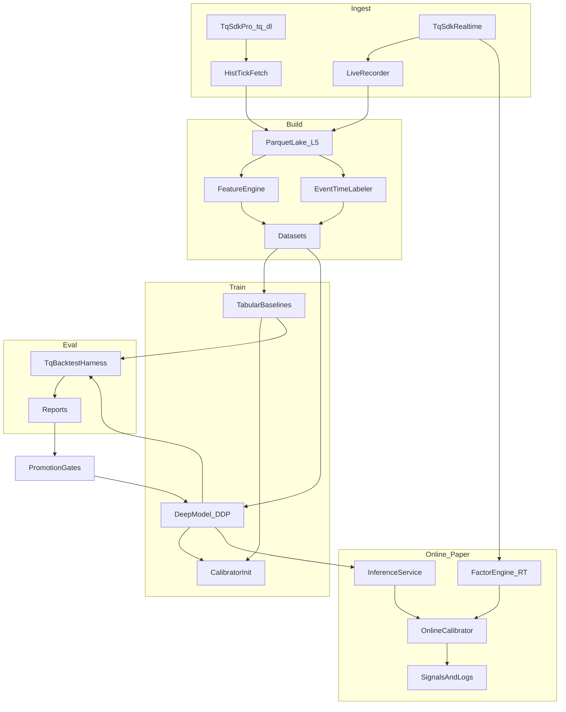

# ghTrader: AI-Centric SHFE Tick System (CU/AU/AG) — Detailed Implementation Plan

## 0) Executive summary (what we’re building first)

- **Phase 1 (research-first)**: build a complete **data→features→train→evaluate** loop using **TqSdk Pro** historical L5 ticks and built-in backtest/replay.
- **Phase 2 (continual learning)**: add **daily automated retrain + gated promotion** and an intraday **online linear calibrator** that adapts on **hundreds of factors**.
- **Phase 3 (live-capable)**: add a low-latency “online inference + paper execution” loop (still no real orders until explicitly enabled).

We will treat `tqsdk-python/` as a vendored dependency and build our system around it.

---

## 1) Requirements

### 1.1 Functional requirements

- **Markets**: SHFE copper/gold/silver (CU/AU/AG).
- **Data**:
        - Historical **tick (L5)** download via TqSdk Pro (`tq_dl`).
        - Live subscription/recording (for ongoing dataset growth).
- **Research modes**:
        - Offline dataset building (features + event-time labels).
        - GPU training (multi-GPU DDP).
        - Backtest evaluation (Tier1: `TqBacktest`; Tier2: offline micro-sim later).
- **AI**:
        - Deep model (DeepLOB-style first, then small Transformer).
        - Intraday **online calibrator** on deep logits + engineered factor vector.
- **Continual learning**:
        - Daily scheduled retrain.
        - Automated evaluation and gated promotion.
        - Rollback to last good model.

### 1.2 Non-functional requirements

- **Safety**: research-only by default; no live trading until explicit enablement.
- **Reproducibility**: every run records code version + data manifests + config + metrics.
- **Performance**:
        - Parquet lake on NVMe, ZSTD.
        - CPU-parallel feature generation + backtests.
        - GPU-parallel training.
- **Maintainability**: minimal files/modules, but clean boundaries.

### 1.3 External requirements

- **TqSdk account** with **`tq_dl`** permission for historical downloads.
- **Python**: choose **Python 3.11** (good ecosystem support; TqSdk supports 3.7+).
- **GPU stack**: NVIDIA drivers + CUDA compatible with chosen PyTorch build.

---

## 2) What we will reuse from `tqsdk-python` (code references)

### 2.1 Historical tick download: Pro-only, L5 for SHFE

- `TqApi.get_tick_data_series()` is PRO-only (`tq_dl`) and returns a static DataFrame (not streaming). It cannot run inside coroutines or in backtest/replay modes:
```905:993:tqsdk-python/tqsdk/api.py
    def get_tick_data_series(self, symbol: Union[str, List[str]], start_dt: Union[date, datetime],
                             end_dt: Union[date, datetime], adj_type: Union[str, None] = None) -> pd.DataFrame:
        """
        获取指定时间段内的 tick 序列，TqSdk 会缓存已经下载过的合约，提升代码执行效率、节约请求流量。

        本接口仅限专业版用户使用，如需购买专业版或者申请试用，请访问 https://www.shinnytech.com/tqsdk-buy/。
        ...
        """
        return self._get_data_series("get_tick_data_series", symbol, 0, start_dt, end_dt, adj_type)

    def _get_data_series(self, call_func: str, symbol_list: Union[str, List[str]], duration_seconds: int,
                         start_dt: Union[date, datetime], end_dt: Union[date, datetime],
                         adj_type: Union[str, None] = None) -> pd.DataFrame:
        if self._loop.is_running():
            raise Exception(f"不支持在协程中调用 {call_func} 接口")
        if not self._auth._has_feature("tq_dl"):
            raise Exception(
                f"{call_func} 数据获取方式仅限专业版用户使用，如需购买专业版或者申请试用，请访问 https://www.shinnytech.com/tqsdk-buy/")
        if self._backtest:
            raise Exception(f"不支持在回测/复盘中调用 {call_func} 接口")
```

- The underlying data-series implementation includes **SHFE L5 book fields**:
```346:356:tqsdk-python/tqsdk/data_series.py
    def _get_data_cols(symbol, dur_nano):
        # 获取数据列
        if dur_nano != 0:
            return ["open", "high", "low", "close", "volume", "open_oi", "close_oi"]
        else:
            cols = ["last_price", "highest", "lowest", "average", "volume", "amount", "open_interest"]
            price_length = 5 if symbol.split('.')[0] in {"SHFE", "SSE", "SZSE"} else 1
            for i in range(1, price_length + 1):
                cols.extend(f"{x}{i}" for x in ["bid_price", "bid_volume", "ask_price", "ask_volume"])
            return cols
```


### 2.2 Streaming historical download tool (also PRO)

`DataDownloader` enforces `tq_dl` and for tick download disallows multi-symbol tick alignment:

```32:116:tqsdk-python/tqsdk/tools/downloader.py
class DataDownloader:
    def __init__(self, api: TqApi, symbol_list: Union[str, List[str]], dur_sec: int, start_dt: Union[date, datetime],
                 end_dt: Union[date, datetime], csv_file_name: Union[str, asyncio.StreamWriter], write_mode: str = "w",
                 adj_type: Union[str, None] = None) -> None:
        ...
        if not self._api._auth._has_feature("tq_dl"):
            raise Exception("您的账户不支持下载历史数据功能，需要购买后才能使用。升级网址：https://www.shinnytech.com/tqsdk-buy/")
        ...
        self._dur_nano = dur_sec * 1000000000
        if self._dur_nano == 0 and len(self._symbol_list) != 1:
            raise Exception("Tick序列不支持多合约")
```

### 2.3 Backtest semantics we must account for

`TqBacktest` is event-driven; quote fields depend on whether you subscribe ticks or klines.

```34:66:tqsdk-python/tqsdk/backtest.py
class TqBacktest(object):
    """
    回测模式下 quote 的更新频率由所订阅的 tick 和 k线周期确定:
  * 只要订阅了 tick, 则对应合约的 quote 就会使用 tick 生成...
        ...
    模拟交易要求报单价格大于等于对手盘价格才会成交...
    回测模式下 wait_update 每次最多推进一个行情时间。
    回测结束后会抛出 BacktestFinished 例外。
    """
```

---

## 3) System architecture (components + data flow)

### 3.1 Major components

- **DataIngest**
        - Historical: `get_tick_data_series` (primary) and `DataDownloader` (secondary) → Parquet.
        - Live recorder: `get_tick_serial` → append Parquet.
- **ParquetLake**
        - Canonical store for raw L5 ticks.
        - Partitioned by `symbol/date`.
- **FeatureLabelBuilder**
        - Causal feature generation (hundreds of factors, incremental-capable).
        - Event-time multi-horizon labels.
- **Modeling**
        - Baselines: Logistic/XGBoost.
        - Deep: DeepLOB-style CNN+RNN, then Transformer.
        - OnlineCalibrator: intraday online logistic model on deep logits + factor vector.
- **Evaluation**
        - Tier1: TqSdk backtest harness.
        - Tier2: offline L5 micro-sim (later).
- **Continual Training**
        - Daily scheduled retrain + walk-forward evaluation.
        - Promotion gates + rollback.

### 3.2 Data flow diagram



---

## 4) Tech stack (recommended)

### 4.1 Core

- **Language**: Python 3.11
- **Market data + backtest**: vendored **TqSdk** (`tqsdk-python/`)
- **Storage**: Parquet + ZSTD (via `pyarrow`)
- **Dataframe**: `polars` for fast transformations (optional), `pandas` for TqSdk interoperability

### 4.2 ML

- **Deep learning**: PyTorch (DDP via `torchrun`)
- **Tabular**: LightGBM or XGBoost
- **Online learning**: custom SGD/FTRL logistic regression (tiny dependency surface)

### 4.3 Scaling

- **CPU parallelism**: Ray (later) OR `multiprocessing` initially
- **Experiment tracking**: minimal JSON manifests first; optional MLflow later

### 4.4 Ops

- **Scheduling**: `cron` or `systemd timer` for daily retrain jobs
- **Logging**: `structlog` or standard logging

---

## 5) Data lake design

### 5.1 Symbols (defaults)

We will support two symbol modes:

- **Continuous (research)**: `KQ.m@SHFE.cu`, `KQ.m@SHFE.au`, `KQ.m@SHFE.ag` (good for continuous modeling; verify tick support via `tq_dl`).
- **Underlying contracts (microstructure realism)**: actual contract codes (e.g., `SHFE.cu2502`).

Default in MVP: start with **underlying contracts** (dominant/front month) for stability; add continuous mapping once proven.

### 5.2 Raw tick schema (canonical)

Columns (from TqSdk tick series):

- **Keys**: `symbol`, `datetime` (epoch-ns)
- **Top-level**: `last_price`, `average`, `highest`, `lowest`, `volume`, `amount`, `open_interest`
- **L5 book**: `bid_price1..5`, `bid_volume1..5`, `ask_price1..5`, `ask_volume1..5`

### 5.3 Partitioning

- Path: `data/lake/ticks/symbol=.../date=YYYY-MM-DD/part-....parquet`
- Parquet: ZSTD compression, Arrow schema locked.

### 5.4 Data manifests

Each ingest/build run writes:

- `data/manifests/<run_id>.json`
        - symbols, date range, row counts, schema hash, source (`tq_dl` vs live), code version.

---

## 6) Feature engineering (hundreds of factors)

### 6.1 FactorEngine requirements

- **Incremental update** per tick (O(1) update) with rolling windows implemented via ring buffers.
- **Registry** to enable/disable factors by config.
- **Two modes**:
        - Offline batch: compute full factor matrix from Parquet.
        - Online RT: compute a thin subset for real-time signals.

### 6.2 Factor categories (initial set)

- **Book shape**: spread, microprice, imbalance at each level, depth-weighted prices.
- **Dynamics**: deltas of price/volume, event-time returns, short-term volatility.
- **Liquidity/pressure**: order book slope, queue imbalance proxies.
- **Cross-symbol**: CU/AU/AG co-movement features (optional later).

---

## 7) Labels (event-time, multi-horizon)

- Define mid: `mid = (bid_price1 + ask_price1)/2`.
- Choose horizons: `N ∈ {10, 50, 200}` ticks (configurable).
- Threshold: `k` ticks (start with `k=1`).
- Label: 3-class {DOWN, FLAT, UP} based on `mid[t+N]-mid[t] `relative to `k*price_tick`.

For online learning: label becomes available after N ticks; we update calibrator with delayed outcomes.

---

## 8) Modeling approach (best-fit for this server)

### 8.1 Model ladder (in order)

1) **Baselines**: Logistic + XGBoost/LightGBM

2) **DeepLOB-style**: CNN over L5 snapshot + LSTM/GRU over time

3) **Transformer encoder**: longer context, multi-horizon heads

### 8.2 “Best approach most likely” for your hardware

- **Daily GPU retrain** of deep model(s) + **intraday online calibrator**.
- The calibrator can “real-time fit hundreds of factors” efficiently while the deep model captures nonlinear structure.

### 8.3 Online calibrator (stacking)

- Inputs: `[deep_logits] + [factor_vector]`.
- Model: online multinomial logistic regression.
- Update: SGD/FTRL using delayed event-time labels.
- Guardrails: learning-rate caps, drift detection, disable-on-instability.

---

## 9) Evaluation & backtesting

### 9.1 Tier1: TqBacktest harness (fast iteration)

- Run event-driven backtests using TqSdk’s simulator.
- Capture `TqSim` stats/trade logs + additional custom metrics.

### 9.2 Tier2: Offline L5 micro-sim (realism; later)

- Model latency, partial fills, queue position approximations.
- Run large sweeps without relying on remote backtest.

### 9.3 Model promotion gates (daily)

A candidate model is promoted only if it:

- Improves walk-forward **net PnL** and **drawdown**.
- Maintains acceptable **turnover** and **tail risk**.
- Meets latency budget in “paper online” mode.

---

## 10) Project structure (minimal but scalable)

We’ll keep the file count small but not monolithic.

### 10.1 Proposed paths

- [`README.md`](README.md)
        - Project rules + setup + CLI usage + safety constraints.
- [`pyproject.toml`](pyproject.toml)
        - Dependencies, entrypoints, formatting.
- [`.gitignore`](.gitignore)
        - Ignore `data/`, `runs/`, `artifacts/`, secrets.
- [`tqsdk-python/`](tqsdk-python)
        - Vendored upstream.

Core package (keep to ~8–10 files):

- [`src/ghtrader/__init__.py`](src/ghtrader/__init__.py)
- [`src/ghtrader/cli.py`](src/ghtrader/cli.py)
        - Single CLI with subcommands: `download`, `record`, `build`, `train`, `backtest`, `paper`.
- [`src/ghtrader/tq_ingest.py`](src/ghtrader/tq_ingest.py)
        - TqSdk integration: historical download + live recorder.
- [`src/ghtrader/lake.py`](src/ghtrader/lake.py)
        - Parquet schema, partitioning, manifest writing/reading.
- [`src/ghtrader/features.py`](src/ghtrader/features.py)
        - FactorEngine + registry.
- [`src/ghtrader/labels.py`](src/ghtrader/labels.py)
        - Event-time labels, horizons.
- [`src/ghtrader/models.py`](src/ghtrader/models.py)
        - DeepLOB model, Transformer, tabular wrappers.
- [`src/ghtrader/online.py`](src/ghtrader/online.py)
        - OnlineCalibrator + paper online loop.
- [`src/ghtrader/eval.py`](src/ghtrader/eval.py)
        - Backtest harness + metrics + promotion gates.

(If you want even fewer files, we can consolidate `features/labels/models/online/eval` into `core.py` initially, but the above is a good balance.)

### 10.2 Runtime directories (generated)

- `data/` (Parquet lake, manifests)
- `runs/` (configs, metrics, reports)
- `artifacts/` (models, scalers, feature specs)

---

## 11) Milestones & acceptance criteria

### M0: Scaffold + rules

- Repo scaffold, dependency wiring to local `tqsdk-python`.
- README contains project rules (research-only defaults).

### M1: Historical L5 lake

- Download L5 ticks for CU/AU/AG for a chosen date range.
- Write Parquet partitions + manifest.

### M2: Feature + label pipeline

- Generate factor matrix + multi-horizon event-time labels.
- Walk-forward splits.

### M3: Baseline models

- Logistic/XGBoost training + evaluation.
- Sanity PnL backtests.

### M4: DeepLOB model

- Multi-GPU training + inference export.
- Compare vs baseline on PnL stability.

### M5: Online calibrator (hundreds of factors)

- Paper-online loop: compute factors in real time + calibrate logits.
- Intraday weight updates using delayed labels.

### M6: Daily auto-train + promotion

- Scheduled job trains + evaluates + promotes model with gates.

### M7: Realistic evaluation

- Offline micro-sim for L5 + latency/fill realism.

---

## 12) Implementation todos (dependency graph)