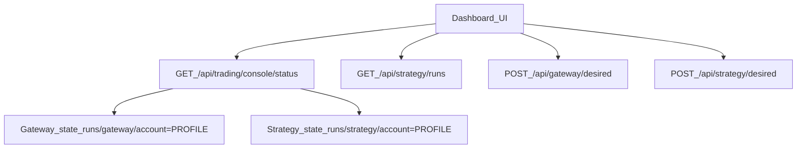

# PRD-aligned legacy removal + src/ cleanup

## Scope (as chosen)

- **Cleanup/align only**: remove old architecture and PRD-conflicting code, tighten consistency, update tests.
- **Hard delete** legacy code/files (no archiving).

## Phase 0 — Make PRD internally consistent (remove “legacy architecture” mentions)

- Edit **PRD** to eliminate “legacy trading” references so the PRD matches the desired target state:
  - Remove/replace references like:
    - Trading tab run history mentioning “legacy runs if present”
    - `GET /api/trading/console/status` mentioning “legacy state if present”
  - Ensure trading architecture section is explicitly **Gateway + Strategy only**.
- Files:
  - [`PRD.md`](/home/ops/ghTrader/PRD.md)

## Phase 1 — Hard-delete legacy trading runner (“runs/trading”)

- Remove the legacy runner entrypoints and artifacts writers:
  - Delete legacy runner module:
    - [`src/ghtrader/trade.py`](/home/ops/ghTrader/src/ghtrader/trade.py)
  - Remove legacy run-dir writer:
    - Remove `TradeRunWriter` (and any `runs/trading` assumptions) from [`src/ghtrader/tq_runtime.py`](/home/ops/ghTrader/src/ghtrader/tq_runtime.py)
  - Remove CLI command that launches the legacy runner:
    - Delete `ghtrader trade` command wiring from [`src/ghtrader/cli.py`](/home/ops/ghTrader/src/ghtrader/cli.py)

## Phase 2 — Remove legacy dashboard routes + API surface

- Delete legacy HTTP endpoints and any filesystem scanning of `runs/trading`:
  - Remove from [`src/ghtrader/control/app.py`](/home/ops/ghTrader/src/ghtrader/control/app.py):
    - `GET /api/trading/status`
    - `GET /api/trading/runs`
    - `GET /api/trading/run/{run_id}/tail`
    - Remove `legacy_trade` from `GET /api/trading/console/status` response (Gateway+Strategy only)
  - Update `/api/accounts` aggregation to **stop scanning `runs/trading/`**; instead summarize per-profile state using:
    - `runs/gateway/account=<PROFILE>/state.json` + `desired.json`
    - `runs/strategy/account=<PROFILE>/state.json` + `desired.json`

## Phase 3 — Trading UI cleanup (remove legacy controls; keep PRD tabs)

- Update Trading Console UI to be **Gateway-first** only:
  - [`src/ghtrader/control/templates/trading.html`](/home/ops/ghTrader/src/ghtrader/control/templates/trading.html):
    - Remove the “Start Trading (legacy)” form and any “legacy presets” sections
    - Replace “Legacy trading runs (runs/trading/)” with Strategy run history (from `runs/strategy/<run_id>/`)
  - [`src/ghtrader/control/static/trading.js`](/home/ops/ghTrader/src/ghtrader/control/static/trading.js):
    - Remove legacy form wiring and legacy endpoints `/api/trading/runs`
    - Update run-history fetching to `GET /api/strategy/runs?account_profile=...`
    - Remove links to `/ops/trading/run/<id>`
  - [`src/ghtrader/control/views.py`](/home/ops/ghTrader/src/ghtrader/control/views.py):
    - Remove `/ops/trading/trade` POST handler (it shells out to `ghtrader trade`)
    - Remove `/ops/trading/run/{run_id}` page (legacy run viewer)
    - Remove any server-side listing of `runs/trading` for `/trading` and `/ops` pages
  - Delete unused legacy template:
    - [`src/ghtrader/control/templates/trading_run.html`](/home/ops/ghTrader/src/ghtrader/control/templates/trading_run.html)

## Phase 4 — Repo-wide PRD compliance sweep (non-trading)

- Run a systematic scan and fix any remaining PRD-conflicting artifacts:
  - No `runs/trading` references
  - No legacy endpoints left
  - No `ticks_lake` / `lake_version` references outside migration/docs
  - Ensure dashboard old `/ops/*` routes only redirect (no “second UI source of truth” pages)
- Keep changes “cleanup-only”: don’t implement large PRD roadmap modules (regime/anomaly/tca) unless they’re required to remove conflicts.

## Phase 5 — Tests + verification

- Update tests that currently depend on legacy trading:
  - [`tests/test_control_accounts_api.py`](/home/ops/ghTrader/tests/test_control_accounts_api.py)
  - [`tests/test_control_trading_console_api.py`](/home/ops/ghTrader/tests/test_control_trading_console_api.py)
  - [`tests/test_dashboard_ui_polish_v2.py`](/home/ops/ghTrader/tests/test_dashboard_ui_polish_v2.py)
- Verification checklist:
  - `pytest`
  - Grep gates: no matches for `runs/trading`, `/api/trading/status`, `/api/trading/runs`, `legacy_trade`, and old provenance names in `src/`.
