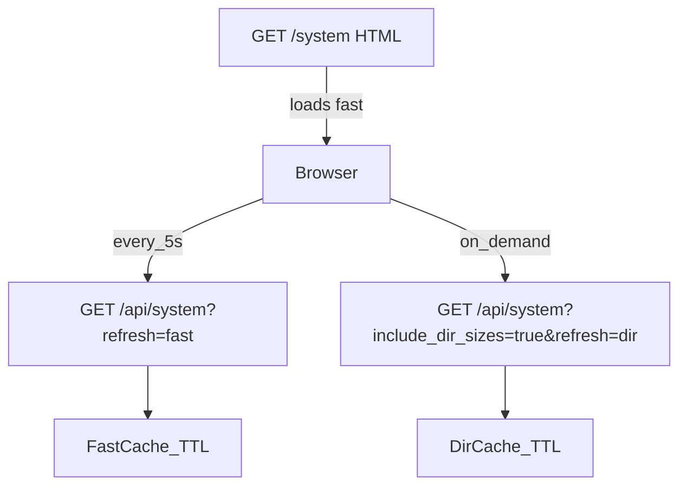

# System tab comprehensive improvements

## Goals (per PRD §5.11 “basic system status”)

- Make `/system` feel **instant** (no multi-second blocking).
- Improve **clarity**:
  - Filesystem capacity vs “directory size” are different; show both.
  - Show **% used** and highlight low free-space.
- Improve **GPU visibility**:
  - Always show *something useful*: parsed `nvidia-smi`, or a diagnostic string.
- Add **auto-refresh (~5s)** for lightweight metrics while the page is open.
- Add **lazy/cached directory sizes** for `data/`, `runs/`, `artifacts/` (manual refresh; must not block page load).

## 0) Update PRD (source of truth)

Update [`PRD.md`](/home/ops/ghTrader/PRD.md) §5.11 Observability → “system status” to explicitly require:

- System page must **not block** on expensive probes (GPU queries or directory scans).
- Disk section must show:
  - filesystem totals (total/used/free + %)
  - optional per-directory sizes (lazy/cached)
- Metrics should be refreshable and may auto-refresh.

## 1) Backend: metrics + caching

Edit [`src/ghtrader/control/system_info.py`](/home/ops/ghTrader/src/ghtrader/control/system_info.py):

- Introduce an in-module cache with TTLs + a lock.
  - **Fast cache** (refreshed frequently): CPU/mem, filesystem usage, GPU summary.
  - **Slow cache** (refreshed rarely / on demand): directory sizes (`du`).
- Add a helper to compute **directory size** safely:
  - Prefer `du -sb <path>` (timeout; parse bytes).
  - Return `{bytes, human}` and surface stderr on failure.
- Add “last updated” timestamps to make caching transparent.

## 2) API: fetchable system snapshot

Add a small JSON endpoint (auth-protected) in [`src/ghtrader/control/app.py`](/home/ops/ghTrader/src/ghtrader/control/app.py) (preferred place for JSON APIs):

- `GET /api/system`
  - Query params:
    - `include_dir_sizes=true|false` (default false)
    - `refresh=none|fast|dir` (default none)
  - Returns:
    - CPU/mem (+ optional load avg, uptime)
    - filesystem disk usage for data/runs/artifacts (plus “missing” flags)
    - GPU info string + updated_at
    - directory sizes (when available), otherwise `null/pending`

This keeps the HTML route `/system` lightweight and lets the browser refresh without re-rendering the whole template.

## 3) Frontend: faster page + auto-refresh

Update [`src/ghtrader/control/templates/system.html`](/home/ops/ghTrader/src/ghtrader/control/templates/system.html):

- Keep the initial HTML lightweight (cards + tables with placeholders).
- Add a small vanilla JS snippet (no deps) to:
  - Poll `/api/system` every ~5s for **fast metrics**.
  - Request directory sizes lazily (`include_dir_sizes=true`) and display them when ready.
  - Provide buttons:
    - “Refresh now” (fast)
    - “Refresh directory sizes” (slow)
- Use existing CSS components:
  - `.progressBar` to show disk % used
  - `.pill` / warning colors for “low free space” (thresholds defined in JS)

## 4) Tests

Add tests to prevent regressions:

- `GET /system` returns 200 with missing `artifacts/`.
- `GET /api/system` returns 200 and includes expected keys.
- Directory size behavior is testable without real `du`/GPU:
  - monkeypatch `subprocess.run` to return fixed `du` outputs and confirm JSON fields populate.

Likely files:

- extend existing control tests or add `tests/test_control_system_api.py`.

## 5) Validation

- Run `pytest`.
- Restart `ghtrader dashboard` and confirm:
  - System tab renders quickly.
  - GPU info appears without delaying the page.
  - Directory sizes populate after a moment and are cached.
  - Auto-refresh updates CPU/mem without heavy recomputation.
