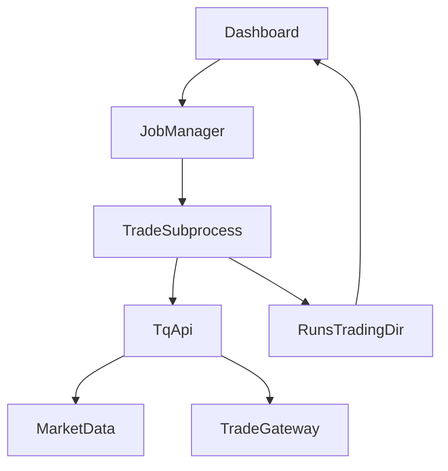

# TqSdk account + trading features (phased: sim/paper first, real later)

## Context and goal

We will design ghTrader’s **account + trading** layer using the vendored TqSdk library in this repo (`tqsdk-python/`). The plan must support:

- **Phase 1 (safe)**: paper + simulated execution for research and strategy validation.
- **Phase 2 (gated)**: real account execution, explicitly enabled, with strong safety/risk controls.
- **Both execution styles**:
  - **Target position** via `TargetPosTask` (recommended default)
  - **Direct orders** via `insert_order` / `cancel_order` (order-level control)

This design must integrate with current ghTrader components:

- Online inference/paper loop: [`src/ghtrader/online.py`](/home/ops/ghTrader/src/ghtrader/online.py)
- Tier1 backtest harness: [`src/ghtrader/eval.py`](/home/ops/ghTrader/src/ghtrader/eval.py)
- Control plane dashboard/jobs model: [`src/ghtrader/control/`](/home/ops/ghTrader/src/ghtrader/control/)

## Research takeaways (from vendored TqSdk docs/code)

Key TqSdk mechanics we must design around:

- **Account types** (docs: `tqsdk-python/doc/usage/trade.rst`):
  - `TqSim()` local simulation
  - `TqKq()` “快期模拟” (cloud/persistent simulated account)
  - `TqAccount(broker_id, account_id, password, ...)` real futures account (supports optional server overrides; auto settlement confirm)
- **Core data model**: `get_account()`, `get_position()`, `get_order()` return live-updating dict-like references updated only during `wait_update()`.
- **Order API**: `insert_order()` and `cancel_order()` instructions are actually sent on the **next** `wait_update()` (see `tqsdk-python/tqsdk/api.py`).
- **Advanced order types**: `insert_order(..., advanced="FAK"|"FOK", limit_price=None|"BEST"|"FIVELEVEL"|float)` (docs: `tqsdk-python/doc/advanced/order.rst`).
- **TargetPosTask constraints** (docs/code: `tqsdk-python/doc/usage/targetpostask.rst`, `tqsdk-python/tqsdk/lib/target_pos_task.py`):
  - Must keep calling `wait_update()` after `set_target_volume()`.
  - Exactly one `TargetPosTask` per **(account, symbol)**.
  - **Must not mix** `TargetPosTask` with `insert_order` for the same account/symbol (TqSdk warns this can cause wrong orders).
  - Supports price policy (`ACTIVE`/`PASSIVE`/callable), offset priority (`今昨,开` etc), and optional “big order split” (`min_volume/max_volume`).
  - Has lifecycle management: `cancel()` + `is_finished()` (docs: `tqsdk-python/doc/advanced/targetpostask2.rst`).
- **Risk controls**:
  - TqSdk has optional **local risk rules** (`api.add_risk_rule(...)`) including open-count/volume limits and order-rate limiting (code: `tqsdk-python/tqsdk/risk_rule.py`, `tqsdk-python/tqsdk/api.py`).
  - Note: local risk is gated by TqSdk “professional” feature flag (`tq_lc_rk`). We must not rely solely on it.
- **Ops guidance** (docs: `tqsdk-python/doc/advanced/unanttended.rst`):
  - Prefer letting fatal errors crash the strategy process (supervisor should restart). Always close API on exit.

## PRD-first updates (what to add to PRD.md)

Update [`/home/ops/ghTrader/PRD.md`](/home/ops/ghTrader/PRD.md) to add a new trading section (suggested: **§5.12 Account + trading (TqSdk)**) covering:

- **Trading modes**:
  - `paper` (no orders; research-only)
  - `sim` (TqSim/TqKq; orders allowed)
  - `live` (TqAccount; orders allowed; requires explicit enable)
- **Account configuration**:
  - `.env` keys for broker/account credentials (separate from `TQSDK_USER/TQSDK_PASSWORD` auth)
  - single-account baseline; optional multi-account in future via `TqMultiAccount`
- **Execution styles**:
  - Target-position executor (TargetPosTask) and direct-order executor
  - Explicit rule: do not mix TargetPosTask and direct orders for same (account, symbol)
- **Risk and safety**:
  - `GHTRADER_LIVE_ENABLED` gate (already exists) + an additional explicit CLI confirm for live trading
  - kill switch, max position, max daily loss, order-rate limiting
  - optional integration of TqSdk local risk rules when available
- **Observability and persistence**:
  - periodic account snapshots (balance, margin, positions)
  - order/trade event log (fills, cancels, rejects)
  - persisted run metadata for reproducibility (strategy config, model artifact hash)
- **Contract selection / “main” handling**:
  - trading may accept either a specific contract (e.g. `SHFE.cu2602`) or a continuous alias (e.g. `KQ.m@SHFE.cu`)
  - if continuous alias is provided, trading must resolve to today’s underlying main contract using the existing roll schedule files (built by `main-schedule`)

## Implementation plan

### Phase 1: paper + simulated execution

1) **Unify a TqSdk runtime wrapper**

- Add a small runtime module (e.g. `src/ghtrader/tq_runtime.py`) that:
  - builds `TqApi(...)` with selected account type (`TqSim` / `TqKq`)
  - exposes “references” (quotes/ticks/account/positions/orders) and a structured “snapshot” serializer
  - standardizes graceful shutdown (`api.close()`)

2) **Execution abstraction (two executors)**

- Add `src/ghtrader/execution.py` defining:
  - `TargetPosExecutor` (wraps `TargetPosTask`, enforces no direct orders)
  - `DirectOrderExecutor` (wraps `insert_order/cancel_order`, supports advanced order params; handles SHFE close-today when needed)
  - a shared interface so strategy code is independent of execution style

3) **Strategy runner subprocess**

- Add a new long-running command (suggested: `ghtrader trade`) that runs as a dashboard-managed subprocess job.
- Inputs:
  - `--mode paper|sim|live` (Phase 1 implements paper+sim only)
  - `--account tqsim|tqkq` (Phase 1)
  - `--executor targetpos|direct`
  - `--symbols ...` (or `--var cu` + schedule resolver)
  - model + thresholds + horizon + optional online calibrator
- Output:
  - logs to stdout/stderr (captured by control plane)
  - structured snapshots/events to `runs/trading/<run_id>/...`

4) **Symbol resolver for continuous aliases**

- Add helper (e.g. `src/ghtrader/symbol_resolver.py`) that:
  - if user passes `KQ.m@SHFE.cu`, resolves to the correct underlying contract for “today” using the schedule parquet copied by `main_depth` or written by `main_schedule`.
  - resets feature/calibrator state when underlying changes.

### Phase 2: real trading (explicitly gated)

5) **Real account support**

- Extend config + runtime wrapper to support `TqAccount(...)` with `.env` credentials.
- Enforce **two-step safety gate**:
  - `GHTRADER_LIVE_ENABLED=true`
  - CLI flag like `--confirm-live "I_UNDERSTAND"` (non-interactive safe)

6) **Risk controls (must-have)**

- Implement ghTrader-side pre-trade checks (work even without TqSdk pro features):
  - max net position per symbol
  - max order size
  - max daily loss/drawdown (based on account snapshots)
  - order-rate limiter
  - session-time guard (no trading outside allowed trading windows)
- Optionally attach TqSdk local risk rules when available (e.g. `TqRuleOrderRateLimit`, `TqRuleOpenVolumesLimit`).

7) **Safe shutdown semantics**

- On SIGTERM (dashboard cancel):
  - stop generating new targets
  - cancel outstanding orders
  - optionally flatten to 0 using TargetPosTask cancel+replace workflow (per TqSdk `targetpostask2` docs)
  - write a final snapshot + exit cleanly

## Dashboard coverage

Extend the dashboard (under `src/ghtrader/control/`) with a dedicated **Trading** section:

- Start/stop `ghtrader trade` jobs
- Show last-known account snapshot + open orders/positions for each running trading job (read from `runs/trading/...`)
- Provide quick links to logs

## Tests-first strategy

- Unit tests (no network):
  - symbol resolver logic
  - risk checks (pure functions)
  - direct-order offset mapping logic (esp. SHFE CLOSETODAY vs CLOSE)
  - persistence format validators for snapshots/events
- Integration tests (explicit + skipped by default):
  - TqSim/TqKq smoke loop (requires credentials)

## Architecture diagram

## Files expected to change/add

- **Update**: [`/home/ops/ghTrader/PRD.md`](/home/ops/ghTrader/PRD.md)
- **Add**: `src/ghtrader/tq_runtime.py`
- **Add**: `src/ghtrader/execution.py`
- **Add**: `src/ghtrader/symbol_resolver.py`
- **Update**: [`/home/ops/ghTrader/src/ghtrader/cli.py`](/home/ops/ghTrader/src/ghtrader/cli.py) (new `trade` command; gated `live`)
- **Update**: dashboard routes/templates under [`/home/ops/ghTrader/src/ghtrader/control/`](/home/ops/ghTrader/src/ghtrader/control/) (new Trading page)
- **Add tests**: `tests/test_trading_*.py`

## Acceptance criteria

- Paper/sim trading runner exists and is controllable via dashboard.
- Supports both TargetPosTask and direct-order execution modes (mutually exclusive per symbol).
- Real trading is present but cannot run unless explicitly enabled (env + confirm flag).
- Risk controls are enforced even without TqSdk professional risk-rule support.
- Trading jobs produce persisted snapshots/events suitable for later analysis and reproducibility.