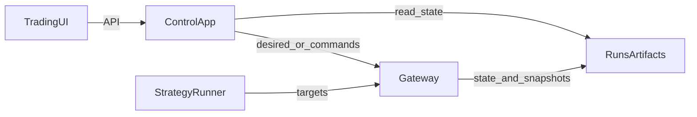

# Trading & Account System Cleanup

## Context

- Scope confirmed: only the Trading section UI is being restructured to three tabs.
- PRD is canonical; update it first, then align code and tests.

## Architecture / Data Flow

## Plan

1. Update PRD to reflect the new Trading UI and account classification.

   - Edit [/home/ops/ghTrader/PRD.md](/home/ops/ghTrader/PRD.md) §5.11 (Trading page tab definitions) to replace “Live Status / Start-Control / Run History / Accounts” with “Auto Monitor / Manual Test / Account Config.”
   - Clarify sim vs live account semantics in §5.12 (e.g., sim accounts are TqSim/TqKq; live accounts are broker-credentialed profiles in `runs/control/accounts.env`).

2. Consolidate account/profile env handling and remove conflicting definitions.

   - Keep the PRD-aligned implementation in [/home/ops/ghTrader/src/ghtrader/control/app.py](/home/ops/ghTrader/src/ghtrader/control/app.py) and reconcile or remove the divergent `/control/routes/accounts.py` logic that uses `TQSDK_*` keys ([/home/ops/ghTrader/src/ghtrader/control/routes/accounts.py](/home/ops/ghTrader/src/ghtrader/control/routes/accounts.py)).
   - Ensure profile normalization and env suffix handling match [/home/ops/ghTrader/src/ghtrader/tq/runtime.py](/home/ops/ghTrader/src/ghtrader/tq/runtime.py).

3. Align trading runtime with PRD symbol resolution and roll safety.

   - Integrate [/home/ops/ghTrader/src/ghtrader/trading/symbol_resolver.py](/home/ops/ghTrader/src/ghtrader/trading/symbol_resolver.py) into [/home/ops/ghTrader/src/ghtrader/trading/strategy_runner.py](/home/ops/ghTrader/src/ghtrader/trading/strategy_runner.py) and [/home/ops/ghTrader/src/ghtrader/tq/gateway.py](/home/ops/ghTrader/src/ghtrader/tq/gateway.py) so `KQ.m@...` aliases resolve to execution symbols per trading day.
   - On roll, reset StrategyRunner state and ensure Gateway subscriptions/targets do not leak across contracts; persist the `requested_symbol -> execution_symbol` mapping into gateway/strategy state for monitoring.

4. Refactor Trading UI into the three requested tabs with clearer responsibilities.

   - Update [/home/ops/ghTrader/src/ghtrader/control/templates/trading.html](/home/ops/ghTrader/src/ghtrader/control/templates/trading.html) to replace the tab nav and reorganize content:
     - **Auto Monitor**: consolidated status KPIs, gateway/strategy health, positions/orders, recent signals, run history.
     - **Manual Test**: gateway/strategy desired-state forms and safety commands; add explicit “monitor-only → live” gating cues.
     - **Account Config**: broker account profiles table + add/edit/verify actions.
   - Adjust [/home/ops/ghTrader/src/ghtrader/control/static/trading.js](/home/ops/ghTrader/src/ghtrader/control/static/trading.js) to match new DOM structure and keep polling light; update CSS in [/home/ops/ghTrader/src/ghtrader/control/static/app.css](/home/ops/ghTrader/src/ghtrader/control/static/app.css) only if new layout elements are needed.

5. API adjustments + tests + live validation.

   - If the new UI needs additional monitoring fields, extend `/api/trading/console/status` in [/home/ops/ghTrader/src/ghtrader/control/app.py](/home/ops/ghTrader/src/ghtrader/control/app.py) with derived summary fields (without breaking existing tests).
   - Update/add tests in [/home/ops/ghTrader/tests/test_control_trading_console_api.py](/home/ops/ghTrader/tests/test_control_trading_console_api.py) and [/home/ops/ghTrader/tests/test_control_accounts_api.py](/home/ops/ghTrader/tests/test_control_accounts_api.py) to cover new tab/content assumptions and any API changes.
   - Run tests in venv (e.g., `source .venv/bin/activate && pytest ...`).
   - Live one‑lot validation: first run `live_monitor` for the chosen profile and confirm snapshots/events; then perform the single live test (after you provide account profile + symbol/side), ensuring `GHTRADER_LIVE_ENABLED=true` and `confirm_live=I_UNDERSTAND`.

## Todos

- update-prd-trading-ui: Update PRD trading/account requirements.
- reconcile-accounts-env: Consolidate account/profile env handling.
- symbol-roll-safety: Wire continuous symbol resolution + roll resets.
- trading-ui-3tabs: Rebuild Trading UI into 3 tabs + JS updates.
- tests-and-live-check: Update tests and run live one‑lot validation.