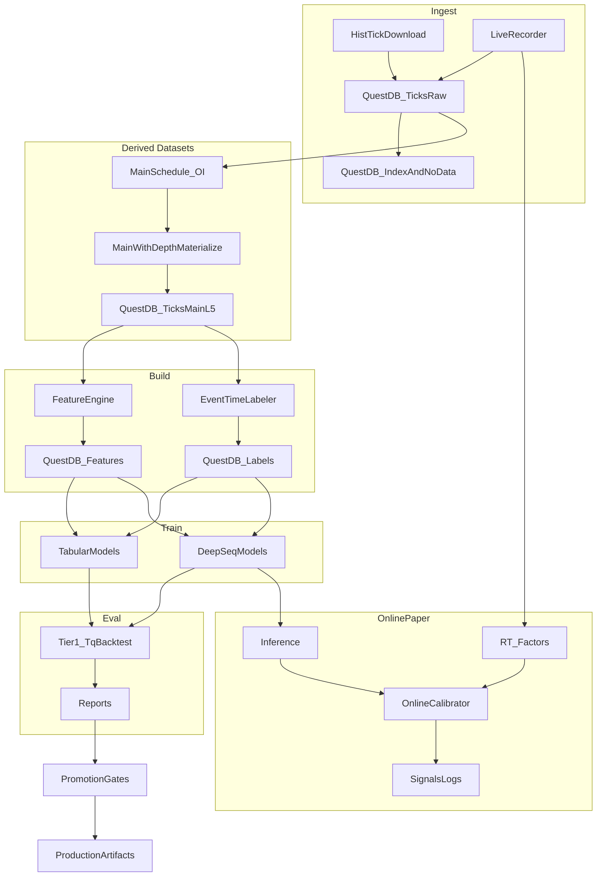

## ghTrader PRD (Product Requirements Document)

### Document control

- **Product**: ghTrader (research-only AI-centric SHFE tick system)
- **Scope**: SHFE CU/AU/AG directional micro-alpha research at tick/HFT granularity
- **Status**: Active (canonical)
- **Last updated**: 2026-01-16
- **Owner**: ghTrader maintainers

---

### Canonicality rules (single source of truth)

- This file (`PRD.md`) is the **only canonical plan/spec** for ghTrader.
- Any future design/implementation planning must:
  - **read and understand this PRD first**, then
  - **update/evolve this PRD** before or alongside code changes.
- Other documents (e.g. older `.cursor/plans/*`) are **historical** and must not be treated as authoritative if they conflict with this PRD.

---

## 1) Product overview

ghTrader is a **research-only**, AI-centric quantitative trading R&D system for **SHFE copper (CU), gold (AU), and silver (AG)**.

It provides a full loop:

- **Ingest**: historical and live **L5 tick** data via **TqSdk Pro (`tq_dl`)**
- **Store (canonical)**: QuestDB time-series DB for ticks + derived datasets (main-with-depth, features, labels, schedules)
- **Validate**: QuestDB-backed completeness + integrity (index/no-data + per-day manifests/checksums)
- **Build**: causal factor features + event-time labels
- **Model**: tabular + deep sequence models, plus online calibration
- **Evaluate**: Tier1 backtest (TqBacktest) + Tier2 offline micro-sim
- **Continual**: daily refresh/train/eval/promote with rollback
- **Benchmark**: standardized offline metrics + latency profiling + comparisons

---

## 2) Goals and success criteria

### 2.1 Primary goals

- Build a **reproducible research platform** to iterate on directional micro-alpha for CU/AU/AG.
- Use the server’s compute (multi-CPU + multi-GPU) to:
  - train deep models daily,
  - run many backtests/sweeps in parallel,
  - support rapid model research.

### 2.2 Success criteria (what “good” looks like)

A model family is considered “better” when, on walk-forward evaluation:

- **Trading performance**: higher net PnL with controlled drawdown and turnover
- **Stability**: robust across contracts/regimes (not single-window overfit)
- **Latency**: meets paper-online latency budget (see §6.3)
- **Reproducibility**: every result can be reproduced from pinned code + manifest + config

---

## 3) Non-goals / out of scope

- **Live trading / real order routing** is out of scope until explicitly added (research-only default).
- Full OMS, risk engine, compliance automation.
- Exchange co-location / true microsecond execution.
- Perfect queue position modeling (Tier2 micro-sim is an approximation).

---

## 4) Users and workflows

### 4.1 Primary users

- **Quant researcher**: builds datasets, trains models, evaluates trading performance
- **ML engineer**: implements/benchmarks model architectures and training pipelines
- **Infra engineer**: maintains data system (QuestDB + schedulers), scheduled training jobs, compute utilization

### 4.2 Core workflows

- **Data workflow (QuestDB-first)**: `download`/`record` → `data verify` → `data fill-missing` (if needed) → `main-schedule` → `main-l5` → `build` (features/labels) → `train` → `backtest`/`benchmark`
- **Continual workflow**: `daily-train` (scheduled) → gated promotion → rollback on regression
- **Model research workflow**: `compare` and benchmarking reports across model families

---

## 5) Functional requirements

### 5.1 Data ingest (historical)

- Must support historical L5 tick download using **TqSdk Pro** (`tq_dl`).
- Must support chunking/resume to handle long ranges.
- Must write ingest manifests.

#### 5.1.1 Symbol types and depth limitations (observed)

ghTrader must explicitly support two classes of symbols (both may exist in QuestDB):

- **Specific contracts (preferred for microstructure research)**:
  - Example: `SHFE.cu2602`
  - Provides **L5 depth** (`bid/ask_price1..5`, `bid/ask_volume1..5`)
- **Continuous main contracts (useful for long history but depth-limited)**:
  - Example: `KQ.m@SHFE.cu`
  - Provides **L1 only** in practice: levels **2–5 are present but null (NaN)**.
  - We keep this data only as an auxiliary long-history reference; it is **not sufficient** for LOB/depth models.

Implementation:
- `src/ghtrader/tq_ingest.py` (`download_historical_ticks`)

#### 5.1.2 Trading calendar correctness + no-data day semantics

Problem:
- Weekday-only calendars are incorrect for China futures (SHFE holidays exist).
- Some valid trading days may legitimately have **no ticks available** in TqSdk Pro history (e.g., data gaps, pre-listing boundary days). These must not cause infinite retries.

Requirements:
- **Trading day source**: use Shinny/TqSdk’s holiday list to compute trading days (no akshare dependency):
  - Source URL: `https://files.shinnytech.com/shinny_chinese_holiday.json` (configurable via `TQ_CHINESE_HOLIDAY_URL`)
  - Trading day rule: weekday AND not in holiday list (best-effort; cache locally).
- **No-data markers**:
  - For each symbol, persist trading dates that were attempted but returned **zero ticks**, so ingest completion is idempotent.
  - Store in QuestDB (canonical) table: `ghtrader_no_data_days_v2`
    - Columns: `symbol`, `trading_day`, `lake_version`, `ticks_lake`, `reason`, `created_at`
    - Uniqueness: `(symbol, trading_day, lake_version, ticks_lake)` (dedup/upsert).
  - Missing-date computation must exclude both **present** days in `ghtrader_symbol_day_index_v2` and recorded no-data days.
- **Chunk behavior**:
  - If a requested chunk yields no ticks, mark all dates in that chunk as no-data (unless already present in QuestDB).
  - If a chunk yields partial days, mark any requested dates that did not produce ticks as no-data.

#### 5.1.3 Data Provider Abstraction

While TqSdk is the current data provider, ghTrader should maintain a modular architecture that does not hard-code TqSdk throughout the codebase:

**Abstract interfaces**:
- `DataProvider`: Base interface for tick data providers
  - `download_historical(symbol, start, end) -> Iterator[TickBatch]`
  - `subscribe_live(symbols) -> AsyncIterator[Tick]`
  - `get_trading_calendar(exchange) -> List[date]`
  - `get_contract_info(symbol) -> ContractMetadata`

- `ExecutionProvider`: Base interface for order execution
  - `submit_order(symbol, side, quantity, price) -> OrderId`
  - `cancel_order(order_id) -> bool`
  - `get_positions() -> Dict[str, Position]`
  - `get_account() -> AccountSnapshot`

**Current implementation**:
- TqSdk is the sole implementation of both interfaces
- All TqSdk-specific code should be isolated in `src/ghtrader/tq_*.py` modules
- Core logic (features, models, evaluation) should not import TqSdk directly

**Future extensibility**:
- Architecture allows adding alternative data providers without major refactoring
- Potential future providers: CTP direct, other vendor APIs, replay providers
- Simulation providers (see Section 5.8) should implement the same interfaces

**TqSdk-specific requirements** (current implementation):
- TqSdk Pro (`tq_dl`) for historical L5 tick download
- TqSdk for live recording and trading execution
- Shinny authentication (`TqAuth`)
- Broker account integration for live trading

Implementation:
- `src/ghtrader/data_provider.py` (abstract interfaces, new module)
- `src/ghtrader/tq_ingest.py` (TqSdk implementation for data)
- `src/ghtrader/tq_runtime.py` (TqSdk implementation for execution)

### 5.2 Data ingest (live recorder)

- Must subscribe to ticks and append to QuestDB (ILP).
- Must deduplicate via stable row identity (`row_hash`) and/or timestamp monotonic checks per symbol.
- Must flush periodically and handle session boundaries.
- Must update the QuestDB coverage/index tables for each `(symbol, trading_day)` batch as part of ingest.

Implementation:
- `src/ghtrader/tq_ingest.py` (`run_live_recorder`)

### 5.3 Tick storage (QuestDB-only)

- **Canonical tick store**: QuestDB (daemon time-series DB) stores raw ticks for all contracts and derived datasets.
- **Core tick tables (v2)**:
  - Canonical ticks table: `ghtrader_ticks_raw_v2`
  - Provenance column `ticks_lake` distinguishes raw vs derived ticks (`raw|main_l5`).
- **Schema**:
  - Must include full L5 columns even for L1-only sources; for `KQ.m@...` deeper levels are expected to be null/NaN.
  - Must store `datetime_ns` (int64 epoch-ns as provided by TqSdk) and a QuestDB `TIMESTAMP` column `ts` derived from it.
  - Must store provenance columns `lake_version` and `ticks_lake`.

Implementation:
- `src/ghtrader/serving_db.py` (QuestDB schema + ingestion)

#### 5.3.0.0 Lake/version selection (v2 only)

- There is no lake version toggle; all ingestion and downstream builds use **v2**.
- All QuestDB tables and index rows must include `lake_version='v2'` for future-proofing, but mixing across versions is not supported.

#### 5.3.0 Contract coverage + L5 availability index (QuestDB-backed)

To make the data system robust (fill/verify/repair), ghTrader must be able to compute coverage from the canonical tick DB:

- Per contract (symbol):
  - first/last tick day present (any ticks)
  - first/last L5 day present (depth levels 2–5 have non-null/non-NaN values)
  - freshness for active contracts (behind latest trading day → `stale`)
- This must be backed by a QuestDB-maintained index table (no full-table scans on dashboard paths):
  - `ghtrader_symbol_day_index_v2` with at least:
    - `symbol`, `trading_day`, `lake_version`, `ticks_lake`
    - `rows_total`, `first_datetime_ns`, `last_datetime_ns`
    - `l5_present` (boolean; true if any level2–5 price/vol values are non-null/non-NaN and >0)
- The dashboard contract explorer must use this index (and `ghtrader_no_data_days_v2`) instead of local scans or akshare-driven active-ranges.

#### 5.3.0.2 Data integrity validation, checksums, and audit command

ghTrader must provide first-class integrity tooling for the canonical QuestDB data system.

Integrity requirements (QuestDB):
- Tick ingestion must be idempotent using a deterministic row identity (`row_hash`) and provenance keys (`ticks_lake`, `lake_version`).
- The system must maintain `ghtrader_symbol_day_index_v2` as the authoritative coverage ledger.
- The system must maintain `ghtrader_no_data_days_v2` to prevent infinite retries and to make “missing days” semantics explicit.
- **Day manifest/checksums (QuestDB-native)**:
  - For each `(symbol, trading_day, ticks_lake, lake_version)`, the system must persist deterministic per-day aggregates in `ghtrader_symbol_day_index_v2`:
    - `rows_total`, `first_datetime_ns`, `last_datetime_ns`, `l5_present`
    - `row_hash_min`, `row_hash_max`, `row_hash_sum` (and optionally `row_hash_sum_abs`)
  - These values define the canonical **day-manifest** used by `audit` to validate integrity without any file-based checksums.

Audit command:
- Must provide `ghtrader audit` which validates QuestDB-backed datasets and produces:
  - JSON report under `runs/audit/<run_id>.json`
  - exit code **0** if no errors, **1** if errors
- Required checks:
  - schema conformity (QuestDB tables contain required columns/types; no missing critical columns)
  - datetime integrity (non-decreasing; duplicate rate reporting)
  - basic sanity rules for ticks (non-negative volume/OI; non-negative prices; `ask_price1 >= bid_price1` when present)
  - index consistency: `ghtrader_symbol_day_index_v2` matches the underlying tick tables for sampled partitions
  - derived-vs-raw equivalence for `main_l5` (tick value columns must match raw underlying; `symbol` differs by design; metadata columns must match schedule provenance) when `ghtrader_ticks_main_l5_v2` is enabled

#### 5.3.0.3 Database / query layer (QuestDB-only)

Canonical ticks, features, labels, and schedules are stored in QuestDB.

- **QuestDB (canonical ticks)**:
  - Stores `ticks_raw` for all contracts/aliases.
  - Optionally stores `ticks_main_l5` for derived main-with-depth datasets.
  - Time semantics must be explicit:
    - Store `datetime_ns` (int64 epoch-ns as provided by TqSdk) AND a QuestDB `TIMESTAMP` column (`ts`) derived from it.
    - Store `trading_day` as an explicit partition/key column for coverage/indexing.
  - Stores derived datasets:
    - `ghtrader_features_v2` (features)
    - `ghtrader_labels_v2` (labels)
  - Ingestion must be idempotent and provenance-aware (`lake_version`, `ticks_lake`, `row_hash`).

- **No embedded file-based SQL engine**:
  - ghTrader does not ship a local SQL engine for file-based datasets. The dashboard explorer is QuestDB-only.

- **Dashboard SQL Explorer (QuestDB-backed)**:
  - HTML: `/explorer`
  - JSON: `POST /api/questdb/query`
  - Guardrails: read-only (single-statement `SELECT`/`WITH` only), capped row limits, and intended for local-only access via SSH forwarding.

QuestDB is the chosen canonical tick store for this phase.

#### 5.3.1 Derived dataset: “main-with-depth” (materialized continuity with L5)

Because `KQ.m@...` continuous symbols are L1-only, ghTrader must support a derived dataset that provides:

- **Continuity of the main contract over time**
- **L5 depth** (sourced from the underlying specific contract ticks)

Definition:

- The derived symbol is named like the continuous series (e.g. `KQ.m@SHFE.cu`), but it is **materialized** from L5 ticks of the underlying contract selected by the roll schedule (§5.3.2).
- Output is written to QuestDB with `ticks_lake='main_l5'` and `lake_version='v2'` (stored in the canonical ticks table).
- Provenance must be recorded (schedule hash, underlying contracts used, row counts per day).

Segment metadata contract (required for correctness):

- The roll schedule must include a **segment id** that increments each time `main_contract` changes.
  - `segment_id` is stable and deterministic for a given schedule.
- Every derived `main_l5` tick row must include:
  - `underlying_contract` (string): the specific contract used for that trading day (e.g. `SHFE.cu2602`)
  - `segment_id` (int): schedule segment id for that trading day
- Derived features and labels must **propagate** `underlying_contract` and `segment_id` so downstream datasets can enforce no roll-boundary leakage.

Sequence semantics (critical for ML correctness):

- Feature/label sequences **must not cross roll boundaries**.
- Dataset builders must enforce that a training example comes from a **single segment** (constant `segment_id`) / underlying contract.
  - Default behavior is to **exclude cross-boundary windows** rather than attempting price-splice or boundary token hacks.

Builder semantics for derived ticks (critical):
- When building features on derived main-with-depth ticks (`ghtrader_ticks_main_l5_v2`, `ticks_lake='main_l5'`):
  - rolling-window state (lookback tail) must be **reset** when the underlying contract changes between adjacent trading days.
- When building labels on derived main-with-depth ticks (`ghtrader_ticks_main_l5_v2`, `ticks_lake='main_l5'`):
  - cross-day lookahead must be **disabled** when the underlying changes between adjacent trading days (end-of-day labels become NaN rather than leaking).
- Materialization must persist schedule provenance (QuestDB-first):
  - store `schedule_hash` and other provenance metadata (underlying contract, segment id) in the derived tick rows and/or a small QuestDB metadata table keyed by `schedule_hash`
  - the roll schedule is stored in QuestDB (see §5.3.2); there is no file-based schedule export
  - optional debugging-only artifacts (e.g. a JSON summary of a schedule build) may be written under `runs/` as reports, but must not be required for runtime resolution

#### 5.3.2 Main continuous roll schedule rule (SHFE-style OI rule)

We treat the roll schedule as **given**, not “invented” by ghTrader. The rule:

- At first listing, use the **same-variety contract with max close OI** on day \(T\) as the main contract effective from **\(T+1\)**.
- Switch condition: if at end of day \(T\), some other contract has
  - `oi_other(T) > 1.1 * oi_main(T)`
  then switch effective from **\(T+1\)**.
- **No intraday switching**.

Data source for the schedule (no akshare):
- The schedule must be computed from **tick data** by aggregating end-of-day `open_interest` from the canonical tick DB (QuestDB).
- For the “main-with-depth” dataset, the effective schedule range must start at the earliest date where the main contract has **true L5** available (levels 2–5 non-null/non-NaN), to avoid mixing L1-only eras into depth-model training.

Continuous code semantics (vendor conventions):

- “88-style” continuous = simple splice (no price smoothing).
- “888-style” continuous = back-adjusted prices across rolls (not appropriate for tick microstructure).

ghTrader’s derived “main-with-depth” dataset uses **88-style splice semantics** (no smoothing).

### 5.4 Features (structured factor library, causal)

ghTrader must compute features causally (no future information leakage) and provide both offline batch and online incremental computation.

#### 5.4.0.1 Factor Taxonomy

Factors are organized into a structured taxonomy for maintainability and research:

**Microstructure factors**:
- **Order flow**: Order Flow Imbalance (OFI), VPIN (Volume-synchronized PIN), Kyle's Lambda (price impact coefficient)
- **Liquidity**: Bid-ask spread (quoted/effective/realized), depth at each level, liquidity resilience (recovery speed)
- **Price impact**: Amihud illiquidity, Pastor-Stambaugh liquidity risk, temporary/permanent impact decomposition
- **Information**: PIN (Probability of Informed Trading), adverse selection components

**Technical factors**:
- **Momentum**: Returns at multiple horizons (1/5/10/50/100/500 ticks), momentum acceleration
- **Volatility**: Realized variance, GARCH-style predictions, HAR-RV (Heterogeneous Autoregressive RV), Parkinson/Garman-Klass estimators
- **Volume**: VWAP deviation, volume profile (time-of-day patterns), volume surprises
- **Patterns**: Tick-level patterns, support/resistance proximity (rolling extrema)

**Order book factors**:
- **Imbalance**: Multi-level imbalances (L1-L5), weighted imbalances, imbalance derivatives
- **Pressure**: Weighted bid/ask pressure indices, cumulative depth ratios
- **Shape**: Book curvature (second derivative of depth), concentration (Herfindahl of depth), slope
- **Dynamics**: Quote arrival rates, cancellation rates, quote lifetime statistics

**Cross-asset factors**:
- **Correlation**: Rolling correlations between CU/AU/AG, dynamic conditional correlation (DCC)
- **Cointegration**: Spread dynamics, error correction terms, half-life of mean reversion
- **Lead-lag**: Granger causality features, cross-correlation at various lags

**Derived/learned factors**:
- **PCA factors**: Principal components of raw feature matrix
- **Autoencoder latents**: Learned low-dimensional representations from deep autoencoders
- **Regime indicators**: HMM state probabilities, changepoint detector outputs

#### 5.4.0.2 Computation Requirements

- Must compute features causally (only use data up to time t for feature at time t)
- Must provide:
  - **Offline batch computation**: Process historical data efficiently
  - **Online incremental computation**: Ring-buffer design for real-time feature updates
- Must support configurable lookback windows per factor
- Must handle missing data gracefully (forward-fill, interpolation, or NaN propagation)

#### 5.4.0.3 Storage (QuestDB-first)

Features must be stored in QuestDB table `ghtrader_features_v2` (not as filesystem files) with:
- Primary time column `ts` and `datetime_ns`
- `symbol`, `trading_day`, `lake_version`, `ticks_lake`
- Factor columns (wide schema) or a stable long-form schema (if wide is too dynamic)
- Build metadata recorded in QuestDB (build id/config hash, factor set, lookback config)

#### 5.4.0.4 Feature Store Architecture

ghTrader must implement feature store principles to ensure consistency between training and serving:

**Training-Serving Parity**:
- Feature computation logic must be identical for offline (batch) and online (real-time) modes
- Same code path must be used for both, parameterized only by data source (historical vs live)
- Any discrepancy (training-serving skew) must be detected and flagged as an error
- Feature definitions should be declarative where possible (config-driven)

**Point-in-Time Correctness**:
- Features retrieved for training must reflect exactly what was available at that timestamp
- No lookahead: feature at time T must only use data from times <= T
- This is critical for backtesting validity and avoiding future information leakage
- Feature joins must use event-time semantics, not wall-clock time

**TTL (Time-to-Live) and Staleness**:
- Online features must have configurable TTL per feature type
- If a feature value is older than TTL, serve null or raise staleness error (configurable)
- Default TTL: 30 minutes for intraday features, 1 day for daily features
- Staleness monitoring must be integrated with anomaly detection (Section 5.14)

**Materialization**:
- **Batch materialization**: End-of-day or end-of-session push of computed features to online store
- **Incremental materialization**: Per-tick or per-minute updates for real-time features
- Materialization cadence must be configurable per feature type
- Materialization jobs must be idempotent (safe to retry)

**Offline Store**:
- QuestDB `ghtrader_features_v2` table for full historical feature data
- Supports point-in-time joins for training dataset generation
- Partitioned by `trading_day` for efficient queries

**Online Store**:
- In-memory or Redis-backed store for low-latency feature retrieval during inference
- Keyed by `(symbol, feature_name)` with latest value and timestamp
- Must support sub-10ms retrieval latency for real-time trading

**Lineage and Versioning**:
- Track which raw data columns contribute to each derived feature
- Feature definitions must be versioned; incompatible changes require new version
- Breaking changes (schema, semantics) must increment major version
- Storage: `ghtrader_feature_registry_v2` table with:
  - `feature_name`, `version`, `definition_hash`
  - `input_columns` (JSON array), `output_dtype`
  - `lookback_ticks`, `ttl_seconds`
  - `created_at`, `deprecated_at`

#### 5.4.1 Automatic Feature Engineering

ghTrader should support automated feature generation and selection:

**Feature generation**:
- Automated operator application: lag(n), diff(n), rolling_mean(n), rolling_std(n), ewm(span)
- Interaction features: products, ratios of base features
- Polynomial features: degree-2 combinations (with sparsity control)

**Feature selection**:
- Recursive Feature Elimination (RFE) with cross-validation
- SHAP-based importance ranking
- Mutual information scoring
- Correlation-based redundancy filtering

**Feature store**:
- Centralized registry of all features with metadata
- Lineage tracking (which raw columns → which derived features)
- Version control for feature definitions
- Storage: `ghtrader_feature_registry_v2` table

**Feature validation**:
- Distribution drift detection (KS test, PSI)
- Staleness checks (feature not updated recently)
- Range/sanity checks (detect anomalous feature values)

#### 5.4.2 Alternative Data Integration (future scope)

ghTrader architecture should support integration of alternative data sources:

- **Sentiment**: Chinese financial news, social media (Weibo, Xueqiu), analyst reports
- **Macroeconomic**: PMI, CPI releases, industrial production data
- **Fundamental**: SHFE warehouse inventory reports, import/export data
- **Cross-market**: LME copper prices, USD/CNY exchange rate, related commodity indices

Alternative data must be:
- Timestamped precisely for causal alignment
- Stored with appropriate latency modeling (publication delay)
- Validated for predictive value before production use

Implementation:
- `src/ghtrader/features.py` (`FactorEngine`)
- `src/ghtrader/feature_store.py` (new module for registry/validation)

### 5.5 Labels (event-time, multi-horizon)

ghTrader supports multiple label types for different prediction tasks.

#### 5.5.1 Direction Labels (price movement prediction)

- Define mid price: `mid = (bid_price1 + ask_price1) / 2`.
- Horizons: configurable list (default `{10, 50, 200}` ticks).
- Threshold: `k * price_tick` (default `k=1`).
- 3-class label: DOWN/FLAT/UP based on `mid[t+N] - mid[t]`.

Storage: `ghtrader_labels_v2` table with:
- `ts`, `datetime_ns`, `symbol`, `trading_day`
- one column per configured horizon (e.g. `label_10`, `label_50`, `label_200`)
- label-build metadata recorded in QuestDB (threshold, horizons, config hash)

#### 5.5.2 Fill Probability Labels (execution prediction)

For execution optimization models (KANFormer-style), ghTrader must support fill probability labels:

**Time-to-fill labels**:
- For hypothetical limit orders at various price levels (best bid, best bid - 1 tick, etc.)
- Label: time (in ticks or milliseconds) until order would be filled
- Censored if not filled within horizon (survival analysis framing)

**Fill probability labels**:
- Probability that a limit order at price P would be filled within N ticks
- Computed from historical LOB dynamics and queue position estimation
- Multiple horizons: N = {10, 50, 100, 500} ticks

**Queue position estimation**:
- Estimate queue position for hypothetical order based on current depth
- Track queue dynamics (arrivals, cancellations, executions ahead)
- Label: estimated queue position at each tick

Storage: `ghtrader_fill_labels_v2` table with:
- `ts`, `datetime_ns`, `symbol`, `trading_day`
- `price_level` (offset from best bid/ask in ticks)
- `side` (bid/ask)
- `time_to_fill_{horizon}` (NULL if not filled)
- `fill_prob_{horizon}` (probability estimate)
- `queue_position` (estimated position in queue)

#### 5.5.3 Execution Cost Labels (for TCA)

For transaction cost analysis and execution optimization:

**Realized slippage labels**:
- For historical orders: actual execution price vs arrival price
- Decomposed into: spread cost, market impact, timing cost
- Requires execution log data (from trading runs)

**Market impact labels**:
- Price movement caused by order (temporary and permanent)
- Estimated from LOB dynamics around large trades
- Used to calibrate market impact models

Storage: `ghtrader_execution_labels_v2` table with:
- `ts`, `order_id`, `symbol`, `trading_day`
- `arrival_price`, `execution_price`, `slippage_ticks`
- `spread_cost`, `impact_cost`, `timing_cost` (decomposition)
- `order_size`, `execution_duration`

#### 5.5.4 Label Computation Requirements

All label types must:
- Be computed causally (no lookahead beyond the label horizon)
- Handle contract roll boundaries (no cross-contract labels)
- Be stored with build metadata (config hash, computation timestamp)
- Support incremental computation for new data

Implementation:
- `src/ghtrader/labels.py` (direction labels)
- `src/ghtrader/fill_labels.py` (fill probability labels, new module)
- `src/ghtrader/execution_labels.py` (execution cost labels, new module)

### 5.6 Modeling (offline)

We maintain a **model ladder** (simplest → most powerful), and choose winners by trading outcomes + latency gates:

#### 5.6.0.1 Tabular Baselines
- Logistic Regression (interpretable baseline)
- XGBoost (gradient boosting with regularization)
- LightGBM (fast, handles high-cardinality features)

#### 5.6.0.2 Deep Sequence Models
- **DeepLOB-style CNN+LSTM**: Convolutional feature extraction + recurrent sequence modeling
- **Transformer encoder**: Self-attention for tick sequences
- **TCN (Temporal Convolutional Network)**: Dilated causal convolutions, strong latency/performance tradeoff
- **TLOB dual-attention transformer**: Explicit spatial (LOB levels) + temporal (sequence) attention
- **SSM/Mamba-style**: Fast linear-time sequence modeling (O(n) vs O(n²) attention)

#### 5.6.0.3 Advanced Architectures (extended model zoo)
- **Temporal Fusion Transformer (TFT)**: Multi-horizon forecasting with interpretable variable selection and attention
- **PatchTST**: Patch-based transformer for time series (channel-independent, proven SOTA on benchmarks)
- **Informer/Autoformer**: Long-sequence efficient transformers with ProbSparse attention
- **TimesNet**: Multi-scale temporal modeling via 2D convolutions on period-frequency representations
- **N-BEATS/N-HiTS**: Interpretable neural basis expansion with hierarchical interpolation

#### 5.6.0.4 Probabilistic Models (uncertainty quantification)
- **Quantile regression networks**: Direct quantile prediction for confidence intervals
- **Mixture Density Networks (MDN)**: Multi-modal price distribution modeling
- **Bayesian neural networks**: Epistemic uncertainty via weight distributions (MC Dropout or variational)
- **Normalizing flows**: Flexible density estimation for return distributions
- **Deep Ensembles**: Uncertainty via ensemble disagreement

#### 5.6.0.5 Foundation Models for Finance (transfer learning)
- **Pre-trained LOB encoders**: Self-supervised pre-training on tick sequences (masked prediction, contrastive learning)
- **Transfer learning**: Fine-tune from larger tick datasets or cross-market pre-training
- **Contrastive learning**: Learn market state representations via SimCLR/MoCo-style objectives

#### 5.6.0.6 Reinforcement Learning (execution and strategy optimization)
- **PPO/SAC agents**: On-policy/off-policy RL for execution optimization
- **Offline RL**: Conservative Q-Learning (CQL), Decision Transformer for learning from historical executions
- **Multi-agent RL**: Market simulation with competing agents for robustness testing

#### 5.6.0.7 SOTA LOB Architectures (2025-2026)

The following represent cutting-edge architectures from recent research (2024-2026):

- **T-KAN (Temporal Kolmogorov-Arnold Networks)** [Jan 2026]:
  - Replaces fixed linear transforms with learnable B-spline edge functions in LSTM-style gates
  - 19.1% F1 improvement vs DeepLOB at k=100 horizon on FI-2010 benchmark
  - +132% returns vs DeepLOB's -82% under realistic transaction costs (1 bps)
  - Interpretable: reveals "dead-zones" (input ranges with minimal effect) and asymmetric sensitivities
  - FPGA-optimizable for sub-microsecond inference latency
  - Reference: Makinde (2026), arXiv:2601.02310

- **LOBERT (LOB Encoder Foundation Model)** [Nov 2025]:
  - BERT-style encoder foundation model for LOB message streams
  - One-token-per-message tokenization with continuous price/volume/time embeddings
  - Piecewise Linear-Geometric Scaling (PLGS) for extreme value handling
  - Masked Message Modeling (MMM) pretraining objective
  - 26.4% full message prediction accuracy vs 6.1% for S5 baseline
  - Strong transfer learning potential across assets
  - Reference: arXiv:2511.12563

- **KANFormer** [Dec 2025]:
  - Predicts order-fill probabilities (time-to-fill), not just price direction
  - Hybrid architecture: dilated causal convolutions + Transformer encoder + KAN modules
  - Incorporates agent information and queue position features
  - Focuses on calibration metrics (Brier score, log-likelihood, C-index) for execution decisions
  - Suitable for execution optimization and smart order routing
  - Reference: arXiv:2512.05734

- **LOBDIF (LOB Diffusion Models)** [Late 2024]:
  - Applies diffusion models to joint event-type and timing prediction
  - Denoising network with skip-step sampling for reduced inference latency
  - Substantially outperforms Hawkes processes and event LSTMs for timing prediction
  - Suitable for event-stream forecasting and order arrival modeling
  - Reference: arXiv:2412.09631

- **Siamese MHA+LSTM** [2025]:
  - Exploits bid-ask symmetry via Siamese architecture (shared networks for bid/ask sides)
  - Combines Order Flow Imbalance (OFI) with raw LOB features
  - Multi-head attention (MHA) with LSTM for temporal modeling
  - Strong performance on Chinese A-share markets at shorter horizons
  - Reference: arXiv:2505.22678

Model selection criteria:
- Walk-forward trading outcomes (PnL, Sharpe, max drawdown)
- Latency gates (inference time < budget for paper-online feasibility)
- Stability across symbols, contract rolls, and market regimes
- Uncertainty calibration (for probabilistic models)
- **Alpha decay analysis**: Performance at multiple horizons (k=10, 50, 100, 200) to assess predictability degradation
- **Transaction cost-adjusted returns**: Simulated PnL under realistic spread/slippage (not just classification accuracy)
- **Calibration quality**: Brier score, reliability diagrams, Expected Calibration Error (ECE)
- **Fill probability metrics**: For execution models - AUC, C-index, time-to-fill MAE

Implementation:
- `src/ghtrader/models.py`

#### 5.6.1 Ensemble and Stacking Framework

ghTrader must support model ensembles to improve prediction robustness and reduce variance:

**Ensemble strategies**:
- **Voting ensembles**: Simple/weighted averaging of predictions across models
- **Stacking**: Meta-learner trained on base model outputs
- **Blending**: Holdout-based stacking variant for reduced overfitting
- **Boosting ensembles**: Sequential error correction (for tabular models)

**Dynamic ensemble management**:
- Automatic model selection based on recent rolling performance (e.g., last N trading days)
- Dynamic weight adjustment: exponential weighting by recent accuracy or Sharpe
- Diversity metrics: ensure ensemble members provide complementary predictions (correlation penalties)
- Regime-conditional weights: different ensemble weights per detected market regime

**Ensemble configuration**:
- Storage: `ghtrader_ensemble_configs_v2` table with:
  - `ensemble_id`, `created_at`, `config_hash`
  - `member_models` (JSON array of model artifact references)
  - `weights` (JSON array or null for equal weighting)
  - `strategy` (voting/stacking/blending)
  - `performance_window_days` (for dynamic weighting)
- Must support versioning and rollback of ensemble configurations

**Ensemble inference**:
- Must aggregate predictions efficiently (single forward pass per member)
- Must provide uncertainty estimates from ensemble disagreement
- Must log per-member predictions for debugging and attribution

Implementation:
- `src/ghtrader/ensemble.py` (new module)

### 5.7 Online calibrator (stacked learning)

- Must support intraday adaptation by fitting on delayed event-time labels.
- Must include guardrails: disable-on-instability, performance monitoring.
- **Drift detection**: Integrated with Section 5.14 Anomaly and Drift Detection framework
  - Monitor feature drift (input distribution changes)
  - Monitor concept drift (label distribution changes)
  - Trigger recalibration or fallback when drift exceeds thresholds
- Input: `[model_probs_or_logits] + [factor_vector]`.

Implementation:
- `src/ghtrader/online.py` (`OnlineCalibrator`, `DelayedLabelBuffer`, `run_paper_trading`)
- Drift detection via `src/ghtrader/anomaly.py` (see Section 5.14)

### 5.8 Evaluation and Simulation

ghTrader provides a unified evaluation and simulation framework spanning backtesting, micro-simulation, and synthetic market generation.

#### 5.8.1 Tier1: TqBacktest Harness

- Uses TqSdk's backtest mode for realistic order execution simulation
- Supports paper trading evaluation against historical data
- Fast iteration for strategy validation

Implementation: `src/ghtrader/eval.py`

#### 5.8.2 Tier2: Offline Micro-Sim

- Higher fidelity simulation with latency modeling and partial fill approximations
- Queue position estimation for limit orders
- Configurable market impact models
- Suitable for execution algorithm testing

Implementation: `src/ghtrader/pipeline.py` (`OfflineMicroSim`)

#### 5.8.3 Order Book Simulator (for RL training)

For reinforcement learning and advanced strategy testing, ghTrader must support synthetic LOB simulation:

- **Realistic LOB dynamics**: Order arrival/cancellation processes based on Hawkes or Poisson models
- **Queue behavior**: Accurate queue position tracking and fill probability modeling
- **Configurable market maker behavior**: Adjustable liquidity provision patterns
- **Historical replay with order injection**: Replay real tick data while injecting hypothetical orders
- **Synthetic tick generation**: Generate stress test scenarios (flash crash, liquidity crisis)

#### 5.8.4 Market Generator

For data augmentation and robustness testing:

- **Statistical tick arrival models**: Hawkes processes (self-exciting), Poisson with time-varying intensity
- **Volatility clustering**: GARCH-style volatility dynamics
- **Jump processes**: Occasional large price moves (Poisson jumps)
- **Correlation structure**: Multi-asset generation with realistic cross-correlations (CU/AU/AG)
- **Regime-conditional generation**: Different parameters per market regime (trending/mean-reverting/volatile)

#### 5.8.5 Multi-Agent Simulation

For strategy robustness and market impact analysis:

- **Multiple interacting strategies**: Simulate competing agents in the same market
- **Agent diversity**: Mix of trend-followers, mean-reverters, noise traders
- **Market impact feedback**: Strategies affect prices, which affects other strategies
- **Crowding detection**: Identify when strategies are too correlated

#### 5.8.6 Replay with Modification

For counterfactual analysis and execution optimization:

- **Historical replay with hypothetical orders**: What would have happened if we traded differently?
- **Execution strategy comparison**: A/B test execution algorithms on same historical data
- **Counterfactual PnL estimation**: Estimate alternative strategy performance

Implementation:
- `src/ghtrader/eval.py` (Tier1)
- `src/ghtrader/pipeline.py` (`OfflineMicroSim` for Tier2)
- `src/ghtrader/simulator.py` (new module for LOB simulation, market generation, multi-agent)

### 5.9 Continual training + promotion

Daily job must:

1. Refresh data
2. Build features/labels
3. Train candidate model(s)
4. Evaluate
5. Apply promotion gates
6. Roll back on regression

Implementation:
- `src/ghtrader/pipeline.py` (`run_daily_pipeline`, `PromotionGate` in `eval.py`)

### 5.10 Benchmarking and comparisons

ghTrader must provide comprehensive benchmarking that goes beyond classification accuracy to include trading-relevant metrics.

#### 5.10.1 Standard Metrics

- Must produce standardized JSON reports:
  - Offline metrics (accuracy/F1/logloss/ECE)
  - Latency stats (inference time p50/p95/p99)
  - Trading metrics (see below)
- Offline benchmarking must use **walk-forward evaluation** with **multiple splits** when data volume permits (target: **≥5 splits**; fewer splits allowed for short ranges).
- Reports must include:
  - **per-split metrics**
  - **aggregate mean/std** across splits (at minimum: accuracy, F1-macro, logloss, ECE)
  - **calibration bin stats** (for reliability diagrams)
- Must support comparing multiple model families.

#### 5.10.2 Transaction Cost-Adjusted Evaluation

Beyond classification accuracy, models must be evaluated under realistic trading costs:

- **Cost-adjusted returns**: Simulate trading with configurable:
  - Spread cost (half-spread paid per trade)
  - Slippage (market impact as function of order size)
  - Commission (fixed + variable per contract)
  - Default: 1 basis point (bps) total cost per round-trip

- **Break-even analysis**:
  - Minimum accuracy/edge needed to overcome transaction costs
  - Report "cost-neutral accuracy" threshold per model
  - Flag models that are profitable before costs but unprofitable after

- **PnL metrics under cost**:
  - Cumulative PnL with costs
  - Sharpe ratio (after costs)
  - Maximum drawdown (after costs)
  - Win rate and profit factor

#### 5.10.3 Alpha Decay Analysis

Performance typically degrades at longer prediction horizons. Models must be evaluated across multiple horizons:

- **Multi-horizon evaluation**: Evaluate at k=10, 50, 100, 200 ticks (or configurable)
- **Alpha decay curves**: Plot performance (F1, accuracy, Sharpe) vs horizon
- **Half-life estimation**: At what horizon does performance drop to 50% of k=10 performance?
- **Horizon selection**: Recommend optimal horizon based on performance/cost tradeoff

Reports must include:
- Per-horizon metrics table
- Alpha decay visualization (accuracy vs horizon plot)
- Comparative decay curves across model families

#### 5.10.4 Calibration Diagnostics

For probabilistic models and uncertainty quantification:

- **Reliability diagrams**: Predicted probability vs observed frequency (binned)
- **Expected Calibration Error (ECE)**: Weighted average of bin calibration errors
- **Maximum Calibration Error (MCE)**: Worst-case bin error
- **Brier score**: Mean squared error of probability predictions
- **Log-likelihood**: For density estimation models

Calibration breakdown by:
- Market regime (high-vol vs low-vol)
- Time of day (open, midday, close)
- Symbol

#### 5.10.5 Fill Probability Metrics (for execution models)

For models predicting order execution (KANFormer-style):

- **AUC/C-index**: Discrimination ability for fill vs no-fill
- **Time-to-fill MAE/RMSE**: Timing prediction accuracy
- **Integrated Brier Score**: Calibration over time
- **Lift curves**: Improvement over baseline at various thresholds

Implementation:
- `src/ghtrader/benchmark.py`
- CLI commands: `benchmark`, `compare`

### 5.11 Control plane (headless ops dashboard; SSH-only)

Because the server is accessed remotely and has **no GUI OS**, ghTrader must provide a **web control system** that manages core operations beyond direct CLI use.

Requirements:

- **Access**:
  - Dashboard must bind to `127.0.0.1` by default (no public exposure).
  - Operator accesses via SSH port-forward: `ssh -L 8000:127.0.0.1:8000 ops@server`.
  - Optional shared token (defense-in-depth) may be supported.
- **Information architecture (role-based pages)**:
  - The dashboard provides a **command center** home page and **role-focused pages** for major workflows:
    - **Dashboard** (`/`): Command center with KPIs, pipeline status, quick actions
    - **Jobs** (`/jobs`): Job listing and management
    - **Data** (`/data`): Data coverage, contract explorer, DB sync
    - **Models** (`/models`): Model inventory, training, benchmarks
    - **Trading** (`/trading`): Trading console, positions, run history
    - **Ops** (`/ops`): Pipeline operations, ingest, schedule/build, integrity, locks
    - **SQL** (`/explorer`): QuestDB SQL explorer (read-only)
    - **System** (`/system`): CPU/memory/disk/GPU monitoring
  - Each page uses **tabbed layouts** to organize related functionality without excessive scrolling.
  - Navigation includes:
    - Status indicators (QuestDB, GPU) in the topbar
    - Running jobs badge on the Jobs nav item
    - Toast notifications for async feedback
- **Page-specific requirements**:
  - **Dashboard home** (`/`):
    - System status bar (QuestDB, GPU, CPU, Memory)
    - KPI grid (running jobs, data symbols, models, trading status)
    - Pipeline status visualization (Ingest → Sync → Schedule → main_l5 → Build → Train)
    - Quick action buttons for common workflows
    - Running and recent jobs tables
  - **Data hub** (`/data`):
    - Single primary workflow: **Contracts** (**QuestDB-first**)
      - Sources: TqSdk catalog (incl. pre-2020 cache) + QuestDB index discovered symbols + QuestDB status
      - Includes a collapsed **Overview** section (lazy-loaded) for coverage (ticks, main_l5, features, labels)
      - Must not expose local/file-based storage concepts in the UI (QuestDB-only system)
      - **Status taxonomy** (QuestDB-first correctness):
        - `complete`: all expected trading days have data in QuestDB (present + no-data = expected)
        - `missing` (or `incomplete`): some expected trading days are neither present nor marked as no-data
        - `stale`: active contract but last tick is older than threshold (freshness check)
        - `unindexed`: symbol has no rows in `ghtrader_symbol_day_index_v2` — index bootstrap is needed before Verify/Fill can compute meaningful completeness
      - **Index bootstrap** (operator action):
        - If the QuestDB symbol-day index is empty/underpopulated for an exchange/variety, the system must detect this and offer an explicit **Bootstrap Index** action.
        - Bootstrap scans the canonical ticks table and populates `ghtrader_symbol_day_index_v2` for the selected scope.
        - Verify must **gate** on index health: refuse to run (or skip symbols) when `index_missing=true` to avoid misleading "everything is missing" results.
        - Fill Missing has two modes:
          - **Normal mode (index-backed)**: requires index health; refuses/skips `index_missing=true` symbols.
          - **Init mode (new-variety seed)**: when `symbols_indexed==0` for an exchange/variety, Step 3 may enqueue per-symbol **`download`** jobs over inferred per-contract windows (clamped by optional Start/End overrides). This mode must be explicit and confirmed.
      - Must include an integrated **Workflow stepper card** above the contracts table (replaces previous toolbar + options panel):
        - **Step 0 (Refresh)**: Refresh snapshot (shows snapshot time/source)
        - **Step 1 (Index health)**: Index health + **Bootstrap Index** button (shows `index_missing X/Y` symbols)
        - **Step 2 (Verify)**: Verify completeness (shows last verify summary; disabled if index unhealthy)
        - **Step 3 (Fill Missing)**:
          - Normal: Fill missing days (disabled until index healthy; confirm dialog)
          - Init: when `symbols_indexed==0` and `symbols_unindexed>0`, allow **Init (Download)** to seed a brand-new variety by enqueueing per-symbol downloads over inferred windows (confirm dialog; respects Start/End clamps)
        - **Step 4 (Update All)**: Update All (explicit description; confirm dialog) — daily forward-fill active + recently expired
        - **Step 5 (Compute L5 start)**: Compute L5 start (PRD-required; shows last L5-start summary)
        - Advanced options (collapsible): date overrides + refresh catalog toggle
        - Inline help: "What each step does" description (not just tooltips)
      - Action semantics (avoid duplicates/confusion):
        - **Refresh**: rebuild the cached Contracts snapshot (cache-first read paths; no heavy work on request path)
        - **Bootstrap Index**: scan ticks table and populate index for selected exchange/var (enqueued job)
        - **Verify**: compute expected vs present vs no-data (index-backed; skips unindexed symbols) and persist a report
        - **Fill missing (normal)**: ingest missing days from TqSdk into QuestDB (index-backed; TqSdk-heavy; throttled; refuses unindexed symbols)
        - **Fill missing (init / new-variety)**: when `symbols_indexed==0`, enqueue per-symbol `download` jobs over inferred per-contract windows (clamped by optional Start/End overrides)
        - **Update All**: daily forward-fill active + recently expired (TqSdk-heavy; throttled)
  - **Models** (`/models`):
    - Tab 1: Model inventory (list trained artifacts with search/filter)
    - Tab 2: Training (train form + sweep form + active training jobs)
    - Tab 3: Benchmarks (benchmark/compare/backtest forms, results table)
  - **Trading** (`/trading`):
    - Tab 1: Live status (KPIs, positions, signals, risk metrics, orders)
    - Tab 2: Start trading (full form with safety warnings, presets)
    - Tab 3: Run history (historical trading runs table)
  - **Ops** (`/ops`):
    - Tab 1: Pipeline (happy path buttons, running ingest jobs)
    - Tab 2: Ingest (download, download-contract-range, record forms)
    - Tab 3: Schedule & Build (schedule, main_l5, features/labels forms)
    - Tab 4: Integrity (audit forms, recent reports)
    - Tab 5: Locks (active locks table with key reference)
  - Legacy routes (`/ops/ingest`, `/ops/build`, etc.) may remain for API compatibility.
- **Job execution model**:
  - Long-running operations must run as **subprocess jobs** (not in-process), so they are cancellable and resilient to UI restarts.
  - Job history must **persist across dashboard restarts**.
  - Must support: start, view status, tail logs, cancel (SIGTERM), and record exit codes/durations.
- **Multi-session robustness (terminal + dashboard)**:
  - The system must be safe under **multiple concurrent terminal sessions** and/or multiple dashboard instances.
  - All `ghtrader ...` CLI invocations must **auto-register** into the same SQLite job registry so the dashboard reflects all sessions.
  - Job status must be **restart-safe**:
    - the running CLI process must write its own final status/exit_code on completion
    - the dashboard must not be the only source of truth for job completion
  - SQLite must be configured for concurrency:
    - `journal_mode=WAL`
    - non-trivial `busy_timeout` to avoid flaky “database is locked” errors
  - Strict resource locking must prevent conflicting concurrent jobs (see below).
- **Persistence and logs**:
  - Store job metadata in local SQLite: `runs/control/jobs.db`.
  - Store stdout/stderr logs per job: `runs/control/logs/job-<id>.log`.
- **Supported operations (via UI)**:
  - The dashboard must expose **usable forms for every CLI command**:
    - `download`, `download-contract-range`, `record`
    - `build`, `train`, `benchmark`, `compare`, `backtest`, `paper`, `daily-train`, `sweep`
    - `main-schedule`, `main-l5`
    - `audit`
    - completeness/integrity tooling (QuestDB-first):
      - `data verify` (compute expected vs actual days using QuestDB index/no-data tables)
      - `data fill-missing` (fill missing days from TqSdk into QuestDB)
  - The `/ops` page must provide a “happy path” set of **pipeline buttons** that maps to the canonical workflow:
    - **Verify completeness** (QuestDB index)
    - **Fill missing** (QuestDB ingest)
    - **Compute schedule** (OI rule; QuestDB-backed)
    - **Build main_l5 (L5 era only)**
    - **Build features/labels**
    - **Train**
    - Each button must clearly indicate preconditions (e.g. “QuestDB not reachable”, “schedule missing”, “main_l5 not built”).
  - **Optional automation: daily Update scheduler (dashboard)**:
    - The dashboard may enqueue at most **one** `ghtrader update` job per **trading day** for configured targets (e.g. `SHFE:cu`).
    - It must avoid duplicates if an update job is already running/queued for the same target that day (multi-session safe).
    - Controlled by environment variables:
      - `GHTRADER_DAILY_UPDATE_TARGETS` (comma-separated, e.g. `SHFE:cu,SHFE:au`)
      - `GHTRADER_DAILY_UPDATE_RECENT_EXPIRED_DAYS` (default `10`)
    - Manual triggers must remain available (Data hub “Update” button, CLI `ghtrader update`).
- **Observability**:
  - Must display data coverage (QuestDB index by symbol/trading_day, derived dataset coverage).
    - Coverage UI is **v2-only** (QuestDB tables with `lake_version='v2'`).
  - Must display **ingest progress** for running/queued ingest jobs:
    - `download`: % complete over requested trading-day range (includes no-data markers)
    - `download-contract-range`: per-contract and overall % complete using trading calendar + no-data markers (no akshare active-ranges)
  - Must display a **contract explorer** (TqSdk-backed catalog + QuestDB index/status):
    - Operator chooses `exchange` + `variety` (e.g. `SHFE` + `cu`). (v2-only)
    - The system lists **all contracts** for that variety (including expired) by merging multiple sources:
      - Important: TqSdk’s contract-service queries may not include older (pre-2020-09) instruments. The catalog must merge:
        - `TqApi.query_quotes(...)` results (contract service)
        - TqSdk’s bundled pre-2020 cache (`tqsdk/expired_quotes.json.lzma`, used internally as `_pre20_ins_info`)
      - Additionally, the UI must include **QuestDB-only symbols** discovered from `ghtrader_symbol_day_index_v2`,
        so that contracts already ingested are never “invisible” even if TqSdk does not list them.
    - For each contract, show:
      - **Coverage (QuestDB index)**:
        - first/last tick day present
        - first/last tick timestamp present (minute-level, derived from `datetime_ns`)
        - distinct trading-day counts (tick days) when available
        - freshness for active contracts (minute-level “last tick age”; stale if too old)
      - **L5 availability**:
        - first L5 day present (from `ghtrader_symbol_day_index_v2.l5_present`)
        - last L5 timestamp present (minute-level, derived from `datetime_ns`)
        - distinct trading-day counts (L5 days) when available
        - optional: **TqSdk L5 probe** (small sample probe, cached) as a *remote hint* only
      - **Completeness vs expected (QuestDB-first)**:
        - expected trading days (from trading calendar + contract metadata)
        - present-day count (QuestDB index)
        - missing-day count (excluding known-no-data days)
        - known-no-data day count (from `ghtrader_no_data_days_v2`)
    - Contract explorer actions:
      - **Verify**: enqueue a completeness verification job (expected vs actual vs no-data) for the selected scope.
      - **Fill missing**: enqueue ingest jobs to backfill missing trading days into QuestDB.
      - **Probe L5**: enqueue per-contract probe jobs (subprocess).
      - Optional integrity checks: quick checks + ability to run `audit`.
      - **Update**: check remote availability and fill forward (active + recently expired) and refresh QuestDB.
    - Bulk Fill/Probe must be **throttled** to avoid starting hundreds of TqSdk-heavy processes:
      - Use a queue/scheduler that runs at most `GHTRADER_MAX_PARALLEL_TQSDK_JOBS` (default **4**) concurrently.
  - Progress UI must work for **already-running jobs** (no restart required) by using job logs + lake state.
  - Performance: progress computation must be safe to refresh (use caching/TTL; avoid heavy scans every few seconds).
  - Network policy for dashboard read paths:
    - Default dashboard reads (page loads and `GET /api/...` used for UI rendering) must be **cache-only** and must **not** download external resources (holiday lists, catalogs, etc.).
      - If caches are missing, fall back to safe local heuristics (e.g., weekday-only trading calendar) and show a clear “cache missing” hint.
    - Explicit user actions (e.g., clicking “Refresh catalog”) may perform network I/O, but must remain bounded by timeouts and must surface errors.
  - Contracts explorer refresh model:
    - The Contracts table must be served from a **cached snapshot** produced by a background job (no long work on request path).
    - Clicking “Refresh” enqueues a snapshot rebuild (optionally including a live catalog refresh) and the UI polls snapshot status until updated.
    - Coverage computation must query QuestDB index tables (no full-table scans of ticks on request paths).
    - If the QuestDB symbol-day index is empty/unpopulated but ticks exist, Refresh must **auto-bootstrap** the index (bounded; avoid repeated attempts via TTL/marker) and then refresh the snapshot.
      - The UI must clearly communicate when an index bootstrap is running or has failed.
  - Reliability: dashboard queries that touch QuestDB must use **bounded timeouts**:
    - QuestDB connection checks must set `connect_timeout` and fail fast with explicit errors
    - Contract explorer must not hang indefinitely waiting for QuestDB; it must return promptly with `questdb.ok=false` and a clear error payload when unreachable
  - Must display basic system status (fast to load; safe to refresh):
    - CPU/memory (and optional load average / uptime).
    - Disk:
      - Filesystem totals for key roots (total/used/free + % used).
      - Optional per-directory sizes for `data/`, `runs/`, `artifacts/` (must be lazy/cached and must not block page load).
    - GPU: best-effort `nvidia-smi` summary or a helpful diagnostic string (must be cached/non-blocking for the HTML page).
  - Must surface integrity status: latest audit report(s) and how to run an audit.
  - Must surface multi-session state:
    - show job source (`terminal` vs `dashboard`)
    - show active **locks** and which job holds them

#### 5.11.1 Strict resource locks (no conflicting concurrent writers)

Because some CLI commands overwrite shared outputs (e.g. `build` overwrites rows in `ghtrader_features_v2` / `ghtrader_labels_v2` for a symbol/config), ghTrader must enforce **strict locks** across all sessions.

Locking requirements:
- Lock acquisition must happen in the **CLI process** (so it applies equally to dashboard and terminal sessions).
- If required locks are not available, the job must remain **queued** until locks are acquired (or fail fast if configured).
- Locks must be automatically released on normal completion and best-effort released on crashes (stale lock reaping).

Canonical lock keys (minimum set):
- `ticks:symbol=<SYM>` for `download`, `record`
- `ticks_range:exchange=<EX>,var=<VAR>` for `download-contract-range`
- `build:symbol=<SYM>,ticks_lake=<raw|main_l5>` for `build`
- `train:symbol=<SYM>,model=<M>,h=<H>` for `train`
- `main_schedule:var=<VAR>` for `main-schedule`
- `main_l5:symbol=<DERIVED>` for `main-l5`
- `trade:account=<PROFILE>` for `trade` (one active run per broker account profile)

Implementation:
- `src/ghtrader/control/` (FastAPI app + job runner + SQLite store)
- CLI command: `ghtrader dashboard`

### 5.12 Account + trading (TqSdk; phased, safety-gated)

ghTrader must support **account monitoring and trading execution** using TqSdk in a **phased** way:

- **Phase 1 (safe)**: paper + simulated execution for research/validation.
- **Phase 2 (gated)**: real account execution, explicitly enabled, with robust safety/risk controls.

#### 5.12.1 Trading modes

Trading mode defines whether orders may be sent:

- **paper**: no orders are sent; compute signals + write logs/snapshots only.
- **sim**: orders are allowed using simulated accounts:
  - `TqSim()` (local sim) or `TqKq()` (快期模拟).
- **live**: orders are allowed using `TqAccount(...)` (real broker account). This is **disabled by default**.
- **live (monitor-only)**: connect to the real broker account and record snapshots/events, but **never send orders**.
  This is the required first step before any live order routing.

#### 5.12.2 Account configuration (.env + dashboard-managed accounts.env)

TqSdk requires:

- **Shinny/快期 auth** (already used for data): `TQSDK_USER`, `TQSDK_PASSWORD` → `TqAuth(...)`
- **Broker account** (for live mode only; multi-account via env profiles):
  - **Primary source**: repo-local `.env` (gitignored)
  - **Dashboard-managed source**: `runs/control/accounts.env` (gitignored via `runs/`)
    - Written/updated by the dashboard when you add/edit/remove broker accounts.
    - Loaded **after** `.env` and may **override** broker account env vars.
  - **Profiles list**: `GHTRADER_TQ_ACCOUNT_PROFILES=main,alt,...` (comma-separated, optional)
  - **Default profile (backwards compatible)**:
    - `TQ_BROKER_ID`
    - `TQ_ACCOUNT_ID`
    - `TQ_ACCOUNT_PASSWORD`
  - **Additional profiles**:
    - For each profile `P` (sanitized to `A-Z0-9_`), define:
      - `TQ_BROKER_ID_P`
      - `TQ_ACCOUNT_ID_P`
      - `TQ_ACCOUNT_PASSWORD_P`
    - Example (`P=MAIN`): `TQ_BROKER_ID_MAIN`, `TQ_ACCOUNT_ID_MAIN`, `TQ_ACCOUNT_PASSWORD_MAIN`
  - **Supported broker IDs**: dashboard should provide a selection list sourced from ShinnyTech’s published list (cached locally; fallback to manual entry if unavailable).

##### 5.12.2.1 Account verification (read-only)

ghTrader must provide a **verification** action for each broker account profile:

- Verification must perform a **read-only login + single snapshot** (no orders).
- Verification must cache a small non-secret result under `runs/control/cache/accounts/` for dashboard display:
  - profile name
  - configured status
  - masked broker/account identifiers (never store raw passwords; never echo full account ids)
  - timestamp and any error string

#### 5.12.3 Execution styles (two executors)

ghTrader must support two execution styles:

- **Target position execution** (recommended): `TargetPosTask` adjusts net position to a target.
  - Constraint: one TargetPosTask per (account, symbol); requires continued `wait_update()`.
  - Safety rule: **must not** mix `TargetPosTask` with direct `insert_order()` for the same (account, symbol).
- **Direct order execution**: use `insert_order()` / `cancel_order()`.
  - Must support advanced order params (`FAK`/`FOK`, `BEST`/`FIVELEVEL`) when applicable.
  - Must handle SHFE close-today semantics where required.

#### 5.12.4 Safety gating and risk controls

Safety gate for live trading:

- Default is **research-only**. Live must require **two steps**:
  - `.env`: `GHTRADER_LIVE_ENABLED=true`
  - CLI: `--confirm-live I_UNDERSTAND`

Monitor-only live mode gate:
- `--mode live --monitor-only` must **not** require `--confirm-live`.
  It must still require broker credentials and must still log all snapshots/events to `runs/trading/...`.

Mandatory risk controls (must work even without TqSdk “professional” local risk features):

- **max position** per symbol (absolute net position)
- **max order size** per order (volume delta)
- **order rate limiting** (max ops per second)
- **max daily loss / drawdown** based on account equity snapshots (kill-switch to stop trading + flatten)
- **session-time guard**: do not send orders outside instrument trading sessions (best-effort using quote trading_time)

Optional: attach TqSdk local risk rules (when available) for defense-in-depth:
- `TqRuleOrderRateLimit`, `TqRuleOpenCountsLimit`, `TqRuleOpenVolumesLimit`

**Advanced risk quantification**:

- **Value-at-Risk (VaR)**:
  - Historical VaR: Empirical quantile from rolling PnL distribution
  - Parametric VaR: Normal/Student-t assumption with rolling volatility
  - Monte Carlo VaR: Simulated PnL paths for complex portfolios
  - Configurable confidence levels (95%, 99%)
  - Horizon: 1-day and intraday (hourly) VaR

- **Expected Shortfall (CVaR)**:
  - Tail risk quantification beyond VaR
  - Average loss in worst (1-α)% of scenarios
  - Required for conservative risk budgeting

- **Stress testing**:
  - Historical scenario replay: 2015 stock crash, 2020 COVID, flash crash events
  - Hypothetical scenarios: N-sigma moves, liquidity freeze, correlation spike
  - Must run stress tests on position changes before execution (pre-trade check)

- **Correlation risk**:
  - Portfolio-level risk decomposition (factor attribution)
  - Cross-symbol position limits based on correlation
  - Dynamic correlation monitoring (regime-dependent correlations)

**Enhanced kill-switch controls**:

- **Per-symbol loss limits**: Independent stop-loss per symbol, not just aggregate
- **Correlation-based portfolio stop**: Trigger when correlated symbols move adversely together
- **Volatility-adaptive thresholds**: Tighter limits in high-vol regimes (from 5.13)
- **Drawdown control**: Adaptive position sizing based on recent drawdown (Kelly fraction reduction)
- **Maximum consecutive losses**: Pause trading after N consecutive losing trades for cooldown

**Position sizing framework**:

- Kelly criterion calculation with uncertainty adjustment (half-Kelly default)
- Volatility targeting: Scale position to target portfolio volatility
- Risk parity weighting across symbols
- Regime-conditional sizing (smaller in volatile regimes)

#### 5.12.5 Symbol semantics (specific vs continuous aliases)

Trading may target:

- **Specific contract** (preferred for execution): e.g. `SHFE.cu2602`
- **Continuous alias**: e.g. `KQ.m@SHFE.cu`

If a continuous alias is provided, trading must **resolve** to the correct underlying contract for the current trading day using the persisted roll schedule (from `main-schedule`). If the underlying changes (roll), the runner must reset any online state and avoid cross-contract leakage.

Continuous alias roll behavior (required):
- The runner must treat the user-supplied symbol as a **strategy symbol** and maintain a binding:
  `requested_symbol -> execution_symbol`.
- The runner must detect trading-day transitions (night session boundary included) and **re-resolve** `execution_symbol` for each continuous alias.
- On roll (execution symbol changes):
  - Reset any online feature/model state (FactorEngine states, deep model buffers)
  - Refresh subscriptions (quotes/ticks/positions) to the new underlying contract
  - In order-enabled modes: flatten/cancel the old underlying contract before switching

Schedule resolution sources (in priority order):

- Preferred: the canonical roll schedule produced by `main-schedule`:
  - QuestDB table `ghtrader_main_schedule_v2` (keyed by `exchange`, `variety`, `trading_day`, includes `main_contract`, `segment_id`, `schedule_hash`)
- Fallback: none. If the canonical schedule is missing, continuous-alias resolution must fail fast in order-enabled modes.

#### 5.12.6 Observability + persistence

Trading runners must persist:

- **Run config** (`runs/trading/<run_id>/run_config.json`):
  - mode (`paper|sim|live`), `monitor_only`, sim account (`tqsim|tqkq`), executor (`targetpos|direct`)
  - model name + symbols requested/resolved + binding (`requested_symbol -> execution_symbol`)
  - risk limits + preflight flags

- **Account snapshots** (`runs/trading/<run_id>/snapshots.jsonl`):
  - Each line is a JSON object with `schema_version>=2`
  - Required fields (best-effort; some may be `null` depending on account/provider):
    - `ts` (UTC ISO)
    - `account`: `balance`, `available`, `margin`, `float_profit`, `position_profit`, `risk_ratio`, **`equity`** (= `balance + float_profit` when both are available)
    - `positions` per symbol (net/long/short, today/his splits when applicable)
    - `orders_alive` (minimal fields for UI display)
    - `account_meta` (non-secret hints for UI): mode, monitor_only, broker_configured

- **Events** (`runs/trading/<run_id>/events.jsonl`):
  - Each line is a JSON object with `ts` + `type`.
  - Required event types for live monitoring UX:
    - `startup_snapshot`, `preflight_failed`, `risk_kill`, `wait_update_failed`, `shutdown_signal`
    - `roll` (continuous alias underlying change) + `roll_flatten_failed` (best-effort)
    - `target_change` (signal/target updates; optional in monitor-only)
    - `signals_disabled` (monitor-only may run without model artifacts; signals become optional)
    - Order lifecycle (diff-based): `order_new`, `order_update`, `order_done`
    - Trade fills (best-effort): `trade_fill`

- **Fast dashboard reads** (recommended):
  - Maintain an atomic `runs/trading/<run_id>/state.json` with:
    - `last_snapshot` (latest snapshot object)
    - `recent_events` (tail N, e.g. 50)
  - This avoids tail-reading large JSONL files in the dashboard.

Feature-spec correctness (required for live safety):
- Online trading must enforce that the factor set/order used for inference matches the trained model’s expected feature shape.
  - Default source of truth: the trained model artifact metadata (feature spec / config hash / factor list).
    - If a separate features metadata table exists (e.g. `ghtrader_features_meta_v2`), it may be used as an additional source of truth.
  - If a feature spec cannot be determined, the runner must fail fast in live order-enabled mode.

Required implementation detail (to ensure training-serving parity in a QuestDB-first system):
- `ghtrader train` must persist a small, non-secret model metadata sidecar next to the model weights:
  - Example filename: `model_h{H}.meta.json`
  - Must include: `enabled_factors`, `ticks_lake`, `lake_version`, and QuestDB build provenance (`feature_build_id`, `label_build_id`, plus `schedule_hash` when `ticks_lake=main_l5`).
  - `ghtrader trade` must read this sidecar and enforce parity without requiring QuestDB connectivity on the hot path.

Write under: `runs/trading/<run_id>/...` so the dashboard can display “last known state” without attaching to the live process.

Dashboard read-only APIs (local-only via SSH forwarding):
- `GET /api/trading/status`: last known active run + last snapshot + recent events (tail N)
- `GET /api/trading/runs?limit=...`: list run history (run_id, last_ts, mode, balance/equity)
- `GET /api/trading/run/{run_id}/tail?events=...&snapshots=...`: fetch recent lines for a specific run

Implementation:
- new modules: `src/ghtrader/tq_runtime.py`, `src/ghtrader/execution.py`, `src/ghtrader/symbol_resolver.py`
- new CLI command: `ghtrader trade`

### 5.13 Market Regime Detection

ghTrader must detect and adapt to different market regimes (trending, mean-reverting, volatile, quiet) to improve model performance and risk management.

#### 5.13.1 Regime Detection Methods

**Hidden Markov Models (HMM)**:
- Latent state models to identify unobserved market regimes
- Observable features: returns, volatility, volume, spread, order flow
- Configurable number of states (default: 3-4 regimes)
- Gaussian HMM or mixture-based emission distributions
- Online Viterbi decoding for real-time state estimation

**Changepoint Detection**:
- PELT (Pruned Exact Linear Time) for offline changepoint identification
- BOCPD (Bayesian Online Changepoint Detection) for real-time structural breaks
- Configurable penalty parameters for sensitivity tuning

**Volatility Regimes**:
- GARCH regime-switching models (Markov-switching GARCH)
- Realized volatility-based regime classification (high/medium/low vol buckets)
- Volatility term structure analysis (short-term vs long-term vol ratios)

**Data-Driven Clustering**:
- K-means or GMM clustering of rolling feature windows
- Self-supervised regime discovery via representation learning
- Stability analysis of detected regimes

#### 5.13.2 Regime-Conditional Strategies

**Model selection per regime**:
- Different model weights or entirely different models per detected regime
- Ensemble reweighting based on regime-specific backtested performance
- Fast switching between regime-specific model configurations

**Parameter adaptation per regime**:
- Regime-specific risk limits (tighter in high-volatility regimes)
- Regime-specific position sizing (Kelly fraction adjustment)
- Regime-specific feature weights (trend features in trending regimes)

#### 5.13.3 Storage and Implementation

Storage: `ghtrader_regime_states_v2` table with:
- `ts`, `datetime_ns`, `symbol`, `trading_day`
- `regime_id` (integer state identifier)
- `regime_probabilities` (JSON array of state probabilities)
- `detection_method` (HMM/changepoint/clustering)
- `model_config_hash`

Implementation:
- `src/ghtrader/regime.py` (new module)

### 5.14 Anomaly and Drift Detection

ghTrader must detect anomalies and distribution drift across data, execution, model, and market dimensions. This section is the authoritative reference for all drift detection requirements (referenced by Section 5.7 Online Calibrator).

#### 5.14.1 Data Quality Anomalies
- Spike detection: Sudden price/volume jumps beyond N standard deviations
- Missing data patterns: Gaps in tick stream, unusual periods of no quotes
- Stale data detection: Timestamp anomalies, repeated identical quotes
- Schema violations: Unexpected null values, out-of-range fields

#### 5.14.2 Execution Anomalies
- Unusual slippage: Realized slippage significantly worse than expected
- Fill rate degradation: Lower-than-expected fill rates for limit orders
- Latency spikes: Order round-trip times exceeding thresholds
- Rejection patterns: Elevated order rejection rates

#### 5.14.3 Model Anomalies
- Prediction distribution shifts: Model output distribution changes significantly
- Confidence collapse: Model uncertainty spikes
- Performance degradation: Rolling accuracy or Sharpe drops below thresholds

#### 5.14.4 Market Anomalies
- Flash events: Extreme price moves in short time windows
- Liquidity crises: Sudden depth depletion, widening spreads
- Volume anomalies: Unusual volume patterns outside normal session profiles
- Correlation breaks: Cross-asset correlations deviating from historical norms

#### 5.14.5 Drift Detection (consolidated)

All drift detection is centralized here to avoid duplication across modules:

**Data Drift (covariate shift)**:
- Feature distribution changes compared to training data
- Detection methods:
  - **PSI (Population Stability Index)**: Binned comparison of distributions
  - **KS test (Kolmogorov-Smirnov)**: Non-parametric distribution comparison
  - **KL divergence**: Information-theoretic drift measure
- Per-feature drift monitoring with configurable thresholds
- Rolling window comparison (e.g., last 1000 ticks vs training distribution)

**Concept Drift (label distribution shift)**:
- P(Y|X) changes: Same features now predict different labels
- Detection methods:
  - **ADWIN (Adaptive Windowing)**: Online changepoint detection
  - **DDM (Drift Detection Method)**: Error rate monitoring with warning/drift levels
  - **Page-Hinkley test**: Sequential changepoint detection
- Triggers recalibration or model retraining

**Prior Probability Shift**:
- P(Y) changes: Class balance shifts (e.g., more UP vs DOWN)
- Monitor rolling label distribution
- Adjust decision thresholds or retrain

**Drift Response Actions**:
- **Warning level**: Log and flag, continue with monitoring
- **Drift level**: Trigger recalibration (Section 5.7) or fallback to simpler model
- **Critical level**: Disable trading, alert operator

Integration points:
- Online calibrator (Section 5.7): Uses drift detection for guardrails
- Feature store (Section 5.4.0.4): Uses data drift for staleness detection
- Model lifecycle (Section 5.16): Uses drift for automatic rollback triggers

#### 5.14.6 Alert System
- Configurable thresholds per anomaly/drift type
- Severity levels: INFO, WARNING, CRITICAL
- Dashboard integration: Real-time anomaly panel
- Notification channels: Log, dashboard badge, optional external (future scope)

Storage: `ghtrader_anomaly_events_v2` table with:
- `ts`, `anomaly_type`, `severity`, `symbol`, `details` (JSON)
- `drift_score` (float, for drift events)
- `detection_method` (string)

Implementation:
- `src/ghtrader/anomaly.py` (new module)
- `src/ghtrader/drift.py` (drift detection algorithms)

### 5.15 Transaction Cost Analysis (TCA)

ghTrader must provide comprehensive transaction cost analysis for execution optimization:

#### 5.15.1 Pre-Trade Analysis
- **Expected cost estimation**: Predict spread, market impact, and timing costs before execution
- **Optimal execution scheduling**: TWAP/VWAP/implementation shortfall optimization
- **Urgency-cost tradeoff**: Model the cost of faster execution vs market impact
- **Liquidity forecast**: Predict available liquidity at target price levels

#### 5.15.2 Post-Trade Analysis
- **Actual vs expected comparison**: Measure realized costs against pre-trade estimates
- **Execution benchmarks**: Compare to VWAP, arrival price, implementation shortfall
- **Slippage attribution**: Decompose total slippage into components

#### 5.15.3 Cost Attribution
- **Spread cost**: Half-spread paid for immediate execution
- **Market impact**: Temporary and permanent price impact from order flow
- **Timing cost**: Cost of delayed execution (favorable/adverse price movement)
- **Opportunity cost**: Cost of unfilled orders

#### 5.15.4 Optimization Feedback
- Use TCA results to improve execution parameters over time
- Calibrate market impact models from realized data
- Adjust aggression/timing based on historical performance

Storage: `ghtrader_tca_v2` table with:
- `ts`, `order_id`, `symbol`, `trading_day`
- `pre_trade_estimate` (JSON with expected costs)
- `post_trade_actual` (JSON with realized costs)
- `benchmark_prices` (arrival, VWAP, etc.)
- `attribution` (JSON with cost decomposition)

Implementation:
- `src/ghtrader/tca.py` (new module)

### 5.16 Model Lifecycle Management

ghTrader must support robust model lifecycle management for production deployment:

#### 5.16.1 Model Registry
- **Versioned model artifacts**: Store model weights, configs, and metadata with unique version IDs
- **Artifact storage**: Local filesystem with structured paths: `models/<model_type>/<version>/`
- **Metadata**: Training config, data manifest, evaluation metrics, creation timestamp
- **Lineage tracking**: Link models to training data, features, and parent models

#### 5.16.2 Deployment Modes
- **Shadow mode**: Run new models alongside production without execution
  - Log predictions and compare to production model
  - Measure latency and resource usage
  - No impact on trading

- **Canary deployment**: Gradually shift traffic to new model
  - Configurable traffic split (e.g., 10% to new model)
  - Automatic rollback on performance degradation
  - A/B comparison during transition

- **Blue-green deployment**: Instant switch between model versions
  - Zero-downtime model updates
  - Quick rollback capability

#### 5.16.3 Promotion Gates
- **Automatic promotion criteria**:
  - Backtested Sharpe ratio >= threshold
  - Maximum drawdown <= threshold
  - Latency requirements met
  - Shadow mode performance acceptable
- **Manual approval gates**: Require human sign-off for production promotion
- **Staged promotion**: Development → Staging → Shadow → Canary → Production

#### 5.16.4 Rollback
- **Performance-triggered rollback**: Automatic revert on live performance degradation
- **Manual rollback**: Quick switch to previous version via CLI
- **Rollback history**: Track all version changes with timestamps and reasons

#### 5.16.5 Model Cards
- Standardized documentation per model:
  - Model architecture and hyperparameters
  - Training data description
  - Intended use and limitations
  - Performance metrics
  - Fairness and bias considerations (market regime performance)

Storage: `ghtrader_model_registry_v2` table with:
- `model_id`, `version`, `model_type`, `status` (development/staging/production/retired)
- `artifact_path`, `config_hash`, `metrics` (JSON)
- `created_at`, `promoted_at`, `retired_at`

Implementation:
- `src/ghtrader/model_registry.py` (new module)

### 5.17 Experiment Tracking

ghTrader must support systematic experiment tracking for research and development:

#### 5.17.1 Experiment Logging
- **Hyperparameter logging**: Automatically capture all training hyperparameters
- **Metric logging**: Track training loss, validation metrics, evaluation scores
- **Artifact logging**: Save model checkpoints, plots, and outputs
- **Code versioning**: Link experiments to git commit hashes

#### 5.17.2 Experiment Organization
- **Projects**: Group related experiments
- **Runs**: Individual training runs with unique identifiers
- **Tags**: Label experiments for filtering (e.g., "baseline", "production", "ablation")
- **Notes**: Attach human-readable descriptions

#### 5.17.3 Comparison and Visualization
- **Metric comparison**: Side-by-side comparison of experiment metrics
- **Parameter diff**: Highlight hyperparameter differences between runs
- **Learning curves**: Visualize training dynamics
- **Dashboard integration**: Embedded experiment browser in ghTrader dashboard

#### 5.17.4 Integration Options
- Native integration: `ghtrader_experiments_v2` table
- Optional MLflow/W&B backend for advanced visualization (plugin architecture)

Storage: `ghtrader_experiments_v2` table with:
- `experiment_id`, `run_id`, `project`
- `hyperparameters` (JSON), `metrics` (JSON)
- `git_commit`, `status`, `created_at`, `duration_seconds`
- `tags` (JSON array), `notes`

Implementation:
- `src/ghtrader/experiments.py` (new module)

### 5.18 Explainability and Interpretability

ghTrader must provide tools for understanding model decisions:

#### 5.18.1 Feature Attribution
- **SHAP values**: Shapley-based feature importance per prediction
  - TreeSHAP for gradient boosting models
  - DeepSHAP for neural networks
  - KernelSHAP as fallback for black-box models
- **Integrated Gradients**: Gradient-based attribution for neural networks
- **Permutation importance**: Model-agnostic feature importance

#### 5.18.2 Attention Visualization
- For transformer-based models:
  - Attention weight heatmaps (temporal and spatial attention)
  - Attention head analysis
  - Token importance scores
- For TLOB dual-attention models:
  - Separate spatial (LOB levels) and temporal attention views

#### 5.18.3 Counterfactual Explanations
- **What-if analysis**: How would prediction change if feature X were different?
- **Minimal counterfactuals**: Smallest change needed to flip prediction
- **Anchor explanations**: Sufficient conditions for prediction

#### 5.18.4 Model Debugging Tools
- **Error analysis by market condition**: Segment errors by regime, time-of-day, volatility
- **Calibration plots**: Predicted probability vs observed frequency
- **Confidence analysis**: When is model uncertain, and is uncertainty calibrated?
- **Slice analysis**: Performance breakdown by symbol, session, contract

#### 5.18.5 Dashboard Integration
- **Explainability panel**: Per-trade SHAP waterfall chart
- **Feature importance trends**: Rolling importance over time
- **Attention viewer**: Interactive attention visualization for recent predictions
- **Model confidence indicator**: Real-time uncertainty visualization

Implementation:
- `src/ghtrader/explain.py` (new module)

### 5.19 Hyperparameter Optimization (HPO)

ghTrader must support systematic hyperparameter optimization:

#### 5.19.1 Optimization Methods

**Bayesian Optimization**:
- Gaussian Process-based surrogate models
- Expected Improvement (EI) and Upper Confidence Bound (UCB) acquisition functions
- Handling of conditional hyperparameters

**Tree-structured Parzen Estimator (TPE)**:
- Efficient for high-dimensional spaces
- Native support in Optuna

**Population-based Training (PBT)**:
- Evolutionary approach for neural network training
- Dynamic hyperparameter schedules

**Grid and Random Search**:
- Baselines for comparison
- Random search often outperforms grid for limited budgets

#### 5.19.2 Multi-Objective Optimization

ghTrader HPO must support Pareto optimization across:
- **Return metrics**: Sharpe ratio, total return, risk-adjusted return
- **Risk metrics**: Maximum drawdown, VaR, volatility
- **Latency**: Inference time constraints
- **Resource usage**: Memory and compute requirements

Pareto frontier visualization for trade-off analysis.

#### 5.19.3 Early Stopping

- **Median pruner**: Stop trials worse than median of completed trials
- **Hyperband/ASHA**: Aggressive early stopping with resource allocation
- **Learning curve extrapolation**: Predict final performance from partial training

#### 5.19.4 Distributed Sweeps

- Utilize all 4 GPUs for parallel trial execution
- Support for distributed workers (Ray Tune backend)
- Fault-tolerant trial execution with checkpointing
- Database-backed study storage for coordination

#### 5.19.5 Integration

- CLI: `ghtrader hpo <model_type> --n-trials 100 --timeout 3600`
- Configuration via YAML with hyperparameter search spaces
- Results linked to experiment tracking (Section 5.17)

Storage: `ghtrader_hpo_trials_v2` table with:
- `study_id`, `trial_id`, `hyperparameters` (JSON)
- `objective_values` (JSON for multi-objective)
- `status` (running/completed/pruned/failed)
- `created_at`, `duration_seconds`

Implementation:
- `src/ghtrader/hpo.py` (new module)

### 5.20 Real-Time Streaming Architecture (future scope)

Architecture provisions for future low-latency streaming:

#### 5.20.1 Event Streaming
- Apache Kafka/Redpanda for tick and event streaming
- Partitioning by symbol for parallelism
- Exactly-once semantics for order events

#### 5.20.2 Stream Processing
- Event-driven feature computation (Apache Flink / Kafka Streams style)
- Incremental aggregations with tumbling/sliding windows
- State management for complex event processing

#### 5.20.3 Real-Time Serving
- Feature store integration for online features
- Sub-millisecond model inference pipelines
- GPU-accelerated batch inference for high throughput

#### 5.20.4 Latency Targets
- Tick-to-decision: < 10ms for simple models
- Tick-to-decision: < 50ms for deep models with GPU inference
- Order round-trip: dependent on broker/exchange

Implementation (future):
- `src/ghtrader/streaming.py` (new module)

---

## 6) Non-functional requirements

### 6.1 Safety and modes

- Default mode is **research-only**.
- Any future live trading capability must require explicit enabling via configuration.

### 6.2 Reproducibility

- All runs must be traceable by:
  - code version
  - data manifest(s)
  - config
  - metrics/report

### 6.3 Performance and latency

- Provide latency instrumentation across:
  - ingest
  - features
  - inference
  - decision

### 6.3.1 QuestDB scaling (ticks/index/features/labels)

- Interactive/dashboard paths must never full-scan tick tables:
  - Use `ghtrader_symbol_day_index_v2` and `ghtrader_no_data_days_v2` for coverage/completeness.
  - Query patterns must be partition-friendly (`trading_day` filters; avoid `count(DISTINCT ...)` over the full history on request paths).
- Ingest must be throughput-first and hardware-aware:
  - Batch ILP writes and update index rows per `(symbol, trading_day)` batch.
  - Ingest must be idempotent (dedup/upsert keys) so retries are safe.
- Feature/label builds must be safe to run repeatedly (QuestDB-first):
  - `ghtrader build` must be **incremental/resumable by default**.
  - Full rebuild of features/labels must require explicit `--overwrite`.
  - Incremental builds must refuse to mix configurations if the stored build metadata/config hash does not match (require `--overwrite`).

Implementation:
- `src/ghtrader/pipeline.py` (`LatencyTracker`, `LatencyContext`)

#### Compute utilization (server-scale)

Given the target hardware (multi-CPU + **4 GPUs**), ghTrader uses a **hybrid scaling** approach:

- **CPU-heavy** stages (ingest, feature/label build, backtests) should parallelize across symbols and/or partitions.
- **GPU-heavy** stages (deep sequence models) should scale using **DDP speedup-first**:
  - Launch deep model training via `torchrun --nproc_per_node=4 ...` to use all GPUs for a **single training run**.
  - Each process binds to `cuda:{LOCAL_RANK}`.
  - Use `DistributedSampler` for datasets; call `set_epoch(epoch)` each epoch.
  - Use AMP (autocast/GradScaler) on GPU when beneficial.
  - Only **rank0** writes model artifacts and benchmark reports.
- **Throughput mode** (multiple independent jobs, one GPU each) is supported later for sweeps/ablations once DDP training is stable.

### 6.4 Testing and quality gates (tests-first)

- **All core functions must have tests written before implementation (TDD)**.
- Unit tests:
  - must not call network or require credentials
- Integration tests:
  - must be explicitly marked (e.g. `pytest.mark.integration`)
  - should be skipped unless `.env` credentials exist

Current state:
- `tests/` includes unit coverage for lake/labels/features/models/online/pipeline/cli.

CI requirements:
- ghTrader must include a **GitHub Actions** workflow that runs on push/PR.
- CI must run:
  - `pytest`
  - `pytest --cov=ghtrader --cov-fail-under=50` (minimal coverage gate; value is set to current-baseline-safe)
- CI must **skip integration tests by default** (credentials/network), unless explicitly enabled.

### 6.5 Security and secrets

- TqSdk credentials must be loaded from **local files** that are **gitignored**:
  - repo-local `.env` (Shinny/快期 auth; optional broker creds)
  - `runs/control/accounts.env` (dashboard-managed broker account profiles; contains secrets)
- `env.example` must be provided.
- Never commit secrets.

---

## 7) Configuration and environment

### 7.1 Virtual environment

- All work must run inside a venv:
  - `python3 -m venv .venv`
  - `source .venv/bin/activate`

### 7.2 Credentials

- Use `.env` (repo-local, gitignored) and `runs/control/accounts.env` (dashboard-managed, gitignored).
- Template: `env.example`.

Implementation:
- `src/ghtrader/config.py` loads `.env` then `runs/control/accounts.env` (if present) and provides `get_tqsdk_auth()`.

---

## 8) System architecture

### 8.1 Repo layout (current)

- `src/ghtrader/`
  - `cli.py` (entrypoints)
  - `config.py` (dotenv + creds)
  - `tq_ingest.py` (TqSdk download/record → QuestDB canonical ticks)
  - `questdb_index.py` (QuestDB index + no-data tables; coverage ledger)
  - `questdb_queries.py` (QuestDB read/query helpers; dashboard explorer support)
  - `l5_detection.py` (unified L5 detection logic for DataFrames and SQL)
  - `main_depth.py` (materialize main-with-depth ticks → QuestDB)
  - `main_l5.py` (build main_l5 for L5-era only)
  - `main_schedule_db.py` (roll schedule computation from QuestDB OI)
  - `serving_db.py` (QuestDB ILP ingestion backend; tick table DDL)
  - `features.py` (FactorEngine)
  - `labels.py` (event-time labels)
  - `models.py` (model zoo)
  - `online.py` (online calibrator + paper loop)
  - `eval.py` (TqBacktest harness + promotion gates)
  - `pipeline.py` (daily pipeline, latency, microsim)
  - `benchmark.py` (bench/compare)
- `tests/` (unit tests)
- `data/` (local caches only; gitignored)
- `runs/` (reports; gitignored)
- `artifacts/` (models; gitignored)

### 8.2 Dataflow diagram (QuestDB-first)

---

## 9) Model research program (what to explore and why)

### 9.1 Frameworks

- **Primary**: PyTorch (already used), DDP for multi-GPU.
- **Tabular**: LightGBM, XGBoost.
- Optional research:
  - `river` for streaming drift detection / incremental baselines
  - JAX/Flax only if we need a specific accelerator advantage (not default)
  - `pykan` / `efficient-kan` for Kolmogorov-Arnold Network experiments (T-KAN)

### 9.2 Model Zoo Reference

The authoritative model zoo is defined in **Section 5.6 Modeling (offline)**. This includes:
- Tabular baselines (5.6.0.1)
- Deep sequence models (5.6.0.2): DeepLOB, Transformer, TCN, TLOB, SSM/Mamba
- Advanced architectures (5.6.0.3): TFT, PatchTST, Informer, TimesNet, N-BEATS
- Probabilistic models (5.6.0.4): Quantile regression, MDN, BNN, Normalizing flows
- Foundation models (5.6.0.5): Pre-trained LOB encoders, contrastive learning
- Reinforcement learning (5.6.0.6): PPO/SAC, offline RL, multi-agent
- **SOTA 2025-2026 (5.6.0.7)**: T-KAN, LOBERT, KANFormer, LOBDIF, Siamese MHA+LSTM

All model architecture specifications, selection criteria, and performance requirements are maintained in Section 5.6 to avoid duplication.

### 9.3 Research Methodology

**Evaluation protocol**:
- Walk-forward validation with multiple splits (see Section 5.10)
- Transaction cost-adjusted returns (1 bps default)
- Alpha decay analysis across horizons (k=10, 50, 100, 200)
- Calibration diagnostics for probabilistic models

**Promotion criteria** (promote model family if it wins on):
- Walk-forward trading outcomes (PnL, Sharpe, max drawdown)
- Latency gates (paper-online feasibility, inference < 10ms for tabular, < 50ms for deep)
- Stability across symbols, contract rolls, and market regimes
- Calibration quality (ECE, Brier score for probabilistic models)

**Research priorities**:
- Run `compare` across model families on CU/AU/AG date range
- Benchmark SOTA models (T-KAN, LOBERT) against existing baselines
- Evaluate uncertainty quantification for position sizing
- Test regime-conditional model selection

---

## 10) CLI requirements

Core commands:

- `ghtrader download`
- `ghtrader record`
- `ghtrader build`
- `ghtrader train`
- `ghtrader backtest`
- `ghtrader paper`
- `ghtrader daily-train`
- `ghtrader sweep`
- `ghtrader benchmark`
- `ghtrader compare`

---

## 11) Roadmap (living backlog)

### 11.1 Near-Term Research Priorities (High Priority)

**Model Architecture Expansion**:
- Run `compare` across `logistic,xgboost,deeplob,transformer,tcn,tlob,ssm,patchtst,tft` on CU/AU/AG date range
- Implement probabilistic models (quantile regression, MDN) for uncertainty quantification
- Add ensemble framework with dynamic weighting based on recent performance
- Benchmark PatchTST and TFT against existing models for multi-horizon prediction

**Market Regime Detection**:
- Implement HMM-based regime detection (3-4 states: trending/mean-reverting/volatile)
- Build regime-conditional model selection logic
- Validate regime stability and transition detection accuracy

**Risk Management Enhancement**:
- Implement VaR and CVaR calculations (historical and parametric)
- Add stress testing with historical scenarios (flash crash, COVID volatility)
- Implement volatility-adaptive position sizing

**Hyperparameter Optimization**:
- Integrate Optuna for Bayesian HPO with multi-GPU parallel trials
- Implement multi-objective optimization (Sharpe vs max drawdown Pareto frontier)
- Add hyperband-style early stopping for efficient search

### 11.2 Medium-Term Research Priorities

**Feature Engineering**:
- Expand factor library to 100+ robust microstructure factors
- Implement structured factor taxonomy (microstructure, technical, orderbook, cross-asset)
- Add automatic feature selection with SHAP importance and RFE
- Build feature store with lineage tracking and drift detection

**Online Learning Enhancement**:
- Add concept drift detection (ADWIN, DDM algorithms)
- Implement incremental neural network updates
- Add experience replay with importance sampling
- Validate stability across contract rolls and regime transitions

**Execution Optimization**:
- Implement transaction cost analysis (TCA) module
- Add pre-trade cost estimation using market impact models
- Build post-trade cost attribution (spread, impact, timing)
- Use TCA feedback to calibrate execution parameters

**Model Lifecycle and MLOps**:
- Implement model registry with versioning and metadata
- Add shadow mode for new model validation
- Build canary deployment with automatic rollback
- Integrate experiment tracking with comparison dashboards

**Explainability**:
- Add SHAP-based feature attribution per prediction
- Implement attention visualization for transformer models
- Build explainability dashboard panel
- Add error analysis by market condition segments

### 11.3 Long-Term Research Priorities

**Reinforcement Learning**:
- Implement RL execution agent (PPO/SAC for order timing and sizing)
- Train offline RL from historical executions (Conservative Q-Learning)
- Build multi-agent simulation for strategy robustness testing

**Simulation Environment**:
- Build order book simulator with realistic LOB dynamics
- Implement Hawkes process-based tick generator
- Add replay-with-modification for counterfactual analysis
- Support multi-agent interaction modeling

**Alternative Data**:
- Build ingestion pipeline for sentiment data (Chinese financial news)
- Add macroeconomic indicator features (PMI, CPI)
- Integrate SHFE warehouse inventory data
- Cross-market correlation features (LME copper, FX)

**Real-Time Architecture**:
- Evaluate Kafka/Redpanda for tick streaming
- Implement event-driven feature computation
- Build sub-10ms inference pipeline for latency-critical strategies
- Feature store integration for online serving

### 11.4 Engineering Priorities

**Core Infrastructure**:
- Add minimal coverage gate to CI
- Add integration tests that validate short TqSdk download using `.env` (optional)
- Harden dataset building for large-scale multi-day ingestion
- Implement distributed training with DDP across 4 GPUs

**Database and Performance**:
- Optimize QuestDB partitioning for typical query patterns
- Add materialized views for common aggregations
- Implement tiered storage (hot/warm/cold) for historical data
- Build compression optimization per column type

**Dashboard and Observability**:
- Add model health panel (prediction distribution, feature drift, latency)
- Add data quality monitoring (ingestion lag, missing data rate)
- Implement anomaly detection alerts with severity levels
- Build execution quality metrics dashboard

**Testing and Quality**:
- Add backtesting statistical significance tests (bootstrap confidence intervals)
- Implement overfitting detection (combinatorial cross-validation)
- Build automated regression testing for model performance
- Add latency regression tests for inference pipeline

