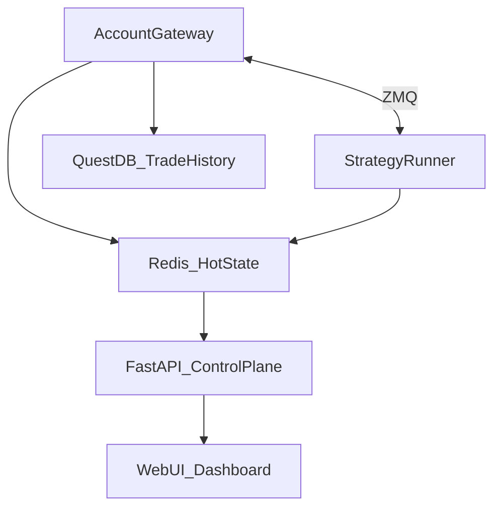
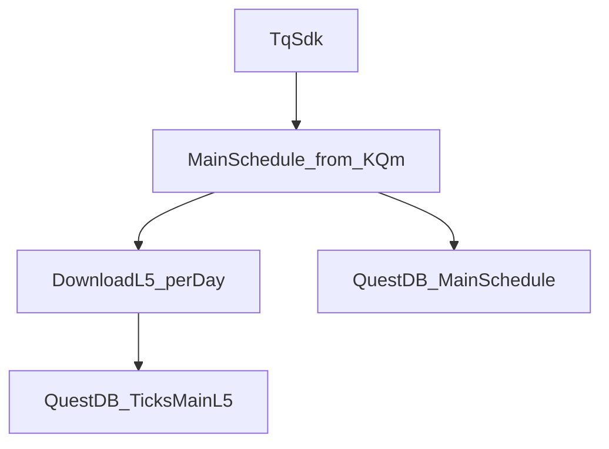

## ghTrader PRD (Product Requirements Document)

### Document control

- **Product**: ghTrader (research-only AI-centric SHFE tick system)
- **Scope**: SHFE CU/AU/AG directional micro-alpha research at tick/HFT granularity
- **Status**: Active (canonical)
- **Last updated**: 2026-02-21
- **Owner**: ghTrader maintainers

---

### Canonicality rules (single source of truth)

- This file (`PRD.md`) is the **only canonical plan/spec** for ghTrader.
- Any future design/implementation planning must:
  - **read and understand this PRD first**, then
  - **update/evolve this PRD** before or alongside code changes.
- Other documents (e.g. older planning docs (including `.cursor/plans/*`)) are **historical** and must not be treated as authoritative if they conflict with this PRD.

---

### Big-Bang alignment boundary (2026-02)

This section defines the current PRD-alignment cleanup scope.

- **In scope**:
  - align already implemented modules to PRD structure and current phase boundaries,
  - remove confirmed obsolete/deferred dead code and stale compatibility implementations,
  - normalize CLI and control-plane entry surfaces to canonical behavior.
- **Out of scope (this pass)**:
  - PRD modules currently marked **Pending** remain pending unless explicitly re-scoped in a future PRD update.
- **Compatibility policy**:
  - backward-compatible redirects (notably `/ops` -> canonical pages) may remain,
  - permanently deferred placeholder commands/APIs should be removed from the active surface rather than kept as dead stubs.
- **External pattern policy (Qlib / RD-Agent / Kronos)**:
  - these projects are used as **reference patterns only** (workflow/config/methodology),
  - ghTrader must not introduce them as runtime core dependencies in this phase,
  - any borrowed pattern must be implemented in-repo under current PRD boundaries.

---


## 1) Product overview

ghTrader is a **research-only**, AI-centric quantitative trading R&D system for **SHFE copper (CU), gold (AU), and silver (AG)**.

It provides a full loop:

- **Ingest**: historical and live **L5 tick** data via **TqSdk Pro (`tq_dl`)**
- **Store (canonical)**: QuestDB time-series DB for main_l5 + schedules (+ optional features/labels later)
- **Validate**: Phase-0 focuses on per-run manifests + schedule provenance only
- **Build**: causal factor features + event-time labels
- **Model**: tabular + deep sequence models, plus online calibration
- **Evaluate**: Tier1 backtest (TqBacktest) + Tier2 offline micro-sim
- **Continual**: daily refresh/train/eval/promote with rollback
- **Benchmark**: standardized offline metrics + latency profiling + comparisons

---

## 2) Goals and success criteria

### 2.1 Primary goals

- **Real-time Command & Control**: The Web UI is the primary cockpit, reflecting system state with <50ms latency.
- Build a **reproducible research platform** to iterate on directional micro-alpha for CU/AU/AG.
- Use the server’s compute (multi-CPU + multi-GPU) to:
  - train deep models daily,
  - run many backtests/sweeps in parallel,
  - support rapid model research.

### 2.2 Success criteria (what “good” looks like)

A model family is considered “better” when, on walk-forward evaluation:

- **Trading performance**: higher net PnL with controlled drawdown and turnover
- **Stability**: robust across contracts/regimes (not single-window overfit)
- **Latency**: meets paper-online latency budget (see §6.3)
- **Reproducibility**: every result can be reproduced from pinned code + manifest + config

---

### 2.3 Non-goals / out of scope

- **Live trading / real order routing** is out of scope until explicitly added (research-only default).
- Full OMS, risk engine, compliance automation.
- Exchange co-location / true microsecond execution.
- Perfect queue position modeling (Tier2 micro-sim is an approximation).

---

## 3) System Architecture

ghTrader employs a hybrid architecture to balance sub-millisecond trading latency with rich, user-friendly observability.

### 3.1 Hybrid Tri-Path Architecture [Implemented]

1. **Hot Path (Trading)**: ZeroMQ (PUB/SUB + REQ/REP).
   - **Latency**: < 1ms (Tick -> Signal -> Order).
   - **Components**: AccountGateway <-> StrategyRunner.
   - **Protocol**: Binary-safe IPC. No disk I/O. No polling.
   - **Failure policy**: No disk fallback for trading decisions. If ZMQ becomes unhealthy, StrategyRunner must stop emitting new targets and surface an explicit degraded/halt state.

2. **Warm Path (UI/Ops)**: Redis (State Cache) + WebSockets.
   - **Latency**: < 50ms (System -> UI).
   - **Components**: Gateway/Strategy -> Redis -> FastAPI -> Web UI.
   - **Protocol**: Redis Pub/Sub + JSON over WebSockets.
   - **Role**: Decoupled observability and command injection.
   - **UI update policy**: WebSocket-first; polling is degraded-mode fallback only (2s active tab, 30s background) when WS is unavailable.

3. **Cold Path (Audit/Data)**: QuestDB + Files.
   - **Latency**: Seconds/Minutes (Async).
   - **Components**: Gateway/Strategy -> Disk (Logs/Snapshots) -> QuestDB.
   - **Role**: Immutable audit trail, historical data, post-mortem analysis.
   - **Boundary**: Disk artifacts are audit mirrors only and must not be used as hot-path IPC inputs.

**Trading + Control-Plane Flow:**



**Data Pipeline Flow:**



### 3.2 Code Organization (Source Tree)

ghTrader is organized by domain. The PRD expects the following package boundaries under `src/ghtrader/`:

- `cli.py`: thin CLI entrypoint (delegates to `cli_commands/` command modules)
- `cli_commands/`: CLI command implementations (subcommands grouped by domain)
- `control/`: FastAPI control-plane (UI + APIs + job runner + SQLite stores + templates/static)
- `tq/`: **TqSdk-only** provider implementation (the only place `tqsdk` is imported besides `config.py`)
- `questdb/`: QuestDB query + schema + ingestion helpers (QuestDB is canonical store)
- `data/`: data lifecycle (calendar, manifests, trading sessions, main-schedule/main-l5 builders)
- `datasets/`: derived dataset builders (features/labels) and registries/validation
- `trading/`: runtime trading modules (Gateway/StrategyRunner adapters + generic order planning)
- `research/`: training/evaluation/benchmark/pipeline utilities
- `util/`: small shared helpers (e.g. JSON IO)
- `config.py`: environment/config loading and `TqAuth` construction
- `data_provider.py`: provider interfaces (`DataProvider`, `ExecutionProvider`)

**Repo Layout:**
- `src/ghtrader/`: Source code
- `tests/`: Unit tests
- `data/`: Local caches only (gitignored)
- `runs/`: Reports and runtime artifacts (gitignored)
- `artifacts/`: Model artifacts (gitignored)

### 3.3 Architecture Principles

- **Service boundaries**: Explicitly separate data build, training, and trading runtimes for failure isolation.
- **Artifact contracts**: Standardize manifest schemas for data/features/labels/models to enable reproducibility.
- **Event bus**: ZeroMQ for hot-path trading; Redis for UI/ops fanout.

---

## 4) Users and workflows

### 4.1 Primary users

- **Quant researcher**: builds datasets, trains models, evaluates trading performance
- **ML engineer**: implements/benchmarks model architectures and training pipelines
- **Infra engineer**: maintains data system (QuestDB + schedulers), scheduled training jobs, compute utilization

### 4.2 Core workflows

- **Data workflow (QuestDB-first)**: Minimal pipeline focused on a single canonical dataset:
  - **Step 1**: Build Schedule (TqSdk `KQ.m@...` → `quote.underlying_symbol`)
  - **Step 2**: Download L5 per trading day for the scheduled underlying contract
  - **Step 3**: Materialize `main_l5` in QuestDB (`ghtrader_ticks_main_l5_v2`)
  - (Optional, later) **Build Features/Labels → Train → Backtest/Trade**
- **Continual workflow**: `daily-train` (scheduled) → gated promotion → rollback on regression
- **Model research workflow**: `compare` and benchmarking reports across model families

---

## 5) Functional requirements

### 5.0 Phasing Strategy

ghTrader implementation is phased to prioritize data quality and research reproducibility before live trading.

- **Phase-0 (Current)**:
  - **Data**: Historical L5 ingest (TqSdk Pro), QuestDB canonical store, Schedule/Main-L5 build.
  - **Validation**: Per-run manifests, schedule provenance, basic field checks.
  - **Control**: Dashboard for schedule/ingest jobs, read-only system monitoring.
  - **Deferred**: Live recording, complex repair/backfill tools, coverage dashboards.

- **Phase-1 (Research)**:
  - **Features/Labels**: Feature store, parity tests, label leakage guardrails.
  - **Modeling**: Training pipeline, experiment tracking, model registry.
  - **Evaluation**: Backtesting (Tier1), offline micro-sim (Tier2).

- **Phase-2 (Trading)**:
  - **Execution**: Live trading with risk gates, TCA, kill-switches.
  - **Ops**: High-availability, failover, advanced monitoring.

### 5.1 Data ingest (historical) [Implemented]

- Must support historical **L5** tick download using **TqSdk Pro** (`tq_dl`).
- Must support chunking/resume to handle long ranges.
- Must write ingest manifests.
- **Writes directly to `ghtrader_ticks_main_l5_v2`** (no raw ticks persisted).
- **Optimization**: Support parallel day processing and batched ILP writes for 5x throughput.

#### 5.1.1 Symbol types and depth limitations (observed)

ghTrader uses two symbol classes, but only one is stored:

- **Specific contracts (data source)**:
  - Example: `SHFE.cu2602`
  - Provides **L5 depth** (`bid/ask_price1..5`, `bid/ask_volume1..5`)
  - Used to build the derived `main_l5` dataset
- **Continuous main alias (schedule source only)**:
  - Example: `KQ.m@SHFE.cu`
  - Provides **L1 only** in practice
  - **Not stored**; only used to determine daily underlying contract mapping

Implementation:
- `src/ghtrader/tq/main_schedule.py` (build schedule from `KQ.m@...`)
- `src/ghtrader/tq/ingest.py` (download L5 ticks per day and write to `main_l5`)

#### 5.1.2 Trading calendar correctness

Problem:
- Weekday-only calendars are incorrect for China futures (SHFE holidays exist).
- Some valid trading days may legitimately have **no ticks available** in TqSdk Pro history (e.g., data gaps, pre-listing boundary days). These must not cause infinite retries.

Requirements:
- **Trading day source**: use Shinny/TqSdk’s holiday list to compute trading days (no akshare dependency):
  - Source URL: `https://files.shinnytech.com/shinny_chinese_holiday.json` (configurable via `TQ_CHINESE_HOLIDAY_URL`)
  - Trading day rule: weekday AND not in holiday list (best-effort; cache locally).
- **Missing-day handling**:
  - For Phase-0, missing/empty days are recorded only in ingest manifests under `data/manifests/`.
  - No additional QuestDB tables are maintained beyond `ghtrader_ticks_main_l5_v2` and `ghtrader_main_schedule_v2`.

#### 5.1.2.1 Trading sessions metadata (TqSdk `quote.trading_time`)

Requirements:
- Capture `quote.trading_time` per variety (day/night sessions) from TqSdk.
- Persist the raw `trading_time` string and a normalized session list (start/end in `HH:MM:SS`).
- Allow end times beyond 24:00:00 (e.g. `25:00:00`) for night sessions; treat these as cross-midnight windows.
- Cache under `data/trading_sessions/` for Phase-0 (MVP); optionally mirror to QuestDB table `ghtrader_trading_sessions_v2` in Phase-1.
- Session metadata is used by later gap detection/diagnose; Phase-0 only requires capture + cache.

Implementation:
- `src/ghtrader/data/trading_sessions.py`
- `src/ghtrader/tq/runtime.py` (consumes cached calendar/session info for trading-day mapping when available)

#### 5.1.3 Data Provider Abstraction

While TqSdk is the current data provider, ghTrader should maintain a modular architecture that does not hard-code TqSdk throughout the codebase:

**Abstract interfaces**:
- `DataProvider`: Base interface for tick data providers
  - `download_historical(symbol, start, end) -> Iterator[TickBatch]`
  - `subscribe_live(symbols) -> AsyncIterator[Tick]`
  - `get_trading_calendar(exchange) -> List[date]`
  - `get_contract_info(symbol) -> ContractMetadata`

- `ExecutionProvider`: Base interface for order execution
  - `submit_order(symbol, side, quantity, price) -> OrderId`
  - `cancel_order(order_id) -> bool`
  - `get_positions() -> Dict[str, Position]`
  - `get_account() -> AccountSnapshot`

**Current implementation**:
- TqSdk is the sole implementation of both interfaces
- All **direct `tqsdk` imports** must be isolated in `src/ghtrader/tq/` modules (and `src/ghtrader/config.py` for `TqAuth` construction only).
- Core logic (features, models, evaluation) should not import TqSdk directly

**Future extensibility**:
- Architecture allows adding alternative data providers without major refactoring
- Potential future providers: CTP direct, other vendor APIs, replay providers
- Simulation providers (see Section 5.7) should implement the same interfaces

**TqSdk-specific requirements** (current implementation):
- TqSdk Pro (`tq_dl`) for historical L5 tick download
- TqSdk for live recording and trading execution
- Shinny authentication (`TqAuth`)
- Broker account integration for live trading

Implementation:
- `src/ghtrader/data_provider.py` (abstract interfaces, new module)
- `src/ghtrader/tq/ingest.py` (TqSdk implementation for data)
- `src/ghtrader/tq/gateway.py` (AccountGateway; owns TqApi connectivity + persists `runs/gateway/` artifacts)
- `src/ghtrader/tq/execution.py` (TqSdk execution primitives)
- `src/ghtrader/tq/runtime.py` (TqSdk runtime helpers: auth/account creation, snapshot shaping, symbol/profile normalization)


### 5.2 Tick storage (QuestDB-only) [Implemented]

- **Canonical tick store**: QuestDB stores only **main_l5** ticks for Phase-0.
- **Core tick tables (v2)**:
  - `ghtrader_ticks_main_l5_v2`
- **Schema**:
  - Must include full L5 columns.
  - Must store `datetime_ns` (int64 epoch-ns) and a QuestDB `TIMESTAMP` column `ts`.
  - Must store provenance columns `dataset_version`, `underlying_contract`, `segment_id`, `schedule_hash`.
- **Optimization**: Tune O3 commit lag (10min for backfill) and leverage partition pruning.

Implementation:
- `src/ghtrader/questdb/serving_db.py` (QuestDB schema + ingestion)

#### 5.2.1 Dataset/version selection (v2 only)

- There is no dataset version toggle; all ingestion and downstream builds use **v2**.
- All QuestDB tables and index rows must include `dataset_version='v2'` for future-proofing, but mixing across versions is not supported.


#### 5.2.2 Data integrity validation (Phase-0 minimal)

Phase-0 focuses on **main_l5 correctness only**:
- Each `main_l5` row includes `underlying_contract`, `segment_id`, and `schedule_hash`.
- Ingest writes a manifest under `data/manifests/` for reproducibility.
- Validation layering is explicit to avoid duplicated requirements:
  - `5.2.2`: day/session coverage + cadence/gap summary (minimal integrity baseline)
  - `5.2.6`: field-level null/anomaly checks
  - `5.2.7`: intra-day gap ledger/statistics
- **Main_l5 validation (Phase-0)**:
  - Validate coverage against **actual trading sessions** (night sessions + holidays) using cached `trading_time` from TqSdk.
  - **Optimization**: Support incremental validation (check only new days) and parallel execution.
  - Respect **exchange-level session overrides**:
    - Skip night sessions during known suspension windows (e.g., SHFE night trading suspended from 2020-02-03 through 2020-05-06) in addition to holiday-gap skips.
    - Handle **one-off delayed night opens** (e.g., SHFE 2019-12-25 delay to 22:30, applied to the 2019-12-26 trading day) by shifting the expected night-session start.
  - **Hybrid cadence detection** (per trading day):
    - If `seconds_with_two_plus / seconds_with_ticks >= strict_ratio`, treat day as **fixed 0.5s cadence** and enforce per-second frequency (2 ticks/sec, boundary seconds tolerant).
    - Otherwise treat as **event-driven** and only flag gaps above a threshold.
  - **Gap threshold**: gaps shorter than `gap_threshold_s` are ignored to avoid false positives from natural sparsity.
  - **Detect + report only** (no auto-repair): missing segments (>= threshold), missing half-seconds (strict days), and summary counts.
  - **Best-effort source attribution**: mark gaps as TqSdk-source when provider returns no data; otherwise `unknown`.
  - Persist to QuestDB:
    - Summary table: `ghtrader_main_l5_validate_summary_v2` (symbol + trading_day + cadence stats + gap counts)
    - Gap detail table: `ghtrader_main_l5_validate_gaps_v2` (per-gap rows; capped per day)
  - Write a validation report under `runs/control/reports/main_l5_validate/` and surface a summary in `/data`.
#### 5.2.3 Update semantics (Phase-0, safe + idempotent)

- **main_schedule**:
  - If the computed schedule hash and latest trading day match what is already stored for `(exchange, variety)`, the build is a **no-op**.
  - Otherwise, rebuild by clearing the existing schedule for that `(exchange, variety)` and writing the new schedule.
- **main_l5**:
  - Default behavior is **full rebuild** (clear then re-ingest).
  - Optional **incremental update** mode may backfill only missing trading days **only if** the schedule hash matches the stored rows.
  - If the stored schedule hash differs or multiple hashes exist for the same derived symbol, a full rebuild is required.
- **Idempotence**:
  - QuestDB tables use DEDUP UPSERT KEYS with `row_hash` so re-ingest does not create duplicates.
  - Update runs should emit a lightweight report under `runs/control/reports/` with expected days vs present days, plus a coverage watermark (last trading day + last tick timestamp).


#### 5.2.4 Database / query layer (QuestDB-only)

Canonical data stored in QuestDB is reduced to:

- **Main schedule**: `ghtrader_main_schedule_v2`
- **Main L5 ticks**: `ghtrader_ticks_main_l5_v2`
  - Time semantics must be explicit:
    - Store `datetime_ns` (int64 epoch-ns from TqSdk) AND `ts` (QuestDB timestamp).
    - Store `trading_day` as an explicit column for per‑day ingestion.
  - Ingestion must be idempotent and provenance-aware (`dataset_version`, `row_hash`, `underlying_contract`, `segment_id`, `schedule_hash`).

- **No embedded file-based SQL engine**:
  - ghTrader does not ship a local SQL engine for file-based datasets. The dashboard explorer is QuestDB-only.

- **Dashboard SQL Explorer (QuestDB-backed)**:
  - HTML: `/explorer`
  - JSON: `POST /api/questdb/query`
  - Guardrails: read-only (single-statement `SELECT`/`WITH` only), capped row limits, and intended for local-only access via SSH forwarding.

QuestDB is the chosen canonical tick store for this phase.

#### 5.2.5 Best-in-class data governance (alignment)

- **Lineage manifests**: each derived dataset build must emit a QuestDB‑stored manifest (config hash, source tables, schedule hash, row_hash summary).
- **Backfill governance**: define allowed backfill windows, approval rules, and change‑log records for any historical corrections.
- **Data SLIs/SLOs**: set explicit freshness/completeness targets and track error budgets in the control plane.

#### 5.2.6 Field-level Quality Validation (QuestDB-only)

Day-level completeness is necessary but not sufficient for tick data. ghTrader must validate field-level completeness and quality within each `(symbol, trading_day, ticks_kind, dataset_version)` partition.

Required field completeness:
- For each partition, compute per-field null/NaN rates for critical fields.
  - L1 required (all tick sources): `bid_price1`, `ask_price1`, `last_price`, `volume`, `open_interest`
  - L5 required (specific contracts; when L5 is expected): `bid_price2..5`, `ask_price2..5`, `bid_volume2..5`, `ask_volume2..5`
- Thresholds (defaults; configurable later):
  - L1 null rate > 1% → **ERROR**
  - L5 null rate > 5% → **WARNING** (because some sources may be depth-limited)

Consecutive missing segments:
- Detect runs of consecutive ticks where a critical field is null/NaN.
- Threshold (default): >100 consecutive ticks with missing `bid_price1` → **ERROR**.

Outlier pre-detection (flagging only; do not auto-correct):
- Price jumps: \(|price[t] - price[t-1]| > k * rolling_std\) (k=5 default)
- Volume spikes: \(volume[t] > k * rolling_median\) (k=10 default)
- Spread anomalies: \((ask - bid) > k * historical_spread_p95\) (k=3 default)
- Session-aware filtering: ignore cross-session deltas and optionally ignore warmup/cooldown windows at session open/close.

Storage (QuestDB):
- Table: `ghtrader_field_quality_v2` (symbol/day-level quality ledger)
  - columns include: `symbol`, `trading_day`, `ticks_kind`, `dataset_version`, `rows_total`
  - per-field null rates (wide columns for L1 + an aggregate L5 null rate) and anomaly counters
  - consecutive-missing metadata (JSON string)

Implementation:
- `src/ghtrader/data/field_quality.py`

#### 5.2.7 Intra-day Gap Detection (QuestDB-only) [Partial]

For high-frequency strategies, missing ticks within a trading day can invalidate backtests and live signals even when day-level completeness passes.

Phase-0 status:
- QuestDB gap ledger persistence is implemented and queryable.
- Full inter-tick interval distribution modeling (median/p95/p99 from raw interval scan) remains pending.

Inter-tick interval analysis:
- Compute inter-tick interval statistics per `(symbol, trading_day)` using `datetime_ns`.
- Detect anomalous gaps: interval > p99_threshold (default heuristic, e.g. >60s for normally active contracts).
- Distinguish trading vs non-trading hours when possible (best-effort; do not block dashboard reads).

Expected tick count modeling:
- For liquid contracts, define a minimum expected tick count (heuristic or historical baseline) and flag abnormally low days.
- Default baseline is adaptive: compare to recent historical distribution (p10/p50/p90) when available.
- Diagnostics should include lookback size, sample count, and p10/p90 values in the diagnose report.

Gap categorization:
- Normal: known non-trading windows (exchange closure / lunch break) when calendar/session metadata is available.
- Suspicious: unexplained >30s gaps during active hours.
- Critical: >5min gaps during active hours.

Storage (QuestDB):
- Table: `ghtrader_tick_gaps_v2` (symbol/day-level gap ledger)
  - interval stats (median/p95/p99/max)
  - abnormal gap counts and largest-gap metadata

Implementation:
- `src/ghtrader/questdb/main_l5_validate.py` (tick gap table schema + upsert path)
- `src/ghtrader/data/main_l5_validation.py` (validation pipeline integration)
- `src/ghtrader/data/gap_detection.py` (query/read surface for dashboard and diagnostics)

#### 5.2.8 Derived dataset: “main-with-depth” (materialized continuity with L5)

Because `KQ.m@...` continuous symbols are L1-only, ghTrader must support a derived dataset that provides:

- **Continuity of the main contract over time**
- **L5 depth** (sourced from the underlying specific contract ticks)

Definition:

- The derived symbol is named like the continuous series (e.g. `KQ.m@SHFE.cu`), but it is **materialized** from L5 ticks of the underlying contract selected by the roll schedule (§5.2.9).
- Output is written to QuestDB table `ghtrader_ticks_main_l5_v2` (`ticks_kind='main_l5'`, `dataset_version='v2'`).
- Provenance must be recorded (schedule hash, underlying contracts used, row counts per day).
- **L5-only guarantee**: `main_l5` must contain **only true L5 rows** (levels 2–5 present). Any L1-only rows are filtered out, and any trading day with zero L5 rows is skipped.

Segment metadata contract (required for correctness):

- The roll schedule must include a **segment id** that increments each time `main_contract` changes.
  - `segment_id` is stable and deterministic for a given schedule.
- Every derived `main_l5` tick row must include:
  - `underlying_contract` (string): the specific contract used for that trading day (e.g. `SHFE.cu2602`)
  - `segment_id` (int): schedule segment id for that trading day
- Derived features and labels must **propagate** `underlying_contract` and `segment_id` so downstream datasets can enforce no roll-boundary leakage.

Sequence semantics (critical for ML correctness):

- Feature/label sequences **must not cross roll boundaries**.
- Dataset builders must enforce that a training example comes from a **single segment** (constant `segment_id`) / underlying contract.
  - Default behavior is to **exclude cross-boundary windows** rather than attempting price-splice or boundary token hacks.

Builder semantics for derived ticks (critical):
- When building features on derived main-with-depth ticks (`ghtrader_ticks_main_l5_v2`, `ticks_kind='main_l5'`):
  - rolling-window state (lookback tail) must be **reset** when the underlying contract changes between adjacent trading days.
- When building labels on derived main-with-depth ticks (`ghtrader_ticks_main_l5_v2`, `ticks_kind='main_l5'`):
  - cross-day lookahead must be **disabled** when the underlying changes between adjacent trading days (end-of-day labels become NaN rather than leaking).
- Materialization must persist schedule provenance (QuestDB-first):
  - store `schedule_hash` and other provenance metadata (underlying contract, segment id) in the derived tick rows and/or a small QuestDB metadata table keyed by `schedule_hash`
  - the roll schedule is stored in QuestDB (see §5.2.9); there is no file-based schedule export
  - optional debugging-only artifacts (e.g. a JSON summary of a schedule build) may be written under `runs/` as reports, but must not be required for runtime resolution

#### 5.2.9 Main continuous roll schedule source (TqSdk main mapping only)

Default source: TqSdk main continuous alias `KQ.m@EXCHANGE.var`. We treat the schedule as **given**, not invented by ghTrader.

Primary rule (TqSdk main mapping):
- Use `quote.underlying_symbol` for `KQ.m@...` to determine the active main contract.
- Build the schedule by running TqSdk in backtest mode for the target date range and capturing every change event (`api.is_changing(quote, "underlying_symbol")`).
- Each change is effective from the **next trading day open (T+1)**.
- **No intraday switching**.
- Expand change events into a **daily** schedule and assign `segment_id` that increments on each underlying change.
- Persist to QuestDB table `ghtrader_main_schedule_v2` with a stable `schedule_hash`.

Coverage constraints:
- For the “main-with-depth” dataset, the effective schedule range must start at the earliest date where the main contract has **true L5** available (levels 2–5 non-null/non-NaN), to avoid mixing L1-only eras into depth-model training.
- Days outside the L5-available era are excluded from `main_l5`.
- **Manual L5 start (Phase‑0)**:
  - Operator runs `ghtrader data l5-start --exchange SHFE --var cu` to probe TqSdk L5 availability and write a report under `runs/control/reports/l5_start/`.
  - Operator **sets `GHTRADER_L5_START_DATE=YYYY-MM-DD` in `.env`** (global) based on the report.
  - `ghtrader main-schedule` **always reads `GHTRADER_L5_START_DATE`** as its start date and **builds through the latest trading day** (no CLI/UI date inputs).
  - When the env value changes, schedule and `main_l5` must be rebuilt to reflect the new range.
- **Schedule alignment (Phase-0)**:
  - After `main_l5` builds, align `main_schedule` start to the **actual first L5 trading day** derived from the earliest tick timestamp (night-session aware).
  - Drop earlier schedule rows while keeping the original `schedule_hash` stable for the remaining rows.

Implementation:
- `src/ghtrader/tq/main_schedule.py` (TqSdk backtest + `underlying_symbol` events)
- `src/ghtrader/data/main_schedule.py` (event list → daily schedule)
- `src/ghtrader/questdb/main_schedule.py` (persist/resolve)

Continuous code semantics (vendor conventions):

- “88-style” continuous = simple splice (no price smoothing).
- “888-style” continuous = back-adjusted prices across rolls (not appropriate for tick microstructure).

ghTrader’s derived “main-with-depth” dataset uses **88-style splice semantics** (no smoothing).

### 5.3 Features (structured factor library, causal) [Implemented]

ghTrader must compute features causally (no future information leakage) and provide both offline batch and online incremental computation.

#### 5.3.1 Factor Taxonomy

Factors are organized into a structured taxonomy for maintainability and research:

**Microstructure factors**:
- **Order flow**: Order Flow Imbalance (OFI), VPIN (Volume-synchronized PIN), Kyle's Lambda (price impact coefficient)
- **Liquidity**: Bid-ask spread (quoted/effective/realized), depth at each level, liquidity resilience (recovery speed)
- **Price impact**: Amihud illiquidity, Pastor-Stambaugh liquidity risk, temporary/permanent impact decomposition
- **Information**: PIN (Probability of Informed Trading), adverse selection components

**Technical factors**:
- **Momentum**: Returns at multiple horizons (1/5/10/50/100/500 ticks), momentum acceleration
- **Volatility**: Realized variance, GARCH-style predictions, HAR-RV (Heterogeneous Autoregressive RV), Parkinson/Garman-Klass estimators
- **Volume**: VWAP deviation, volume profile (time-of-day patterns), volume surprises
- **Patterns**: Tick-level patterns, support/resistance proximity (rolling extrema)

**Order book factors**:
- **Imbalance**: Multi-level imbalances (L1-L5), weighted imbalances, imbalance derivatives
- **Pressure**: Weighted bid/ask pressure indices, cumulative depth ratios
- **Shape**: Book curvature (second derivative of depth), concentration (Herfindahl of depth), slope
- **Dynamics**: Quote arrival rates, cancellation rates, quote lifetime statistics

**Cross-asset factors**:
- **Correlation**: Rolling correlations between CU/AU/AG, dynamic conditional correlation (DCC)
- **Cointegration**: Spread dynamics, error correction terms, half-life of mean reversion
- **Lead-lag**: Granger causality features, cross-correlation at various lags

**Derived/learned factors**:
- **PCA factors**: Principal components of raw feature matrix
- **Autoencoder latents**: Learned low-dimensional representations from deep autoencoders
- **Regime indicators**: HMM state probabilities, changepoint detector outputs

#### 5.3.2 Computation Requirements

- Must compute features causally (only use data up to time t for feature at time t)
- Must provide:
  - **Offline batch computation**: Process historical data efficiently
  - **Online incremental computation**: Ring-buffer design for real-time feature updates
- Must support configurable lookback windows per factor
- Must handle missing data gracefully (forward-fill, interpolation, or NaN propagation)

#### 5.3.3 Storage (QuestDB-only)

Features must be stored in QuestDB table `ghtrader_features_v2` (not as filesystem files) with:
- Primary time column `ts` and `datetime_ns`
- `symbol`, `trading_day`, `dataset_version`, `ticks_kind`
- Factor columns (wide schema) or a stable long-form schema (if wide is too dynamic)
- Build metadata recorded in QuestDB (build id/config hash, factor set, lookback config)

#### 5.3.4 Feature Store Architecture

ghTrader must implement feature store principles to ensure consistency between training and serving:

**Training-Serving Parity**:
- Feature computation logic must be identical for offline (batch) and online (real-time) modes
- Same code path must be used for both, parameterized only by data source (historical vs live)
- Any discrepancy (training-serving skew) must be detected and flagged as an error
- Feature definitions should be declarative where possible (config-driven)

**Point-in-Time Correctness**:
- Features retrieved for training must reflect exactly what was available at that timestamp
- No lookahead: feature at time T must only use data from times <= T
- This is critical for backtesting validity and avoiding future information leakage
- Feature joins must use event-time semantics, not wall-clock time

**TTL (Time-to-Live) and Staleness**:
- Online features must have configurable TTL per feature type
- If a feature value is older than TTL, serve null or raise staleness error (configurable)
- Default TTL: 30 minutes for intraday features, 1 day for daily features
- Staleness monitoring must be integrated with anomaly detection (Section 5.13)

**Materialization**:
- **Batch materialization**: End-of-day or end-of-session push of computed features to online store
- **Incremental materialization**: Per-tick or per-minute updates for real-time features
- Materialization cadence must be configurable per feature type
- Materialization jobs must be idempotent (safe to retry)

**Offline Store**:
- QuestDB `ghtrader_features_v2` table for full historical feature data
- Supports point-in-time joins for training dataset generation
- Partitioned by `trading_day` for efficient queries

**Online Store**:
- In-memory or Redis-backed store for low-latency feature retrieval during inference
- Keyed by `(symbol, feature_name)` with latest value and timestamp
- Must support sub-10ms retrieval latency for real-time trading

**Lineage and Versioning**:
- Track which raw data columns contribute to each derived feature
- Feature definitions must be versioned; incompatible changes require new version
- Breaking changes (schema, semantics) must increment major version
- Storage: `ghtrader_feature_registry_v2` table with:
  - `feature_name`, `version`, `definition_hash`
  - `input_columns` (JSON array), `output_dtype`
  - `lookback_ticks`, `ttl_seconds`
  - `created_at`, `deprecated_at`

#### 5.3.5 Best-in-class feature store hardening (alignment)

- **Parity tests**: enforce offline/online feature parity with golden replays.
- **Staleness SLAs**: per‑feature TTL SLOs; alert when breached.
- **Schema governance**: breaking‑change protocol with automatic version bump and migration notes.

#### 5.3.6 Automatic Feature Engineering

ghTrader should support automated feature generation and selection:

**Feature generation**:
- Automated operator application: lag(n), diff(n), rolling_mean(n), rolling_std(n), ewm(span)
- Interaction features: products, ratios of base features
- Polynomial features: degree-2 combinations (with sparsity control)

**Feature selection**:
- Recursive Feature Elimination (RFE) with cross-validation
- SHAP-based importance ranking
- Mutual information scoring
- Correlation-based redundancy filtering

**Feature store**:
- Centralized registry of all features with metadata
- Lineage tracking (which raw columns → which derived features)
- Version control for feature definitions
- Storage: `ghtrader_feature_registry_v2` table

**Feature validation**:
- Distribution drift detection (KS test, PSI)
- Staleness checks (feature not updated recently)
- Range/sanity checks (detect anomalous feature values)

#### 5.3.7 Alternative Data Integration (future scope)

ghTrader architecture should support integration of alternative data sources:

- **Sentiment**: Chinese financial news, social media (Weibo, Xueqiu), analyst reports
- **Macroeconomic**: PMI, CPI releases, industrial production data
- **Fundamental**: SHFE warehouse inventory reports, import/export data
- **Cross-market**: LME copper prices, USD/CNY exchange rate, related commodity indices

Alternative data must be:
- Timestamped precisely for causal alignment
- Stored with appropriate latency modeling (publication delay)
- Validated for predictive value before production use

Implementation:
- `src/ghtrader/datasets/features.py` (`FactorEngine`)
- `src/ghtrader/datasets/feature_store.py` (new module for registry/validation)

### 5.4 Labels (event-time, multi-horizon) [Partial]

ghTrader supports multiple label types for different prediction tasks.

Phase-0 status:
- Direction labels (`DOWN/FLAT/UP`) are implemented in the canonical pipeline.
- Fill-probability labels are implemented (`ghtrader_fill_labels_v2`, `src/ghtrader/fill_labels.py`).
- Execution-cost labels remain pending (see 5.4.3).

#### 5.4.1 Direction Labels (price movement prediction)

- Define mid price: `mid = (bid_price1 + ask_price1) / 2`.
- Horizons: configurable list (default `{10, 50, 200}` ticks).
- Threshold: `k * price_tick` (default `k=1`).
- 3-class label: DOWN/FLAT/UP based on `mid[t+N] - mid[t]`.

Storage: `ghtrader_labels_v2` table with:
- `ts`, `datetime_ns`, `symbol`, `trading_day`
- one column per configured horizon (e.g. `label_10`, `label_50`, `label_200`)
- label-build metadata recorded in QuestDB (threshold, horizons, config hash)

#### 5.4.2 Fill Probability Labels (execution prediction) [Implemented]

For execution optimization models (KANFormer-style), ghTrader must support fill probability labels:

**Time-to-fill labels**:
- For hypothetical limit orders at various price levels (best bid, best bid - 1 tick, etc.)
- Label: time (in ticks or milliseconds) until order would be filled
- Censored if not filled within horizon (survival analysis framing)

**Fill probability labels**:
- Probability that a limit order at price P would be filled within N ticks
- Computed from historical LOB dynamics and queue position estimation
- Multiple horizons: N = {10, 50, 100, 500} ticks

**Queue position estimation**:
- Estimate queue position for hypothetical order based on current depth
- Track queue dynamics (arrivals, cancellations, executions ahead)
- Label: estimated queue position at each tick

Storage: `ghtrader_fill_labels_v2` table with:
- `ts`, `datetime_ns`, `symbol`, `trading_day`
- `price_level` (offset from best bid/ask in ticks)
- `side` (bid/ask)
- `time_to_fill_{horizon}` (NULL if not filled)
- `fill_prob_{horizon}` (probability estimate)
- `queue_position` (estimated position in queue)

#### 5.4.3 Execution Cost Labels (for TCA)

For transaction cost analysis and execution optimization:

**Realized slippage labels**:
- For historical orders: actual execution price vs arrival price
- Decomposed into: spread cost, market impact, timing cost
- Requires execution log data (from trading runs)

**Market impact labels**:
- Price movement caused by order (temporary and permanent)
- Estimated from LOB dynamics around large trades
- Used to calibrate market impact models

Storage: `ghtrader_execution_labels_v2` table with:
- `ts`, `order_id`, `symbol`, `trading_day`
- `arrival_price`, `execution_price`, `slippage_ticks`
- `spread_cost`, `impact_cost`, `timing_cost` (decomposition)
- `order_size`, `execution_duration`

#### 5.4.4 Label Computation Requirements

All label types must:
- Be computed causally (no lookahead beyond the label horizon)
- Handle contract roll boundaries (no cross-contract labels)
- Be stored with build metadata (config hash, computation timestamp)
- Support incremental computation for new data

Implementation:
- `src/ghtrader/datasets/labels.py` (direction labels)
- `src/ghtrader/fill_labels.py` (fill probability labels)
- `src/ghtrader/execution_labels.py` (execution cost labels, new module)

#### 5.4.5 Best-in-class label governance (alignment)

- **Leakage guardrails**: enforce purged/embargoed splits for label generation and evaluation.
- **Label schema versioning**: breaking changes require new label version with explicit migration notes.
- **Label SLIs**: track label coverage, horizon consistency, and missing‑label rates.

### 5.5 Modeling (offline) [Implemented]

We maintain a **model ladder** (simplest → most powerful), and choose winners by trading outcomes + latency gates:

*Note: Tabular baselines, standard deep models (DeepLOB, Transformer, TCN, TLOB, SSM), and SOTA architectures (T-KAN, LOBERT, KANFormer) are implemented.*

#### 5.5.1 Tabular Baselines
- Logistic Regression (interpretable baseline)
- XGBoost (gradient boosting with regularization)
- LightGBM (fast, handles high-cardinality features)

#### 5.5.2 Deep Sequence Models
- **DeepLOB-style CNN+LSTM**: Convolutional feature extraction + recurrent sequence modeling
- **Transformer encoder**: Self-attention for tick sequences
- **TCN (Temporal Convolutional Network)**: Dilated causal convolutions, strong latency/performance tradeoff
- **TLOB dual-attention transformer**: Explicit spatial (LOB levels) + temporal (sequence) attention
- **SSM/Mamba-style**: Fast linear-time sequence modeling (O(n) vs O(n²) attention)

#### 5.5.3 Advanced Architectures (extended model zoo)
- **Temporal Fusion Transformer (TFT)**: Multi-horizon forecasting with interpretable variable selection and attention
- **PatchTST**: Patch-based transformer for time series (channel-independent, proven SOTA on benchmarks)
- **Informer/Autoformer**: Long-sequence efficient transformers with ProbSparse attention
- **TimesNet**: Multi-scale temporal modeling via 2D convolutions on period-frequency representations
- **N-BEATS/N-HiTS**: Interpretable neural basis expansion with hierarchical interpolation

#### 5.5.4 Probabilistic Models (uncertainty quantification)
- **Quantile regression networks**: Direct quantile prediction for confidence intervals
- **Mixture Density Networks (MDN)**: Multi-modal price distribution modeling
- **Bayesian neural networks**: Epistemic uncertainty via weight distributions (MC Dropout or variational)
- **Normalizing flows**: Flexible density estimation for return distributions
- **Deep Ensembles**: Uncertainty via ensemble disagreement

#### 5.5.5 Foundation Models for Finance (transfer learning)
- **Pre-trained LOB encoders**: Self-supervised pre-training on tick sequences (masked prediction, contrastive learning)
- **Transfer learning**: Fine-tune from larger tick datasets or cross-market pre-training
- **Contrastive learning**: Learn market state representations via SimCLR/MoCo-style objectives

#### 5.5.6 Reinforcement Learning (execution and strategy optimization)
- **PPO/SAC agents**: On-policy/off-policy RL for execution optimization
- **Offline RL**: Conservative Q-Learning (CQL), Decision Transformer for learning from historical executions
- **Multi-agent RL**: Market simulation with competing agents for robustness testing

#### 5.5.7 SOTA LOB Architectures (2025-2026) [Implemented]

- **T-KAN (Temporal Kolmogorov-Arnold Networks)**: Learnable B-spline edges in LSTM gates. High interpretability and FPGA-optimizable. (arXiv:2601.02310)
- **LOBERT (Foundation Model)**: BERT-style encoder for LOB messages with PLGS scaling and MMM pretraining. (arXiv:2511.12563)
- **KANFormer**: Hybrid CNN+Transformer+KAN for fill probability and time-to-fill prediction. (arXiv:2512.05734)
- **LOBDIF (Diffusion)**: Diffusion model for joint event-type and timing prediction. (arXiv:2412.09631)
- **Siamese MHA+LSTM**: Exploits bid-ask symmetry with shared networks and multi-head attention. (arXiv:2505.22678)

Model selection criteria:
- Walk-forward trading outcomes (PnL, Sharpe, max drawdown)
- Latency gates (inference time < budget for paper-online feasibility)
- Stability across symbols, contract rolls, and market regimes
- Uncertainty calibration (for probabilistic models)
- **Alpha decay analysis**: Performance at multiple horizons (k=10, 50, 100, 200) to assess predictability degradation
- **Transaction cost-adjusted returns**: Simulated PnL under realistic spread/slippage (not just classification accuracy)
- **Calibration quality**: Brier score, reliability diagrams, Expected Calibration Error (ECE)
- **Fill probability metrics**: For execution models - AUC, C-index, time-to-fill MAE

Implementation:
- `src/ghtrader/research/models.py`

#### 5.5.8 Ensemble and Stacking Framework

ghTrader must support model ensembles to improve prediction robustness and reduce variance:

**Ensemble strategies**:
- **Voting ensembles**: Simple/weighted averaging of predictions across models
- **Stacking**: Meta-learner trained on base model outputs
- **Blending**: Holdout-based stacking variant for reduced overfitting
- **Boosting ensembles**: Sequential error correction (for tabular models)

**Dynamic ensemble management**:
- Automatic model selection based on recent rolling performance (e.g., last N trading days)
- Dynamic weight adjustment: exponential weighting by recent accuracy or Sharpe
- Diversity metrics: ensure ensemble members provide complementary predictions (correlation penalties)
- Regime-conditional weights: different ensemble weights per detected market regime

**Ensemble configuration**:
- Storage: `ghtrader_ensemble_configs_v2` table with:
  - `ensemble_id`, `created_at`, `config_hash`
  - `member_models` (JSON array of model artifact references)
  - `weights` (JSON array or null for equal weighting)
  - `strategy` (voting/stacking/blending)
  - `performance_window_days` (for dynamic weighting)
- Must support versioning and rollback of ensemble configurations

**Ensemble inference**:
- Must aggregate predictions efficiently (single forward pass per member)
- Must provide uncertainty estimates from ensemble disagreement
- Must log per-member predictions for debugging and attribution

Implementation:
- `src/ghtrader/ensemble.py` (new module)

#### 5.5.9 Best-in-class model risk controls (alignment)

- **Risk tiering**: classify models by latency/complexity and apply stricter gates to higher‑risk tiers.
- **Robustness tests**: require regime‑split validation and stress scenarios before promotion.
- **Significance gates**: require statistical confidence (bootstrap CIs) on PnL metrics before promotion.

### 5.6 Online calibrator (stacked learning) [Implemented]

- Must support intraday adaptation by fitting on delayed event-time labels.
- Must include guardrails: disable-on-instability, performance monitoring.
- **Drift detection**: Integrated with Section 5.13 Anomaly and Drift Detection framework
  - Monitor feature drift (input distribution changes)
  - Monitor concept drift (label distribution changes)
  - Trigger recalibration or fallback when drift exceeds thresholds
- Input: `[model_probs_or_logits] + [factor_vector]`.

Implementation:
- `src/ghtrader/research/online.py` (`OnlineCalibrator`, `DelayedLabelBuffer`)
- `src/ghtrader/tq/paper.py` (`run_paper_trading`)  # TqSdk-specific loop (see §5.1.3)
- Drift detection via `src/ghtrader/anomaly.py` (see Section 5.13)

#### 5.6.1 Best-in-class drift SLAs (alignment)

- Define **drift SLAs** (warning/critical thresholds) per model family.
- Tie **rollback** rules to drift + execution anomaly thresholds.
- Require **fallback policy** (simple baseline model) for critical drift events.

### 5.7 Evaluation and Simulation [Implemented]

ghTrader provides a unified evaluation and simulation framework spanning backtesting, micro-simulation, and synthetic market generation.

#### 5.7.1 Tier1: TqBacktest Harness

- Uses TqSdk's backtest mode for realistic order execution simulation
- Supports paper trading evaluation against historical data
- Fast iteration for strategy validation

Implementation: `src/ghtrader/tq/eval.py` (Tier1 TqBacktest harness; TqSdk-specific)

#### 5.7.2 Tier2: Offline Micro-Sim

- Higher fidelity simulation with latency modeling and partial fill approximations
- Queue position estimation for limit orders
- Configurable market impact models
- Suitable for execution algorithm testing

Implementation: `src/ghtrader/research/pipeline.py` (`OfflineMicroSim`)

#### 5.7.3 Order Book Simulator (for RL training)

For reinforcement learning and advanced strategy testing, ghTrader must support synthetic LOB simulation:

- **Realistic LOB dynamics**: Order arrival/cancellation processes based on Hawkes or Poisson models
- **Queue behavior**: Accurate queue position tracking and fill probability modeling
- **Configurable market maker behavior**: Adjustable liquidity provision patterns
- **Historical replay with order injection**: Replay real tick data while injecting hypothetical orders
- **Synthetic tick generation**: Generate stress test scenarios (flash crash, liquidity crisis)

#### 5.7.4 Market Generator

For data augmentation and robustness testing:

- **Statistical tick arrival models**: Hawkes processes (self-exciting), Poisson with time-varying intensity
- **Volatility clustering**: GARCH-style volatility dynamics
- **Jump processes**: Occasional large price moves (Poisson jumps)
- **Correlation structure**: Multi-asset generation with realistic cross-correlations (CU/AU/AG)
- **Regime-conditional generation**: Different parameters per market regime (trending/mean-reverting/volatile)

#### 5.7.5 Multi-Agent Simulation

For strategy robustness and market impact analysis:

- **Multiple interacting strategies**: Simulate competing agents in the same market
- **Agent diversity**: Mix of trend-followers, mean-reverters, noise traders
- **Market impact feedback**: Strategies affect prices, which affects other strategies
- **Crowding detection**: Identify when strategies are too correlated

#### 5.7.6 Replay with Modification

For counterfactual analysis and execution optimization:

- **Historical replay with hypothetical orders**: What would have happened if we traded differently?
- **Execution strategy comparison**: A/B test execution algorithms on same historical data
- **Counterfactual PnL estimation**: Estimate alternative strategy performance

Implementation:
- `src/ghtrader/tq/eval.py` (Tier1)
- `src/ghtrader/research/pipeline.py` (`OfflineMicroSim` for Tier2)
- `src/ghtrader/simulator.py` (new module for LOB simulation, market generation, multi-agent)

#### 5.7.7 Best-in-class evaluation rigor (alignment)

- **Statistical significance**: require bootstrap CIs for core PnL metrics and Sharpe.
- **Stress protocols**: run scenario tests (volatility spikes, liquidity droughts, spread widening).
- **Leakage audits**: ensure event‑time correctness and embargoed splits for all benchmarks.

### 5.8 Continual training + promotion [Implemented]

Daily job must:

1. Refresh data
2. Build features/labels
3. Train candidate model(s)
4. Evaluate
5. Apply promotion gates
6. Roll back on regression

Implementation:
- `src/ghtrader/research/pipeline.py` (`run_daily_pipeline`, `PromotionGate` in `eval.py`)

#### 5.8.1 Best-in-class continual training governance (alignment)

- **Pipeline SLOs**: daily run must complete within defined window; alert on breach.
- **Reproducibility bundle**: store code hash + data manifest + config snapshot per run.
- **Automatic rollback**: require explicit rollback trigger policy and audit trail.

### 5.9 Benchmarking and comparisons [Implemented]

ghTrader must provide comprehensive benchmarking that goes beyond classification accuracy to include trading-relevant metrics.

#### 5.9.1 Standard Metrics

- Must produce standardized JSON reports:
  - Offline metrics (accuracy/F1/logloss/ECE)
  - Latency stats (inference time p50/p95/p99)
  - Trading metrics (see below)
- Offline benchmarking must use **walk-forward evaluation** with **multiple splits** when data volume permits (target: **≥5 splits**; fewer splits allowed for short ranges).
- Reports must include:
  - **per-split metrics**
  - **aggregate mean/std** across splits (at minimum: accuracy, F1-macro, logloss, ECE)
  - **calibration bin stats** (for reliability diagrams)
- Must support comparing multiple model families.

#### 5.9.2 Transaction Cost-Adjusted Evaluation

Beyond classification accuracy, models must be evaluated under realistic trading costs:

- **Cost-adjusted returns**: Simulate trading with configurable:
  - Spread cost (half-spread paid per trade)
  - Slippage (market impact as function of order size)
  - Commission (fixed + variable per contract)
  - Default: 1 basis point (bps) total cost per round-trip

- **Break-even analysis**:
  - Minimum accuracy/edge needed to overcome transaction costs
  - Report "cost-neutral accuracy" threshold per model
  - Flag models that are profitable before costs but unprofitable after

- **PnL metrics under cost**:
  - Cumulative PnL with costs
  - Sharpe ratio (after costs)
  - Maximum drawdown (after costs)
  - Win rate and profit factor

#### 5.9.3 Alpha Decay Analysis

Performance typically degrades at longer prediction horizons. Models must be evaluated across multiple horizons:

- **Multi-horizon evaluation**: Evaluate at k=10, 50, 100, 200 ticks (or configurable)
- **Alpha decay curves**: Plot performance (F1, accuracy, Sharpe) vs horizon
- **Half-life estimation**: At what horizon does performance drop to 50% of k=10 performance?
- **Horizon selection**: Recommend optimal horizon based on performance/cost tradeoff

Reports must include:
- Per-horizon metrics table
- Alpha decay visualization (accuracy vs horizon plot)
- Comparative decay curves across model families

#### 5.9.4 Calibration Diagnostics

For probabilistic models and uncertainty quantification:

- **Reliability diagrams**: Predicted probability vs observed frequency (binned)
- **Expected Calibration Error (ECE)**: Weighted average of bin calibration errors
- **Maximum Calibration Error (MCE)**: Worst-case bin error
- **Brier score**: Mean squared error of probability predictions
- **Log-likelihood**: For density estimation models

Calibration breakdown by:
- Market regime (high-vol vs low-vol)
- Time of day (open, midday, close)
- Symbol

#### 5.9.5 Fill Probability Metrics (for execution models)

For models predicting order execution (KANFormer-style):

- **AUC/C-index**: Discrimination ability for fill vs no-fill
- **Time-to-fill MAE/RMSE**: Timing prediction accuracy
- **Integrated Brier Score**: Calibration over time
- **Lift curves**: Improvement over baseline at various thresholds

Implementation:
- `src/ghtrader/research/benchmark.py`
- CLI commands: `benchmark`, `compare`

### 5.10 Control plane (headless ops dashboard; SSH-only) [Implemented]

Because the server is accessed remotely and has **no GUI OS**, ghTrader must provide a **web control system** that manages core operations beyond direct CLI use.

Requirements:

- **Access**:
  - Dashboard must bind to `127.0.0.1` by default (no public exposure).
  - Operator accesses via SSH port-forward: `ssh -L 8000:127.0.0.1:8000 ops@server`.
  - Optional shared token (defense-in-depth) may be supported.
- **Information architecture (role-based pages)**:
  - The dashboard provides a **command center** home page and **role-focused pages** for major workflows:
    - **Dashboard** (`/`): Command center with KPIs, pipeline status, quick actions
    - **Jobs** (`/jobs`): Job listing and management
    - **Data** (`/data`): Main schedule + main_l5 build
    - **Models** (`/models`): Model inventory, training, benchmarks
    - **Trading** (`/trading`): Trading console, positions, run history
    - **Ops** (`/ops`, legacy): redirects to `/data` for backward compatibility
    - **SQL** (`/explorer`): QuestDB SQL explorer (read-only)
    - **System** (`/system`): CPU/memory/disk/GPU monitoring
  - Each page uses **tabbed layouts** to organize related functionality without excessive scrolling.
  - Navigation includes:
    - Status indicators (QuestDB, GPU) in the topbar
    - Running jobs badge on the Jobs nav item
    - Toast notifications for async feedback
- **Page-specific requirements**:
  - **Dashboard home** (`/`):
    - System status bar (QuestDB, GPU, CPU, Memory)
    - KPI grid (running jobs, data symbols, models, trading status)
    - Pipeline status visualization (Ingest → Sync → Schedule → main_l5 → Build → Train)
    - Quick action buttons for common workflows
    - Running and recent jobs tables
  - **Data hub** (`/data`):
    - Single primary workflow: **Main L5 pipeline** (QuestDB-only)
      - Step 1: **Build Schedule** from `KQ.m@...` mapping
      - Step 2: **Download L5 per trading day** for the scheduled underlying contract
      - Step 3: **Build main_l5** into `ghtrader_ticks_main_l5_v2`
    - The UI should expose only these steps in Phase-0.
  - **Models** (`/models`):
    - Tab 1: Model inventory (list trained artifacts with search/filter)
    - Tab 2: Training (train form + sweep form + active training jobs)
    - Tab 3: Benchmarks (benchmark/compare/backtest forms, results table)
  - **Trading** (`/trading`):
    - Tab 1: **Auto Monitor** — real-time consolidated monitoring dashboard:
      - Gateway/strategy health indicators + mode badges
      - Account KPIs (balance, equity, unrealized PnL)
      - Positions table + recent orders (alive)
      - Recent signals/targets from StrategyRunner
      - Strategy run history (last N runs)
      - **Real-time WebSocket updates** (target <50ms); fallback polling (2s active, 30s background) if WS unavailable
      - **Collapsible raw API response panel** (for debugging/transparency)
    - Tab 2: **Manual Test** — control plane for research/testing:
      - **Quick Start panel** (prominent, at top of tab) — guided workflow to reduce clicks:
        - **Process Status strip**: shows gateway/strategy process state (Stopped / Running / Stale), desired mode, and last update timestamp
        - **Stale warning**: if `state_age_sec > 30` and desired mode is not idle, display warning with restart prompt
        - Compact fields: Mode selector, Symbols input, Confirm live input (only shown for live_trade)
        - **Start Gateway** button: calls `POST /api/gateway/start` to launch gateway job
        - **Stop Gateway** button: calls `POST /api/gateway/stop` to cancel running gateway job
        - **Start Strategy** / **Stop Strategy** buttons (same pattern)
        - Prerequisites enforcement:
          - Symbols required for start (disabled if empty)
          - `live_trade` requires `GHTRADER_LIVE_ENABLED=true` env AND `confirm_live=I_UNDERSTAND`
          - UI must disable Start and show hint when prerequisites unmet
      - **Quick Order panel** (below Quick Start):
        - Symbol selector (populated from gateway effective symbols)
        - Size input (lots, default 1)
        - Current position display (live updated)
        - Gateway mode indicator (shows if orders are enabled)
        - **Open Long** button: sends `set_target` command with target = current + size
        - **Open Short** button: sends `set_target` command with target = current - size
        - **Close Position** button: sends `set_target` command with target = 0
        - Status display (Ready / Sending... / Sent)
      - **Advanced settings** (collapsible `<details>` disclosure, collapsed by default):
        - Gateway desired-state form (mode, symbols, executor, sim account, risk limits, confirm_live)
        - StrategyRunner desired-state form (mode, model, horizon, thresholds, position size)
      - Safety commands (cancel all, flatten, disarm live) — logged and auditable
      - Active gateway/strategy jobs with stop button
      - Raw state inspector (transparent JSON view)
      - **Gateway command: `set_target`** - manual position targeting for one-lot testing:
        - Publishes to Redis command stream with `{type: "set_target", symbol, target, command_id}`
        - Dashboard also persists an audit mirror to `runs/gateway/account=<PROFILE>/commands.jsonl`
        - Gateway clamps target to `max_abs_position` risk limit
        - Uses configured executor (targetpos or direct)
        - All manual targets are logged to Redis events stream and mirrored to `events.jsonl`
    - **Trading API endpoints**:
      - `POST /api/gateway/start`: start gateway job for selected profile (upserts desired state in Redis and snapshots to desired.json if needed, then starts job)
      - `POST /api/gateway/stop`: cancel running gateway job for selected profile
      - `POST /api/strategy/start`: start strategy job for selected profile (requires symbols + model in desired)
      - `POST /api/strategy/stop`: cancel running strategy job for selected profile
      - `GET /api/trading/console/status`: enriched with `gateway_job`, `strategy_job` (active job info), and `stale` flags
    - Tab 3: **Account Config** — broker account management:
      - Profiles table (profile, broker, masked account, configured status, gateway/strategy status, last verify)
      - Add/edit account form (profile, broker ID, account ID, password)
      - Verify action (enqueues `ghtrader account verify` job)
      - Remove action (with confirmation)
      - Broker ID datalist (from Shinny cache or fallback)
  - **Ops** (`/ops`) — **CONSOLIDATED INTO DATA HUB**:
    - The `/ops` page has been merged into `/data` (Data Hub) to provide a unified workflow.
    - All `/ops/*` routes redirect to `/data` with appropriate tab anchors for backward compatibility.
    - Compatibility routes are redirect/proxy only; they are not a place to keep deferred business logic.
    - Former Ops tabs are now available in Data Hub:
      - Pipeline → Data Hub unified 8-step workflow (Steps 0-7)
      - Ingest → Data Hub Ingest tab
      - Schedule & Build → Data Hub Build tab
      - Integrity → Data Hub Integrity tab
      - Locks → Data Hub Locks tab
  - `/data` is the canonical entrypoint for data operations and the single source-of-truth UI.
- **Job execution model**:
  - Long-running operations must run as **subprocess jobs** (not in-process), so they are cancellable and resilient to UI restarts.
  - Job history must **persist across dashboard restarts**.
  - Must support: start, view status, tail logs, cancel (SIGTERM), and record exit codes/durations.
- **Multi-session robustness (terminal + dashboard)**:
  - The system must be safe under **multiple concurrent terminal sessions** and/or multiple dashboard instances.
  - All `ghtrader ...` CLI invocations must **auto-register** into the same SQLite job registry so the dashboard reflects all sessions.
  - Job status must be **restart-safe**:
    - the running CLI process must write its own final status/exit_code on completion
    - the dashboard must not be the only source of truth for job completion
  - SQLite must be configured for concurrency:
    - `journal_mode=WAL`
    - non-trivial `busy_timeout` to avoid flaky “database is locked” errors
  - Strict resource locking must prevent conflicting concurrent jobs (see below).
- **Persistence and logs**:
  - Store job metadata in local SQLite: `runs/control/jobs.db`.
  - Store stdout/stderr logs per job: `runs/control/logs/job-<id>.log`.
- **Supported operations (via UI)**:
  - Phase‑0: only **schedule** and **main_l5** build forms are required.
  - Optional later: features/labels and model training UIs can return after the data pipeline is stable.
- **Observability**:
  - Phase‑0 UI focuses on **schedule** and **main_l5** job status only.
  - Network policy for dashboard read paths:
    - Default dashboard reads (page loads and `GET /api/...` used for UI rendering) must be **cache-only** and must **not** download external resources (holiday lists, catalogs, etc.).
      - If caches are missing, fall back to safe local heuristics (e.g., weekday-only trading calendar) and show a clear “cache missing” hint.
    - Explicit user actions (e.g., clicking “Refresh catalog”) may perform network I/O, but must remain bounded by timeouts and must surface errors.
  - Contracts explorer and coverage dashboards are deferred.
  - Reliability: dashboard queries that touch QuestDB must use **bounded timeouts**:
    - QuestDB connection checks must set `connect_timeout` and fail fast with explicit errors
    - Contract explorer must not hang indefinitely waiting for QuestDB; it must return promptly with `questdb.ok=false` and a clear error payload when unreachable
  - Must display basic system status (fast to load; safe to refresh):
    - CPU/memory (and optional load average / uptime).
    - Disk:
      - Filesystem totals for key roots (total/used/free + % used).
      - Optional per-directory sizes for `data/`, `runs/`, `artifacts/` (must be lazy/cached and must not block page load).
    - GPU: best-effort `nvidia-smi` summary or a helpful diagnostic string (must be cached/non-blocking for the HTML page).
    - QuestDB metrics (read-only, cached):
      - API: `GET /api/questdb/metrics` (auth required; local-only via SSH forwarding).
      - Response fields: `ok`, `endpoint`, `latency_ms`, `metrics` (subset of Prometheus gauges/counters).
      - Expected keys include `metrics.pg_wire_connections` for PGWire saturation tracking.
  - Integrity/audit status is deferred.
  - Must surface multi-session state:
    - show job source (`terminal` vs `dashboard`)
    - show active **locks** and which job holds them

#### 5.10.1 Strict resource locks (no conflicting concurrent writers)

Because some CLI commands overwrite shared outputs (e.g. `build` overwrites rows in `ghtrader_features_v2` / `ghtrader_labels_v2` for a symbol/config), ghTrader must enforce **strict locks** across all sessions.

Locking requirements:
- Lock acquisition must happen in the **CLI process** (so it applies equally to dashboard and terminal sessions).
- If required locks are not available, the job must remain **queued** until locks are acquired (or fail fast if configured).
- Locks must be automatically released on normal completion and best-effort released on crashes (stale lock reaping).

Canonical lock keys (minimum set):
- `main_schedule:var=<VAR>` for `main-schedule`
- `main_l5:symbol=<DERIVED>` for `main-l5`
- `build:symbol=<SYM>,ticks_kind=main_l5` for `build` (if features/labels enabled later)
- `train:symbol=<SYM>,model=<M>,h=<H>` for `train` (if training enabled later)
- `trade:account=<PROFILE>` for AccountGateway (if live trading enabled later)

Implementation:
- `src/ghtrader/control/` (FastAPI app + job runner + SQLite store)
- CLI command: `ghtrader dashboard`

#### 5.10.2 Job Progress Observability

Long-running jobs (Build Schedule, main_l5) must provide **real-time progress visibility** so operators can monitor execution status without parsing raw logs.

Requirements:
- **Progress API**: `/api/jobs/{id}/progress` returns structured progress data including:
  - Current phase and step (e.g., "schedule" → "backfill")
  - Step index and total steps for progress bar
  - Current item being processed (e.g., symbol, trading day)
  - Item index and total items for granular progress
  - Percentage complete (0.0 to 1.0)
  - Estimated time remaining (ETA in seconds)
  - Error message if job failed
- **Job logs (dashboard)**: every line in `runs/control/logs/job-*.log` must include a timestamp prefix, avoid ANSI/color noise, and include event details (key=value) when available.
- **Progress File**: Jobs write progress to `runs/control/progress/job-{id}.progress.json` atomically
- **Job Detail UI**: Job detail page displays:
  - Phase/step with progress indices
  - Current item (if applicable)
  - Progress bar with percentage
  - ETA countdown
  - Error state (if applicable)
- **Progress stream**: WebSocket/SSE push for active jobs; fallback to polling every 2 seconds when WS unavailable

Performance / defaults:
- Concurrency knobs for backfill can be added later if needed; Phase‑0 keeps a single‑process flow for correctness.

Progress data structure:
```json
{
  "job_id": "abc123",
  "phase": "main_l5",
  "phase_idx": 0,
  "total_phases": 2,
  "step": "download_day",
  "step_idx": 3,
  "total_steps": 5,
  "item": "SHFE.cu2602",
  "item_idx": 5,
  "total_items": 20,
  "message": "Downloading SHFE.cu2602 for 2026-01-05 (5/20)",
  "pct": 0.25,
  "eta_seconds": 180,
  "started_at": "2026-01-18T00:00:00Z",
  "updated_at": "2026-01-18T00:01:30Z",
  "error": null
}
```

Implementation:
- `src/ghtrader/control/progress.py` (JobProgress class)
- `src/ghtrader/control/templates/job_detail.html` (UI progress card)

#### 5.10.3 Data Quality Monitoring Dashboard

Phase‑1/2 deferred.

#### 5.10.4 Best-in-class ops + SLOs (alignment)

- Define **SLO dashboards** (data freshness, job latency, QuestDB saturation, drift alerts).
- Add **incident runbooks** for data corruption, QuestDB outages, and model regressions.
- Enforce **audit retention** for job logs, trading commands, and safety actions.

### 5.11 Trading Control Plane & Dashboard [Implemented]

ghTrader must support **account monitoring and trading execution** using TqSdk in a **phased** way:

- **Phase 1 (safe)**: paper + simulated execution for research/validation.
- **Phase 2 (gated)**: real account execution, explicitly enabled, with robust safety/risk controls.

#### 5.11.1 Trading architecture: AccountGateway (OMS/EMS) + StrategyRunner (AI)

To align with a mature quant system design while remaining AI-first and automation-first, ghTrader must separate:

- **AccountGateway**: OMS/EMS responsibilities (account connectivity, order routing, reconciliation, risk, state).
- **StrategyRunner**: AI responsibilities (model inference + feature parity, signal/target generation).

Principles:

- **AI-first automation**: core workflows must be automatable end-to-end (default path).
- **Manual intervention is optional and explicit**: only the minimal set of operator actions needed for safety and incident response should be exposed (e.g. disarm live, cancel all, flatten), but these actions must be **visible, logged, and auditable**.
- **Transparent state**: components persist small, inspectable artifacts under `runs/` for audit/debugging; the dashboard reads hot state via Redis/WebSocket, not disk.
- **Small blast radius**: one AccountGateway process per `account_profile` (see lock key `trade:account=<PROFILE>`).

Components:

- **AccountGateway** (per `account_profile`):
  - Owns the **TqApi lifecycle** (connect/reconnect) and maintains live references for account/positions/orders/quotes.
  - Enforces **risk controls** (PRD §5.11.5) and optional TqSdk defense-in-depth rules.
  - Accepts **target updates** from StrategyRunner (or a manual override), and converts them to executor actions:
    - `TargetPosTask` (default) OR
    - direct `insert_order()`/`cancel_order()` (advanced).
  - Must never mix `TargetPosTask` with `insert_order()` for the same (account,symbol).

- **StrategyRunner** (one or more, per strategy):
  - Must NOT import `tqsdk` directly; it consumes normalized market snapshots from AccountGateway.
  - Loads model artifacts + `model_h{H}.meta.json` and enforces training-serving parity before producing targets.
  - Emits **target positions** (net targets) and strategy-level events (signals/confidence/regime tags).

IPC / state contract (event-driven; local-first):

Hot path (Gateway <-> Strategy):
- ZeroMQ IPC endpoints (local-only):
  - gateway PUB -> strategy SUB: ticks + account snapshots + health
  - strategy PUSH/REQ -> gateway PULL/REP: target updates + commands
  - All messages include `schema_version`, `ts`, `seq`, `account_profile`, `payload`
- **Hot-path safety policy**:
  - StrategyRunner must not read gateway state from disk for trading decisions.
  - If ZMQ data is stale/unavailable, StrategyRunner enters safe-halt (`no_new_targets`) and emits explicit health events (`safe_halt_entered`, `gateway_state_timeout`), then clears with `safe_halt_cleared` when stream health recovers.

Warm path (UI + ops):
- Redis is the hot-state store and fanout layer:
  - `ghtrader:gateway:desired:<PROFILE>` and `ghtrader:strategy:desired:<PROFILE>` (hash)
  - `ghtrader:gateway:state:<PROFILE>` and `ghtrader:strategy:state:<PROFILE>` (hash)
  - `ghtrader:gateway:events:<PROFILE>` (stream)
  - `ghtrader:commands:<PROFILE>` (stream)
  - `ghtrader:targets:<PROFILE>` (stream; optional mirror for UI)
- FastAPI WebSocket endpoints stream updates to the dashboard from Redis.
- Web UI uses WebSocket-first updates; fallback polling is degraded mode only (2s active tab, 30s background tab).

Cold path (audit mirrors; not used for IPC):
- Base directory: `runs/gateway/account=<PROFILE>/`
- Audit snapshots (schema-versioned):
  - `desired.json`: last desired config (mirror of Redis desired state)
  - `state.json`: periodic snapshot of Redis gateway state
  - `events.jsonl`: append-only mirror of gateway events
  - `commands.jsonl`: append-only mirror of operator commands
  - `targets.json`: periodic snapshot of last target set
  - `snapshots.jsonl`: append-only account snapshots (same schema requirements as PRD §5.11.7, but stored under the gateway root)

Dashboard responsibility:

- Provide UI/API to view and modify desired state (Redis), append commands to Redis streams, and display live state/events via WebSocket. Disk mirrors are read-only audit.
- Provide a **GatewaySupervisor** that ensures a gateway process is running for profiles whose `desired.mode != idle`.
- Provide a **StrategySupervisor** that ensures a strategy process is running for profiles whose strategy `desired.mode != idle`.

#### 5.11.2 Trading modes and account types

**Account classification**:

- **Simulated accounts** (no credentials required beyond Shinny auth):
  - `TqSim()`: local-only order book simulation; no network trading.
  - `TqKq()`: 快期模拟 (Kuaiqi simulated); realistic matching but no real capital.
  - Configured via `desired.sim_account` field (`tqsim` or `tqkq`).
- **Live accounts** (broker credentials required in `runs/control/accounts.env` or `.env`):
  - `TqAccount(broker_id, account_id, password)`: real broker connectivity.
  - Each profile (e.g., `default`, `tg_1`) maps to a set of `TQ_BROKER_ID[_P]`, `TQ_ACCOUNT_ID[_P]`, `TQ_ACCOUNT_PASSWORD[_P]` env vars.
  - Live accounts require explicit enablement (`GHTRADER_LIVE_ENABLED=true`) and confirmation (`confirm_live=I_UNDERSTAND`).

**Trading modes** (gateway desired state):

- **idle**: no TqApi; gateway is stopped.
- **paper**: data-only TqApi (no account); compute signals + write logs/snapshots only. Useful for strategy testing without execution.
- **sim**: orders are allowed using a simulated account (`TqSim` or `TqKq`). Safe for research validation.
- **live_monitor**: connect to the real broker account and record snapshots/events, but **never send orders**. This is the required first step before any live order routing.
- **live_trade**: orders are allowed using `TqAccount(...)`. Requires both `GHTRADER_LIVE_ENABLED=true` and `confirm_live=I_UNDERSTAND`; if either is missing, the gateway automatically downgrades to `live_monitor`.

#### 5.11.3 Account configuration (.env + dashboard-managed accounts.env)

TqSdk requires:

- **Shinny/快期 auth** (already used for data): `TQSDK_USER`, `TQSDK_PASSWORD` → `TqAuth(...)`
- **Broker account** (for live mode only; multi-account via env profiles):
  - **Primary source**: repo-local `.env` (gitignored)
  - **Dashboard-managed source**: `runs/control/accounts.env` (gitignored via `runs/`)
    - Written/updated by the dashboard when you add/edit/remove broker accounts.
    - Loaded **after** `.env` and may **override** broker account env vars.
  - **Profiles list**: `GHTRADER_TQ_ACCOUNT_PROFILES=main,alt,...` (comma-separated, optional)
  - **Default profile (backwards compatible)**:
    - `TQ_BROKER_ID`
    - `TQ_ACCOUNT_ID`
    - `TQ_ACCOUNT_PASSWORD`
  - **Additional profiles**:
    - For each profile `P` (sanitized to `A-Z0-9_`), define:
      - `TQ_BROKER_ID_P`
      - `TQ_ACCOUNT_ID_P`
      - `TQ_ACCOUNT_PASSWORD_P`
    - Example (`P=MAIN`): `TQ_BROKER_ID_MAIN`, `TQ_ACCOUNT_ID_MAIN`, `TQ_ACCOUNT_PASSWORD_MAIN`
  - **Supported broker IDs**: dashboard should provide a selection list sourced from ShinnyTech’s published list (cached locally; fallback to manual entry if unavailable).

##### 5.11.3.1 Account verification (read-only)

ghTrader must provide a **verification** action for each broker account profile:

- Verification must perform a **read-only login + single snapshot** (no orders).
- Verification must cache a small non-secret result under `runs/control/cache/accounts/` for dashboard display:
  - profile name
  - configured status
  - masked broker/account identifiers (never store raw passwords; never echo full account ids)
  - timestamp and any error string

#### 5.11.4 Execution styles (two executors)

ghTrader must support two execution styles:

- **Target position execution** (recommended): `TargetPosTask` adjusts net position to a target.
  - Constraint: one TargetPosTask per (account, symbol); requires continued `wait_update()`.
  - Safety rule: **must not** mix `TargetPosTask` with direct `insert_order()` for the same (account, symbol).
- **Direct order execution**: use `insert_order()` / `cancel_order()`.
  - Must support advanced order params (`FAK`/`FOK`, `BEST`/`FIVELEVEL`) when applicable.
  - Must handle SHFE close-today semantics where required.

#### 5.11.5 Safety gating and risk controls

Safety gate for live trading:

- Default is **research-only**. Live must require **two steps**:
  - `.env`: `GHTRADER_LIVE_ENABLED=true`
  - CLI: `--confirm-live I_UNDERSTAND`

Monitor-only live mode gate:
- `--mode live --monitor-only` must **not** require `--confirm-live`.
  It must still require broker credentials and must still log all snapshots/events to `runs/gateway/account=<PROFILE>/...`.

Mandatory risk controls (must work even without TqSdk “professional” local risk features):

- **max position** per symbol (absolute net position)
- **max order size** per order (volume delta)
- **order rate limiting** (max ops per second)
- **max daily loss / drawdown** based on account equity snapshots (kill-switch to stop trading + flatten)
- **session-time guard**: do not send orders outside instrument trading sessions (best-effort using quote trading_time)

Optional: attach TqSdk local risk rules (when available) for defense-in-depth:
- `TqRuleOrderRateLimit`, `TqRuleOpenCountsLimit`, `TqRuleOpenVolumesLimit`

**Advanced risk quantification**:

- **Value-at-Risk (VaR)**:
  - Historical VaR: Empirical quantile from rolling PnL distribution
  - Parametric VaR: Normal/Student-t assumption with rolling volatility
  - Monte Carlo VaR: Simulated PnL paths for complex portfolios
  - Configurable confidence levels (95%, 99%)
  - Horizon: 1-day and intraday (hourly) VaR

- **Expected Shortfall (CVaR)**:
  - Tail risk quantification beyond VaR
  - Average loss in worst (1-α)% of scenarios
  - Required for conservative risk budgeting

- **Stress testing**:
  - Historical scenario replay: 2015 stock crash, 2020 COVID, flash crash events
  - Hypothetical scenarios: N-sigma moves, liquidity freeze, correlation spike
  - Must run stress tests on position changes before execution (pre-trade check)

- **Correlation risk**:
  - Portfolio-level risk decomposition (factor attribution)
  - Cross-symbol position limits based on correlation
  - Dynamic correlation monitoring (regime-dependent correlations)

**Enhanced kill-switch controls**:

- **Per-symbol loss limits**: Independent stop-loss per symbol, not just aggregate
- **Correlation-based portfolio stop**: Trigger when correlated symbols move adversely together
- **Volatility-adaptive thresholds**: Tighter limits in high-vol regimes (from 5.13)
- **Drawdown control**: Adaptive position sizing based on recent drawdown (Kelly fraction reduction)
- **Maximum consecutive losses**: Pause trading after N consecutive losing trades for cooldown

**Position sizing framework**:

- Kelly criterion calculation with uncertainty adjustment (half-Kelly default)
- Volatility targeting: Scale position to target portfolio volatility
- Risk parity weighting across symbols
- Regime-conditional sizing (smaller in volatile regimes)

#### 5.11.6 Symbol semantics (specific vs continuous aliases)

Trading may target:

- **Specific contract** (preferred for execution): e.g. `SHFE.cu2602`
- **Continuous alias**: e.g. `KQ.m@SHFE.cu`

If a continuous alias is provided, trading must **resolve** to the correct underlying contract for the current trading day using the persisted roll schedule (from `main-schedule`). If the underlying changes (roll), the runner must reset any online state and avoid cross-contract leakage.

Continuous alias roll behavior (required):
- The runner must treat the user-supplied symbol as a **strategy symbol** and maintain a binding:
  `requested_symbol -> execution_symbol`.
- The runner must detect trading-day transitions (night session boundary included) and **re-resolve** `execution_symbol` for each continuous alias.
- On roll (execution symbol changes):
  - Reset any online feature/model state (FactorEngine states, deep model buffers)
  - Refresh subscriptions (quotes/ticks/positions) to the new underlying contract
  - In order-enabled modes: flatten/cancel the old underlying contract before switching

Schedule resolution sources (in priority order):

- Preferred: the canonical roll schedule produced by `main-schedule`:
  - QuestDB table `ghtrader_main_schedule_v2` (keyed by `exchange`, `variety`, `trading_day`, includes `main_contract`, `segment_id`, `schedule_hash`)
- Fallback: none. If the canonical schedule is missing, continuous-alias resolution must fail fast in order-enabled modes.

#### 5.11.7 Observability + persistence

Trading runners must persist.

##### 5.11.7.1 Gateway artifacts (`runs/gateway/`)

AccountGateway must persist (per `account_profile`):

- Root: `runs/gateway/account=<PROFILE>/`
- `desired.json`, `targets.json`, `commands.jsonl` (audit mirrors; live control uses Redis/ZMQ per PRD §5.11.1)
- `snapshots.jsonl`: account snapshots, same schema requirements as above (schema_version>=2; account/positions/orders_alive/account_meta)
- `events.jsonl`: gateway lifecycle + execution + risk events (append-only)
- `state.json`: periodic snapshot (mirror of Redis state)

StrategyRunner should persist:

- Stable per-profile surface for supervision/UI:
  - `runs/strategy/account=<PROFILE>/desired.json` (audit mirror of Redis desired state)
  - `runs/strategy/account=<PROFILE>/state.json` (periodic snapshot for audit)
  - `runs/strategy/account=<PROFILE>/events.jsonl` (append-only; StrategyRunner events)
- Per-run audit trail:
  - `runs/strategy/<run_id>/run_config.json` (model + horizons + symbols + thresholds + feature spec hash)
  - `runs/strategy/<run_id>/events.jsonl` (signals/targets/parity failures/regime tags)

Feature-spec correctness (required for live safety):
- Online trading must enforce that the factor set/order used for inference matches the trained model’s expected feature shape.
  - Default source of truth: the trained model artifact metadata (feature spec / config hash / factor list).
    - If a separate features metadata table exists (e.g. `ghtrader_features_meta_v2`), it may be used as an additional source of truth.
  - If a feature spec cannot be determined, the runner must fail fast in live order-enabled mode.

Required implementation detail (to ensure training-serving parity in a QuestDB-first system):
- `ghtrader train` must persist a small, non-secret model metadata sidecar next to the model weights:
  - Example filename: `model_h{H}.meta.json`
- Must include: `enabled_factors`, `ticks_kind`, `dataset_version`, and QuestDB build provenance (`feature_build_id`, `label_build_id`, plus `schedule_hash` when `ticks_kind=main_l5`).
  - Trading must read this sidecar and enforce parity without requiring QuestDB connectivity on the hot path.

Dashboard read-only APIs (local-only via SSH forwarding):
- `GET /api/trading/console/status?account_profile=...`: unified console payload (gateway + strategy)
- `GET /api/gateway/status?account_profile=...`: gateway state for a profile (reads Redis hot state)
- `GET /api/gateway/list`: list gateway profiles + health summary (reads Redis)
- `GET /api/strategy/status?account_profile=...`: strategy stable state (reads Redis hot state)
- `POST /api/strategy/desired`: upsert strategy desired state (writes Redis desired hash and snapshots to `runs/strategy/account=<PROFILE>/desired.json`)
- `GET /api/strategy/runs?limit=...`: list strategy run history (`runs/strategy/<run_id>/...`)

#### 5.11.8 Best-in-class execution risk controls (alignment)

- **Pre‑trade checks**: max order size, max position, max loss, and cooldown windows.
- **Kill switch policy**: auto‑flatten on breach + audit log, with manual override requiring explicit confirm.
- **Execution SLIs**: fill rate, slippage, latency, reject rates with alerts.

### 5.12 Market Regime Detection [Partial]

*Phase-0 status: core HMM training + QuestDB regime state persistence are implemented; regime-conditional strategy controls are pending.*

ghTrader must detect and adapt to different market regimes (trending, mean-reverting, volatile, quiet) to improve model performance and risk management.

#### 5.12.1 Regime Detection Methods

**Hidden Markov Models (HMM)**:
- Latent state models to identify unobserved market regimes
- Observable features: returns, volatility, volume, spread, order flow
- Configurable number of states (default: 3-4 regimes)
- Gaussian HMM or mixture-based emission distributions
- Online Viterbi decoding for real-time state estimation

**Changepoint Detection**:
- PELT (Pruned Exact Linear Time) for offline changepoint identification
- BOCPD (Bayesian Online Changepoint Detection) for real-time structural breaks
- Configurable penalty parameters for sensitivity tuning

**Volatility Regimes**:
- GARCH regime-switching models (Markov-switching GARCH)
- Realized volatility-based regime classification (high/medium/low vol buckets)
- Volatility term structure analysis (short-term vs long-term vol ratios)

**Data-Driven Clustering**:
- K-means or GMM clustering of rolling feature windows
- Self-supervised regime discovery via representation learning
- Stability analysis of detected regimes

#### 5.12.2 Regime-Conditional Strategies

**Model selection per regime**:
- Different model weights or entirely different models per detected regime
- Ensemble reweighting based on regime-specific backtested performance
- Fast switching between regime-specific model configurations

**Parameter adaptation per regime**:
- Regime-specific risk limits (tighter in high-volatility regimes)
- Regime-specific position sizing (Kelly fraction adjustment)
- Regime-specific feature weights (trend features in trending regimes)

#### 5.12.3 Storage and Implementation

Storage: `ghtrader_regime_states_v2` table with:
- `ts`, `datetime_ns`, `symbol`, `trading_day`
- `regime_id` (integer state identifier)
- `regime_probabilities` (JSON array of state probabilities)
- `detection_method` (HMM/changepoint/clustering)
- `model_config_hash`

Implementation:
- `src/ghtrader/regime.py` (HMM training/inference + QuestDB persistence)
- `src/ghtrader/research/pipeline.py` (daily pipeline integration)

### 5.13 Anomaly and Drift Detection [Partial]

*Note: Basic field quality validation is implemented. Comprehensive drift detection (PSI, ADWIN, etc.) and alert system are pending.*

ghTrader must detect anomalies and distribution drift across data, execution, model, and market dimensions. This section is the authoritative reference for all drift detection requirements (referenced by Section 5.6 Online Calibrator).

#### 5.13.1 Data Quality Anomalies
- Spike detection: Sudden price/volume jumps beyond N standard deviations
- Missing data patterns: Gaps in tick stream, unusual periods of no quotes
- Stale data detection: Timestamp anomalies, repeated identical quotes
- Schema violations: Unexpected null values, out-of-range fields

#### 5.13.2 Execution Anomalies
- Unusual slippage: Realized slippage significantly worse than expected
- Fill rate degradation: Lower-than-expected fill rates for limit orders
- Latency spikes: Order round-trip times exceeding thresholds
- Rejection patterns: Elevated order rejection rates

#### 5.13.3 Model Anomalies
- Prediction distribution shifts: Model output distribution changes significantly
- Confidence collapse: Model uncertainty spikes
- Performance degradation: Rolling accuracy or Sharpe drops below thresholds

#### 5.13.4 Market Anomalies
- Flash events: Extreme price moves in short time windows
- Liquidity crises: Sudden depth depletion, widening spreads
- Volume anomalies: Unusual volume patterns outside normal session profiles
- Correlation breaks: Cross-asset correlations deviating from historical norms

#### 5.13.5 Drift Detection (consolidated)

All drift detection is centralized here to avoid duplication across modules:

**Data Drift (covariate shift)**:
- Feature distribution changes compared to training data
- Detection methods:
  - **PSI (Population Stability Index)**: Binned comparison of distributions
  - **KS test (Kolmogorov-Smirnov)**: Non-parametric distribution comparison
  - **KL divergence**: Information-theoretic drift measure
- Per-feature drift monitoring with configurable thresholds
- Rolling window comparison (e.g., last 1000 ticks vs training distribution)

**Concept Drift (label distribution shift)**:
- P(Y|X) changes: Same features now predict different labels
- Detection methods:
  - **ADWIN (Adaptive Windowing)**: Online changepoint detection
  - **DDM (Drift Detection Method)**: Error rate monitoring with warning/drift levels
  - **Page-Hinkley test**: Sequential changepoint detection
- Triggers recalibration or model retraining

**Prior Probability Shift**:
- P(Y) changes: Class balance shifts (e.g., more UP vs DOWN)
- Monitor rolling label distribution
- Adjust decision thresholds or retrain

**Drift Response Actions**:
- **Warning level**: Log and flag, continue with monitoring
- **Drift level**: Trigger recalibration (Section 5.6) or fallback to simpler model
- **Critical level**: Disable trading, alert operator

Integration points:
- Online calibrator (Section 5.6): Uses drift detection for guardrails
- Feature store (Section 5.3.4): Uses data drift for staleness detection
- Model lifecycle (Section 5.15): Uses drift for automatic rollback triggers

#### 5.13.6 Alert System
- Configurable thresholds per anomaly/drift type
- Severity levels: INFO, WARNING, CRITICAL
- Dashboard integration: Real-time anomaly panel
- Notification channels: Log, dashboard badge, optional external (future scope)

Storage: `ghtrader_anomaly_events_v2` table with:
- `ts`, `anomaly_type`, `severity`, `symbol`, `details` (JSON)
- `drift_score` (float, for drift events)
- `detection_method` (string)

Implementation:
- `src/ghtrader/anomaly.py` (new module)
- `src/ghtrader/drift.py` (drift detection algorithms)

### 5.14 Transaction Cost Analysis (TCA) [Pending]

*Note: No implementation found in codebase.*

ghTrader must provide comprehensive transaction cost analysis for execution optimization:

#### 5.14.1 Pre-Trade Analysis
- **Expected cost estimation**: Predict spread, market impact, and timing costs before execution
- **Optimal execution scheduling**: TWAP/VWAP/implementation shortfall optimization
- **Urgency-cost tradeoff**: Model the cost of faster execution vs market impact
- **Liquidity forecast**: Predict available liquidity at target price levels

#### 5.14.2 Post-Trade Analysis
- **Actual vs expected comparison**: Measure realized costs against pre-trade estimates
- **Execution benchmarks**: Compare to VWAP, arrival price, implementation shortfall
- **Slippage attribution**: Decompose total slippage into components

#### 5.14.3 Cost Attribution
- **Spread cost**: Half-spread paid for immediate execution
- **Market impact**: Temporary and permanent price impact from order flow
- **Timing cost**: Cost of delayed execution (favorable/adverse price movement)
- **Opportunity cost**: Cost of unfilled orders

#### 5.14.4 Optimization Feedback
- Use TCA results to improve execution parameters over time
- Calibrate market impact models from realized data
- Adjust aggression/timing based on historical performance

Storage: `ghtrader_tca_v2` table with:
- `ts`, `order_id`, `symbol`, `trading_day`
- `pre_trade_estimate` (JSON with expected costs)
- `post_trade_actual` (JSON with realized costs)
- `benchmark_prices` (arrival, VWAP, etc.)
- `attribution` (JSON with cost decomposition)

Implementation:
- `src/ghtrader/tca.py` (new module)

### 5.15 Model Lifecycle Management [Partial]

*Note: Basic artifact storage and metadata tracking are implemented. Full registry table, deployment modes (shadow/canary), and advanced promotion gates are pending.*

ghTrader must support robust model lifecycle management for production deployment:

#### 5.15.1 Model Registry
- **Versioned model artifacts**: Store model weights, configs, and metadata with unique version IDs
- **Artifact storage**: Local filesystem with structured paths: `models/<model_type>/<version>/`
- **Metadata**: Training config, data manifest, evaluation metrics, creation timestamp
- **Lineage tracking**: Link models to training data, features, and parent models

#### 5.15.2 Deployment Modes
- **Shadow mode**: Run new models alongside production without execution
  - Log predictions and compare to production model
  - Measure latency and resource usage
  - No impact on trading

- **Canary deployment**: Gradually shift traffic to new model
  - Configurable traffic split (e.g., 10% to new model)
  - Automatic rollback on performance degradation
  - A/B comparison during transition

- **Blue-green deployment**: Instant switch between model versions
  - Zero-downtime model updates
  - Quick rollback capability

#### 5.15.3 Promotion Gates
- **Automatic promotion criteria**:
  - Backtested Sharpe ratio >= threshold
  - Maximum drawdown <= threshold
  - Latency requirements met
  - Shadow mode performance acceptable
- **Manual approval gates**: Require human sign-off for production promotion
- **Staged promotion**: Development → Staging → Shadow → Canary → Production

#### 5.15.4 Rollback
- **Performance-triggered rollback**: Automatic revert on live performance degradation
- **Manual rollback**: Quick switch to previous version via CLI
- **Rollback history**: Track all version changes with timestamps and reasons

#### 5.15.5 Model Cards
- Standardized documentation per model:
  - Model architecture and hyperparameters
  - Training data description
  - Intended use and limitations
  - Performance metrics
  - Fairness and bias considerations (market regime performance)

Storage: `ghtrader_model_registry_v2` table with:
- `model_id`, `version`, `model_type`, `status` (development/staging/production/retired)
- `artifact_path`, `config_hash`, `metrics` (JSON)
- `created_at`, `promoted_at`, `retired_at`

Implementation:
- `src/ghtrader/model_registry.py` (new module)

#### 5.15.6 Best-in-class governance + auditability (alignment)

- **Repro bundles**: require code+config+data‑manifest hashes per model artifact.
- **Promotion checklist**: explicit automated + manual gates with recorded approvals.
- **Audit trail**: immutable log of promotions, rollbacks, and deployment modes.

### 5.16 Experiment Tracking [Partial]

*Note: Basic run metadata tracking is implemented. Full experiment registry and MLflow integration are pending.*

ghTrader must support systematic experiment tracking for research and development:

#### 5.16.1 Experiment Logging
- **Hyperparameter logging**: Automatically capture all training hyperparameters
- **Metric logging**: Track training loss, validation metrics, evaluation scores
- **Artifact logging**: Save model checkpoints, plots, and outputs
- **Code versioning**: Link experiments to git commit hashes

#### 5.16.2 Experiment Organization
- **Projects**: Group related experiments
- **Runs**: Individual training runs with unique identifiers
- **Tags**: Label experiments for filtering (e.g., "baseline", "production", "ablation")
- **Notes**: Attach human-readable descriptions

#### 5.16.3 Comparison and Visualization
- **Metric comparison**: Side-by-side comparison of experiment metrics
- **Parameter diff**: Highlight hyperparameter differences between runs
- **Learning curves**: Visualize training dynamics
- **Dashboard integration**: Embedded experiment browser in ghTrader dashboard

#### 5.16.4 Integration Options
- Native integration: `ghtrader_experiments_v2` table
- Optional MLflow/W&B backend for advanced visualization (plugin architecture)

Storage: `ghtrader_experiments_v2` table with:
- `experiment_id`, `run_id`, `project`
- `hyperparameters` (JSON), `metrics` (JSON)
- `git_commit`, `status`, `created_at`, `duration_seconds`
- `tags` (JSON array), `notes`

Implementation:
- `src/ghtrader/experiments.py` (new module)

### 5.17 Explainability and Interpretability [Pending]

*Note: No implementation found in codebase.*

ghTrader must provide tools for understanding model decisions:

#### 5.17.1 Feature Attribution
- **SHAP values**: Shapley-based feature importance per prediction
  - TreeSHAP for gradient boosting models
  - DeepSHAP for neural networks
  - KernelSHAP as fallback for black-box models
- **Integrated Gradients**: Gradient-based attribution for neural networks
- **Permutation importance**: Model-agnostic feature importance

#### 5.17.2 Attention Visualization
- For transformer-based models:
  - Attention weight heatmaps (temporal and spatial attention)
  - Attention head analysis
  - Token importance scores
- For TLOB dual-attention models:
  - Separate spatial (LOB levels) and temporal attention views

#### 5.17.3 Counterfactual Explanations
- **What-if analysis**: How would prediction change if feature X were different?
- **Minimal counterfactuals**: Smallest change needed to flip prediction
- **Anchor explanations**: Sufficient conditions for prediction

#### 5.17.4 Model Debugging Tools
- **Error analysis by market condition**: Segment errors by regime, time-of-day, volatility
- **Calibration plots**: Predicted probability vs observed frequency
- **Confidence analysis**: When is model uncertain, and is uncertainty calibrated?
- **Slice analysis**: Performance breakdown by symbol, session, contract

#### 5.17.5 Dashboard Integration
- **Explainability panel**: Per-trade SHAP waterfall chart
- **Feature importance trends**: Rolling importance over time
- **Attention viewer**: Interactive attention visualization for recent predictions
- **Model confidence indicator**: Real-time uncertainty visualization

Implementation:
- `src/ghtrader/explain.py` (new module)

### 5.18 Hyperparameter Optimization (HPO) [Partial]

ghTrader must support systematic hyperparameter optimization:

Phase-0 status:
- Ray-based sweep execution is implemented (`ghtrader sweep` + `research.pipeline.run_hyperparam_sweep`).
- Dedicated `hpo.py` module, Optuna-first workflow, and QuestDB trial registry are pending.

#### 5.18.1 Optimization Methods

**Bayesian Optimization**:
- Gaussian Process-based surrogate models
- Expected Improvement (EI) and Upper Confidence Bound (UCB) acquisition functions
- Handling of conditional hyperparameters

**Tree-structured Parzen Estimator (TPE)**:
- Efficient for high-dimensional spaces
- Native support in Optuna

**Population-based Training (PBT)**:
- Evolutionary approach for neural network training
- Dynamic hyperparameter schedules

**Grid and Random Search**:
- Baselines for comparison
- Random search often outperforms grid for limited budgets

#### 5.18.2 Multi-Objective Optimization

ghTrader HPO must support Pareto optimization across:
- **Return metrics**: Sharpe ratio, total return, risk-adjusted return
- **Risk metrics**: Maximum drawdown, VaR, volatility
- **Latency**: Inference time constraints
- **Resource usage**: Memory and compute requirements

Pareto frontier visualization for trade-off analysis.

#### 5.18.3 Early Stopping

- **Median pruner**: Stop trials worse than median of completed trials
- **Hyperband/ASHA**: Aggressive early stopping with resource allocation
- **Learning curve extrapolation**: Predict final performance from partial training

#### 5.18.4 Distributed Sweeps

- GPU baseline is **8 GPUs/node** for this deployment.
- Follow **DDP speedup-first** policy:
  - deep model training jobs should prioritize one multi-GPU DDP run (`torchrun --nproc_per_node=8`) before opening throughput-mode sweeps,
  - sweep trials must avoid conflicting with active DDP-8 training by explicit scheduler policy.
- Support for distributed workers (Ray Tune backend)
- Fault-tolerant trial execution with checkpointing
- Database-backed study storage for coordination

#### 5.18.5 Integration

- CLI (implemented): `ghtrader sweep --symbol ... --model ... --n-trials ...`
- CLI (roadmap): `ghtrader hpo <model_type> --n-trials 100 --timeout 3600`
- Configuration via YAML with hyperparameter search spaces
- Results linked to experiment tracking (Section 5.16)

Storage: `ghtrader_hpo_trials_v2` table with:
- `study_id`, `trial_id`, `hyperparameters` (JSON)
- `objective_values` (JSON for multi-objective)
- `status` (running/completed/pruned/failed)
- `created_at`, `duration_seconds`

Implementation:
- `src/ghtrader/research/pipeline.py` (Ray sweep engine)
- `src/ghtrader/cli.py` (`sweep` command)
- `src/ghtrader/hpo.py` (roadmap module; pending)

---

## 6) Non-functional requirements

### 6.1 Safety and modes

- Default mode is **research-only**.
- Any future live trading capability must require explicit enabling via configuration.

### 6.2 Reproducibility

- All runs must be traceable by:
  - code version
  - data manifest(s)
  - config
  - metrics/report

### 6.3 Performance and latency

- Provide latency instrumentation across:
  - ingest
  - features
  - inference
  - decision
- Latency budgets (paper/live targets):
  - Tick ingest -> strategy signal: < 5ms
  - Signal -> gateway order dispatch: < 1ms
  - System -> UI update: < 50ms

### 6.3.1 QuestDB scaling (main_l5/features/labels)

- Interactive/dashboard paths must never full-scan tick tables:
  - Phase‑0 focuses on `ghtrader_ticks_main_l5_v2` + `ghtrader_main_schedule_v2` only.
  - Coverage/completeness dashboards are deferred.
- Ingest must be throughput-first and hardware-aware:
  - Batch ILP writes for `main_l5` rows.
  - Ingest must be idempotent (dedup/upsert keys) so retries are safe.
- Feature/label builds must be safe to run repeatedly (QuestDB-first):
  - `ghtrader build` must be **incremental/resumable by default**.
  - Full rebuild of features/labels must require explicit `--overwrite`.
  - Incremental builds must refuse to mix configurations if the stored build metadata/config hash does not match (require `--overwrite`).

**QuestDB performance tuning (high-core systems)**:
- Set QuestDB worker pools explicitly for large servers to avoid under-utilization:
  - `shared.worker.count` (general SQL execution) sized for high-core boxes.
  - `pg.worker.count` sized for expected PGWire query concurrency.
  - `wal.apply.worker.count` sized for DEDUP UPSERT load.
- Size PGWire connection limit for expected dashboard and job concurrency.
- Monitor PGWire saturation using QuestDB Prometheus metrics (recommended):
  - Enable `metrics.enabled=true` (env `QDB_METRICS_ENABLED=true`) and expose the metrics port.
  - Track `questdb_pg_wire_connections` and alert when near the configured connection limit.
- Prevent mmap failures on large datasets:
  - Host `vm.max_map_count` should be high (>= 1,048,576; consider 2,097,152 for multi-TB datasets).
  - Container `ulimit` should set `nofile` >= 1,048,576 and `memlock` unlimited.
  - Set QuestDB RAM usage limits to allow large file-backed mappings (e.g., `ram.usage.limit.percent=0` or `ram.usage.limit.bytes=0`).
  - On large datasets, QuestDB's `memory_mem_used` reflects mapped file bytes (may exceed on-disk size); monitor RSS for actual RAM footprint.

**QuestDB native deployment + capacity planning checklist (non-Docker)**:
- Storage: NVMe is preferred; ext4/XFS ok. ZFS is optional and only needed for compression. Avoid NFS or other distributed filesystems.
- Use a direct host path for the data directory (no overlayfs). Recommended: `/home/ops/questdb-data` on the NVMe system disk.
- OS limits must be set for the questdb user (see runbook): `vm.max_map_count`, `fs.file-max`, `fs.nr_open`, `LimitNOFILE`, `LimitMEMLOCK`.
- Connection limit alignment: `pg.net.connection.limit` (QuestDB) must match `GHTRADER_QDB_PG_NET_CONNECTION_LIMIT` (app), with a reserve buffer to avoid saturation.
- QuestDB 9.x: use split shared worker pools (`shared.network/query/write.worker.count`) instead of `shared.worker.count`.
- Native deployment runbook and migration steps are documented in `infra/questdb/native/README.md`.
- `.env` is user-managed; the dashboard system page must show env vs server.conf limits and warn on mismatch.

Current system profile (as tuned baseline):
- CPU: 2x AMD EPYC 9V94, 512 threads total
- RAM: ~528 GB (MemTotal)
- Storage: NVMe root (`/dev/nvme0n1p2`), ~28 TB; QuestDB DB size ~282 GB
- Kernel: `vm.max_map_count=2097152`
- Container ulimits: `nofile=1048576`, `memlock=unlimited`
- vm dirty settings: `vm.dirty_ratio=10`, `vm.dirty_background_ratio=5`, `vm.swappiness=10`

Implementation:
- `src/ghtrader/research/pipeline.py` (`LatencyTracker`, `LatencyContext`)

#### 6.3.1.1 Compute utilization (server-scale)

Given the target hardware (2x EPYC, 512GB RAM, NVMe U.2, and **8 GPUs**), ghTrader uses a **hybrid scaling** approach:

- **CPU-heavy** stages (ingest, feature/label build, backtests) should parallelize across symbols and/or partitions.
- **GPU-heavy** stages (deep sequence models) should scale using **DDP speedup-first**:
  - Launch deep model training via `torchrun --nproc_per_node=8 ...` to use all GPUs for a **single training run**.
  - Each process binds to `cuda:{LOCAL_RANK}`.
  - Use `DistributedSampler` for datasets; call `set_epoch(epoch)` each epoch.
  - Use AMP (autocast/GradScaler) on GPU when beneficial.
  - Only **rank0** writes model artifacts and benchmark reports.
- **Throughput mode** (multiple independent jobs, one GPU each) is supported later for sweeps/ablations once DDP training is stable.

Capacity/SLO contract (baseline targets):
- Data plane:
  - main_l5 ingest/build path should be configured via env-driven worker policy (no hard-coded 8-worker cap),
  - QuestDB PGWire connection budgeting must reserve headroom for dashboard/control APIs.
- Training plane:
  - deep-model train route from dashboard must support automatic torchrun path when `gpus > 1`,
  - 8-GPU DDP run should be the default acceleration mode for deep models on this host.
- Control plane:
  - queue/cancel/log APIs must remain stable under concurrent dashboard operations,
  - `/ops/*` remains compatibility layer while canonical entry stays under `/data`, `/models`, `/trading`.

### 6.4 Testing and quality gates (tests-first)

- **All core functions must have tests written before implementation (TDD)**.
- Unit tests:
  - must not call network or require credentials
- Integration tests:
  - must be explicitly marked (e.g. `pytest.mark.integration`)
  - should be skipped unless `.env` credentials exist

Current state:
- `tests/` includes unit coverage for labels/features/models/online/pipeline/cli.

CI requirements:
- ghTrader must include a **GitHub Actions** workflow that runs on push/PR.
- CI must run:
  - `pytest`
  - `pytest --cov=ghtrader --cov-fail-under=50` (minimal coverage gate; value is set to current-baseline-safe)
- CI must **skip integration tests by default** (credentials/network), unless explicitly enabled.

### 6.5 Security and secrets

- TqSdk credentials must be loaded from **local files** that are **gitignored**:
  - repo-local `.env` (Shinny/快期 auth; optional broker creds)
  - `runs/control/accounts.env` (dashboard-managed broker account profiles; contains secrets)
- `env.example` must be provided.
- Never commit secrets.

### 6.6 Operational Resilience [Partial]

*Note: Basic resilience (schema evolution, dependency pinning) is present. Backup/restore policies and incident runbooks are not explicitly implemented.*

- **Backup/restore**: define cadence and validation for QuestDB + model artifacts.
- **Change management**: document schema changes and migration approvals.
- **Dependency security**: periodic vulnerability scans and pinned critical dependencies.
- **Incident response**: documented playbooks and post‑mortem templates for outages.

---

## 7) Configuration and environment

### 7.1 Virtual environment

- All work must run inside a venv:
  - `python3 -m venv .venv`
  - `source .venv/bin/activate`

### 7.2 Credentials

- Use `.env` (repo-local, gitignored) and `runs/control/accounts.env` (dashboard-managed, gitignored).
- Template: `env.example`.

Implementation:
- `src/ghtrader/config.py` loads `.env` then `runs/control/accounts.env` (if present) and provides `get_tqsdk_auth()`.

---


## 8) Model research program (what to explore and why)

### 8.1 Frameworks

- **Primary**: PyTorch (already used), DDP for multi-GPU.
- **Tabular**: LightGBM, XGBoost.
- Optional research:
  - `river` for streaming drift detection / incremental baselines
  - JAX/Flax only if we need a specific accelerator advantage (not default)
  - `pykan` / `efficient-kan` for Kolmogorov-Arnold Network experiments (T-KAN)

### 8.2 Model Zoo Reference

The authoritative model zoo is defined in **Section 5.5 Modeling (offline)**. This includes:
- Tabular baselines (5.5.1)
- Deep sequence models (5.5.2): DeepLOB, Transformer, TCN, TLOB, SSM/Mamba
- Advanced architectures (5.5.3): TFT, PatchTST, Informer, TimesNet, N-BEATS
- Probabilistic models (5.5.4): Quantile regression, MDN, BNN, Normalizing flows
- Foundation models (5.5.5): Pre-trained LOB encoders, contrastive learning
- Reinforcement learning (5.5.6): PPO/SAC, offline RL, multi-agent
- **SOTA 2025-2026 (5.5.7)**: T-KAN, LOBERT, KANFormer, LOBDIF, Siamese MHA+LSTM

All model architecture specifications, selection criteria, and performance requirements are maintained in Section 5.5 to avoid duplication.

### 8.3 Research Methodology

**Evaluation protocol**:
- Walk-forward validation with multiple splits (see Section 5.9)
- Transaction cost-adjusted returns (1 bps default)
- Alpha decay analysis across horizons (k=10, 50, 100, 200)
- Calibration diagnostics for probabilistic models

**Promotion criteria** (promote model family if it wins on):
- Walk-forward trading outcomes (PnL, Sharpe, max drawdown)
- Latency gates (paper-online feasibility, inference < 10ms for tabular, < 50ms for deep)
- Stability across symbols, contract rolls, and market regimes
- Calibration quality (ECE, Brier score for probabilistic models)

**Research priorities**:
- Run `compare` across model families on CU/AU/AG date range
- Benchmark SOTA models (T-KAN, LOBERT) against existing baselines
- Evaluate uncertainty quantification for position sizing
- Test regime-conditional model selection

---

## 9) CLI requirements

Core commands (Phase‑0 data pipeline):

- `ghtrader main-schedule`
- `ghtrader main-l5`
- `ghtrader data l5-start` (manual probe to set `GHTRADER_L5_START_DATE`)

Optional (Phase‑1/2):
- `ghtrader build`, `ghtrader train`, `ghtrader backtest`, `ghtrader paper`
- `ghtrader sweep`, `ghtrader benchmark`, `ghtrader compare`
- `ghtrader audit` (deferred)

CLI surface policy (alignment):
- `cli.py` is a **thin entrypoint**; command implementations live under `cli_commands/` grouped by domain.
- Commands outside the current canonical scope should not remain as permanent deferred stubs in the exposed CLI surface.
- Deferred capabilities may be documented in PRD/roadmap, but CLI exposure is reserved for implemented/tested behavior.

Database administration commands:

- `ghtrader db questdb-health` - Check QuestDB connectivity
- `ghtrader db questdb-init` - Initialize QuestDB tables with correct schema
- `ghtrader db ensure-schema` - Add missing columns to existing QuestDB tables (schema evolution)
- `ghtrader db migrate-columns-v2` - Rename legacy column names to v2 naming convention
- `ghtrader db benchmark` - Benchmark QuestDB ingestion/query performance

---

## 10) Roadmap (living backlog)

### 10.1 Near-Term Research Priorities (High Priority)

- **Model Architecture**: Run `compare` across all baselines and deep models (§5.5). Implement probabilistic models (§5.5.4) and ensemble framework (§5.5.8).
- **Market Regime**: Complete regime-conditional strategy logic on top of implemented HMM detection/storage core (§5.12).
- **Risk Management**: Implement VaR/CVaR, stress testing, and adaptive position sizing (§5.11.5).
- **HPO**: Integrate Optuna for Bayesian multi-objective optimization (§5.18).

### 10.2 Medium-Term Research Priorities

- **Feature Engineering**: Expand factor library (§5.3) and build feature store with drift detection.
- **Online Learning**: Add concept drift detection (ADWIN/DDM) and incremental updates (§5.6, §5.13).
- **Execution Optimization**: Implement TCA module (pre/post-trade analysis) and calibration feedback (§5.14).
- **MLOps**: Implement model registry, shadow/canary deployments, and experiment tracking (§5.15, §5.16).
- **Explainability**: Add SHAP attribution, attention visualization, and dashboard panels (§5.17).

### 10.3 Long-Term Research Priorities

- **Reinforcement Learning**: Implement RL execution agents (PPO/SAC) and offline RL (§5.5.6).
- **Simulation**: Build order book simulator, Hawkes generators, and multi-agent environments (§5.7).
- **Alternative Data**: Ingest sentiment, macro indicators, and cross-market features (§5.3.7).
- **Real-Time**: Evaluate Kafka/Redpanda and sub-10ms inference pipelines (§3.1).

### 10.4 Engineering Priorities

**Core Infrastructure**:
- Enforce PRD §5.1.3 boundary hardening: remove non-`tq/` direct `tqsdk` imports and add guard checks.
- Continue control-plane modularization: extract account-env/cache/supervisor helper logic from `control/app.py` while preserving API behavior.
- Continue control-plane modularization (next wave): extract supervisor tick/start-loop logic into dedicated control modules, keeping API contracts unchanged.
- Start data validation modularization (Wave-B2): move `main_l5_validation` QuestDB query/stat helpers into `questdb/` while keeping `data/` as orchestration layer.
- Continue data validation modularization (Wave-B2 next): extract per-day gap/bucket computation from `main_l5_validation` into reusable data helpers.
- Continue data validation modularization (Wave-B2 next): extract `tqsdk` gap-segment verification into dedicated helpers while preserving report fields and counters.
- Continue data validation modularization (Wave-B2 next): extract day artifact builders (`day_out`/summary/gap rows) into reusable helpers to keep validation function orchestration-only.
- Add minimal coverage gate to CI
- Add integration tests that validate short TqSdk download using `.env` (optional)
- Harden dataset building for large-scale multi-day ingestion
- Implement distributed training with DDP across 8 GPUs

**Database and Performance**:
- Optimize QuestDB partitioning for typical query patterns
- Add materialized views for common aggregations
- Implement tiered storage (hot/warm/cold) for historical data
- Build compression optimization per column type

**Dashboard and Observability**:
- Add model health panel (prediction distribution, feature drift, latency)
- Add data quality monitoring (ingestion lag, missing data rate)
- Implement anomaly detection alerts with severity levels
- Build execution quality metrics dashboard

**Testing and Quality**:
- Add backtesting statistical significance tests (bootstrap confidence intervals)
- Implement overfitting detection (combinatorial cross-validation)
- Build automated regression testing for model performance
- Add latency regression tests for inference pipeline

### 10.5 Best-in-Class Alignment Roadmap (Phased)

**Phase-0: Data governance + reliability (prereq for all)**:
- Define data SLIs/SLOs (freshness, completeness, error budget) and dashboard surfacing (§6.6, §5.10)
- Add dataset lineage/provenance manifests (source, config hash, build id) to QuestDB tables (§5.2, §5.3, §5.4)
- Formalize backfill policy and change log for any historical corrections (§5.2)
- Enforce data contract checks in CI (schema + null‑rate + row_hash integrity) (§6.4)

**Phase-1: Feature/label parity + evaluation rigor**:
- Implement training‑serving parity tests and feature TTL/staleness SLAs (§5.3)
- Add label leakage guardrails and split discipline (purged/embargoed CV) (§5.4, §5.7)
- Standardize robustness/stress tests and statistical significance gates (§5.7, §5.9)

**Phase-2: MLOps + lifecycle hardening**:
- Expand model registry with lineage, promotion gates, and rollback runbooks (§5.15)
- Integrate experiment tracking + reproducibility bundles (§5.16, §6.2)
- Add champion‑challenger + shadow/canary governance (§5.15)

**Phase-3: Execution + risk feedback loop**:
- Implement pre‑trade risk checks, kill‑switch policy, and execution audit trails (§5.11, §6.1)
- Build TCA feedback into execution tuning and model selection (§5.14)
- Add simulation stress harness for execution robustness (§5.7)

**Phase-4: Real‑time streaming (optional, later)**:
- Evaluate event streaming for sub‑10ms inference and online feature serving (§3.1)
- Introduce low‑latency inference service boundary (research → paper → live) (§6.3)

### 10.6 Implementation Traceability Matrix (All Files)

- Full file-level matrix (src/tests/infra, one file per row): `reports/prd_traceability_matrix.md`.
- Coverage snapshot (current): 144 files mapped, 0 unmapped.
- PRD-expected but currently missing modules: 10 (listed in `PRD-Expected But Missing Modules` in the same matrix).
- Big-bang closeout report (deletions/decisions/gaps): `reports/prd_bigbang_closeout.md`.

Status legend:
- **Implemented**: module exists and is wired into current runtime or tooling.
- **Partial**: module exists but key integrations or governance are pending.
- **Pending**: required module/table is specified in PRD but not yet implemented.

Current domain summary:

| Domain | Scope | Status |
|---|---|---|
| Data ingest + storage | `src/ghtrader/data`, `src/ghtrader/tq`, `src/ghtrader/questdb`, `infra/questdb` | Implemented (core), Partial (advanced governance/SLO roadmap) |
| Features + labels | `src/ghtrader/datasets`, `src/ghtrader/fill_labels.py`, `src/ghtrader/questdb/features_labels.py` | Partial (direction + fill labels implemented; execution-cost labels pending) |
| Modeling + benchmark + HPO | `src/ghtrader/research` | Partial (core modeling/benchmark + Ray sweep implemented; advanced governance pending) |
| Trading runtime + Web UI control plane | `src/ghtrader/trading`, `src/ghtrader/tq/gateway.py`, `src/ghtrader/control` | Implemented |
| Regime detection | `src/ghtrader/regime.py` | Partial (HMM + QuestDB persistence + pipeline integration implemented; regime-conditional strategy pending) |
| TCA / Explainability / Registry / Experiments / Drift modules | PRD-required modules listed in matrix | Pending |
