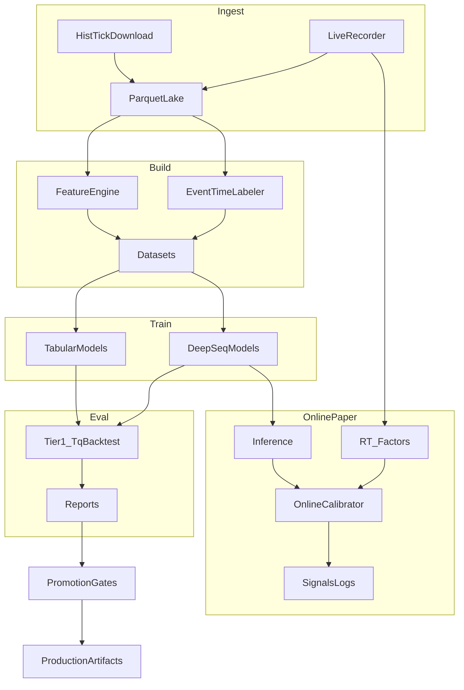

## ghTrader PRD (Product Requirements Document)

### Document control

- **Product**: ghTrader (research-only AI-centric SHFE tick system)
- **Scope**: SHFE CU/AU/AG directional micro-alpha research at tick/HFT granularity
- **Status**: Active (canonical)
- **Last updated**: 2026-01-14
- **Owner**: ghTrader maintainers

---

### Canonicality rules (single source of truth)

- This file (`PRD.md`) is the **only canonical plan/spec** for ghTrader.
- Any future design/implementation planning must:
  - **read and understand this PRD first**, then
  - **update/evolve this PRD** before or alongside code changes.
- Other documents (e.g. older `.cursor/plans/*`) are **historical** and must not be treated as authoritative if they conflict with this PRD.

---

## 1) Product overview

ghTrader is a **research-only**, AI-centric quantitative trading R&D system for **SHFE copper (CU), gold (AU), and silver (AG)**.

It provides a full loop:

- **Ingest**: historical and live **L5 tick** data via **TqSdk Pro (`tq_dl`)**
- **Lake**: Parquet/ZSTD data lake (append-only)
- **Build**: causal factor features + event-time labels
- **Model**: tabular + deep sequence models, plus online calibration
- **Evaluate**: Tier1 backtest (TqBacktest) + Tier2 offline micro-sim
- **Continual**: daily refresh/train/eval/promote with rollback
- **Benchmark**: standardized offline metrics + latency profiling + comparisons

---

## 2) Goals and success criteria

### 2.1 Primary goals

- Build a **reproducible research platform** to iterate on directional micro-alpha for CU/AU/AG.
- Use the server’s compute (multi-CPU + multi-GPU) to:
  - train deep models daily,
  - run many backtests/sweeps in parallel,
  - support rapid model research.

### 2.2 Success criteria (what “good” looks like)

A model family is considered “better” when, on walk-forward evaluation:

- **Trading performance**: higher net PnL with controlled drawdown and turnover
- **Stability**: robust across contracts/regimes (not single-window overfit)
- **Latency**: meets paper-online latency budget (see §6.3)
- **Reproducibility**: every result can be reproduced from pinned code + manifest + config

---

## 3) Non-goals / out of scope

- **Live trading / real order routing** is out of scope until explicitly added (research-only default).
- Full OMS, risk engine, compliance automation.
- Exchange co-location / true microsecond execution.
- Perfect queue position modeling (Tier2 micro-sim is an approximation).

---

## 4) Users and workflows

### 4.1 Primary users

- **Quant researcher**: builds datasets, trains models, evaluates trading performance
- **ML engineer**: implements/benchmarks model architectures and training pipelines
- **Infra engineer**: maintains data lake, scheduled training jobs, compute utilization

### 4.2 Core workflows

- **Data workflow**: `download` (historical) → `build` (features/labels) → `train` → `backtest`/`benchmark`
- **Continual workflow**: `daily-train` (scheduled) → gated promotion → rollback on regression
- **Model research workflow**: `compare` and benchmarking reports across model families

---

## 5) Functional requirements

### 5.1 Data ingest (historical)

- Must support historical L5 tick download using **TqSdk Pro** (`tq_dl`).
- Must support chunking/resume to handle long ranges.
- Must write ingest manifests.

#### 5.1.1 Symbol types and depth limitations (observed)

ghTrader must explicitly support two classes of symbols (both may exist in the lake):

- **Specific contracts (preferred for microstructure research)**:
  - Example: `SHFE.cu2602`
  - Provides **L5 depth** (`bid/ask_price1..5`, `bid/ask_volume1..5`)
- **Continuous main contracts (useful for long history but depth-limited)**:
  - Example: `KQ.m@SHFE.cu`
  - Provides **L1 only** in practice: levels **2–5 are present but null (NaN)**.
  - We keep this data only as an auxiliary long-history reference; it is **not sufficient** for LOB/depth models.

Implementation:
- `src/ghtrader/tq_ingest.py` (`download_historical_ticks`)

#### 5.1.2 Trading calendar correctness + no-data day semantics

Problem:
- Weekday-only calendars are incorrect for China futures (SHFE holidays exist).
- Some valid trading days may legitimately have **no ticks available** in TqSdk Pro history (e.g., data gaps, pre-listing boundary days). These must not cause infinite retries.

Requirements:
- **Trading day source**: use Shinny/TqSdk’s holiday list to compute trading days (no akshare dependency):
  - Source URL: `https://files.shinnytech.com/shinny_chinese_holiday.json` (configurable via `TQ_CHINESE_HOLIDAY_URL`)
  - Trading day rule: weekday AND not in holiday list (best-effort; cache locally).
- **No-data markers**:
  - For each symbol, persist a set of trading dates that were attempted but returned **zero ticks**, so ingest completion is idempotent.
  - Store at: `data/lake_v2/ticks/symbol=<SYMBOL>/_no_data_dates.json` (ISO dates).
  - Missing-date computation must exclude both existing partitions and no-data dates.
- **Chunk behavior**:
  - If a requested chunk yields no ticks, mark all dates in that chunk as no-data (unless already present on disk).
  - If a chunk yields partial days, mark any requested dates that did not produce ticks as no-data.

### 5.2 Data ingest (live recorder)

- Must subscribe to ticks and append to lake.
- Must deduplicate via timestamp monotonic checks per symbol.
- Must flush periodically and handle session boundaries.

Implementation:
- `src/ghtrader/tq_ingest.py` (`run_live_recorder`)

### 5.3 Tick storage (QuestDB canonical + Parquet mirror)

- **Canonical tick store**: QuestDB (daemon time-series DB) stores raw ticks for all contracts.
- **Parquet mirror**: Parquet lake is retained as a durable mirror and for training/export. It is written **alongside QuestDB** at ingest time (write-first/double-write), and can be repaired from QuestDB if needed.
- Partitioning for the Parquet mirror (single lake root; v2 only):
  - **lake_v2 (trading-day)**: `data/lake_v2/ticks/symbol=.../date=YYYY-MM-DD/part-....parquet`
    - `date=YYYY-MM-DD` is the **trading day**, not necessarily the wall-clock calendar date of the tick (night session must map to the correct trading day).
- Compression: ZSTD.
- Schema: locked and hashable.
- Schema includes **L5 columns** even for L1-only sources; for `KQ.m@...` deeper levels are expected to be null.

Implementation:
- `src/ghtrader/lake.py`
- `src/ghtrader/serving_db.py` (QuestDB schema + sync)

#### 5.3.0.0 Lake selection (v2 only)

ghTrader uses a **single Parquet tick mirror**:

- **lake_v2** (`data/lake_v2/...`): partitions are keyed by **trading day**.

Selection rules:

- There is no lake version toggle; all ingestion and downstream builds use **v2**.
- Features/labels manifests must still record `lake_version: "v2"` for reproducibility, but mixing across versions is no longer supported.

#### 5.3.0 Contract coverage + L5 availability index (QuestDB-backed)

To make the data system robust (fill/verify/repair), ghTrader must be able to compute coverage from the canonical tick DB:

- Per contract (symbol):
  - first/last tick day present (any ticks)
  - first/last L5 day present (depth levels 2–5 have non-null/non-NaN values)
  - freshness for active contracts (behind latest trading day → `stale`)
- The dashboard contract explorer must use this index (or directly query QuestDB) instead of akshare-driven active-ranges.

#### 5.3.0.2 Data integrity validation, checksums, and audit command

ghTrader must provide first-class integrity tooling for the on-disk data lake.

Checksums (write-time):
- Every Parquet file written by ghTrader for **core datasets** must write a sibling checksum file at write time:
  - `*.parquet.sha256` (hex digest; computed over the Parquet file bytes)
- Applies to:
  - raw ticks (`data/lake_v2/ticks/...`)
  - derived main-with-depth ticks (`data/lake_v2/main_l5/ticks/...`)
  - features (`data/features/...`)
  - labels (`data/labels/...`)

Manifests (formal, audit-friendly):
- Raw ticks: each `(symbol,date)` partition directory must include a date manifest:
  - `data/lake_v2/ticks/symbol=<SYM>/date=<YYYY-MM-DD>/_manifest.json`
  - includes: file list, per-file row counts, per-file sha256, rows_total.
- Derived main_l5 ticks: each `(derived_symbol,date)` partition directory must include:
  - `data/lake_v2/main_l5/ticks/symbol=<DERIVED>/date=<YYYY-MM-DD>/_manifest.json`
  - includes: file list, per-file row counts, per-file sha256, rows_total.
- Features and labels: each `symbol=...` directory must include `manifest.json`:
  - `data/features/symbol=<SYM>/manifest.json`
  - `data/labels/symbol=<SYM>/manifest.json`
  - includes: build parameters (factors/horizons/ticks_lake, **lake_version=\"v2\"**), schema hash, per-date row counts, and per-file sha256.

Audit command:
- Must provide `ghtrader audit` which scans one or more datasets and produces:
  - JSON report under `runs/audit/<run_id>.json`
  - exit code **0** if no errors, **1** if errors
- Required checks:
  - checksum verification (`*.sha256` matches Parquet bytes)
  - schema conformity (ticks vs `TICK_ARROW_SCHEMA`; features/labels vs their manifest schema hash)
  - datetime integrity (non-decreasing; duplicate rate reporting)
  - basic sanity rules for ticks (non-negative volume/OI; non-negative prices; `ask_price1 >= bid_price1` when present)
  - manifest consistency (manifest row counts match Parquet metadata row counts)
  - derived-vs-raw equivalence for `main_l5` (tick value columns must match raw underlying; `symbol` differs by design; metadata columns must match schedule provenance)

#### 5.3.0.3 Database / query layer (QuestDB canonical ticks; DuckDB optional analytics)

Canonical ticks are stored in QuestDB, but ghTrader must still keep Parquet as a mirror for reproducibility and training.

- **QuestDB (canonical ticks)**:
  - Stores `ticks_raw` for all contracts/aliases.
  - Optionally stores `ticks_main_l5` for derived main-with-depth datasets.
  - Time semantics must be explicit:
    - Store `datetime_ns` (int64 epoch-ns as provided by TqSdk) AND a QuestDB `TIMESTAMP` column (`ts`) derived from it.
  - Ingestion must be idempotent and provenance-aware (lake_version, ticks_lake).

- **DuckDB (optional analytics)**:
  - Used for ad-hoc SQL over Parquet mirrors (`data/lake_v2/...`, `data/features`, `data/labels`) and metrics indexing.
  - DuckDB outputs are rebuildable caches; it is not the operational source of truth for ticks.

Default (Stage A): embedded analytics DB (DuckDB)

- DuckDB is the default embedded query engine for **SQL over Parquet** (lakehouse-style), without changing the canonical Parquet storage model.
- Default DB path (if persisted): `data/ghtrader.duckdb` (rebuildable cache/index).
- Views (Parquet-backed; created/refreshed by CLI init):
  - `ticks_raw_v2` over `data/lake_v2/ticks/...`
  - `ticks_main_l5_v2` over `data/lake_v2/main_l5/ticks/...`
  - `features_all` over `data/features/...`
  - `labels_all` over `data/labels/...`
  - `run_metrics` (when metrics are indexed from `runs/`)
- CLI entrypoints:
  - `ghtrader db init` (create/refresh views; optionally index metrics)
  - `ghtrader db ingest-metrics` (index JSON reports under `runs/` into `run_metrics`)
  - `ghtrader sql` (run **SELECT/WITH-only** queries; export `.csv` or `.parquet`)
- Dashboard Explorer:
  - HTML: `/explorer`
  - JSON: `POST /api/db/query`
  - Guardrails: read-only (SELECT/WITH only + disallowed keyword blocklist), capped row limits, and intended for local-only access via SSH forwarding.
- Dashboard API endpoints (JSON):
  - `GET /api/dashboard/summary` - aggregated KPIs for dashboard home (running/queued jobs, QuestDB status, data symbols, model count, trading status, pipeline status)
  - `GET /api/models/inventory` - list trained model artifacts from `artifacts/` directory
  - `GET /api/trading/status` - current trading run status from `runs/trading/`
  - `GET /api/jobs` - list jobs with optional limit
  - `GET /api/system` - system metrics (CPU, memory, GPU, disk)
  - `GET /api/contracts` - contract catalog with coverage status
  - `GET /api/ingest/status` - ingest job progress
- ghTrader should optionally index **experiment/evaluation outputs** into DuckDB tables for easy comparisons:
  - Backtests under `runs/<symbol>/<model>/<run_id>/...`
  - Benchmarks under `runs/benchmarks/...`
  - Daily pipeline reports under `runs/daily_pipeline/...`
  (Files remain canonical; DuckDB tables are rebuildable indexes.)

QuestDB is the chosen canonical tick store for this phase.

#### 5.3.1 Derived dataset: “main-with-depth” (materialized continuity with L5)

Because `KQ.m@...` continuous symbols are L1-only, ghTrader must support a derived dataset that provides:

- **Continuity of the main contract over time**
- **L5 depth** (sourced from the underlying specific contract ticks)

Definition:

- The derived symbol is named like the continuous series (e.g. `KQ.m@SHFE.cu`), but it is **materialized** from L5 ticks of the underlying contract selected by the roll schedule (§5.3.2).
- Output is written to a separate lake to avoid mixing raw vs derived data:
  - `data/lake_v2/main_l5/ticks/symbol=KQ.m@SHFE.cu/date=YYYY-MM-DD/part-....parquet`
- Provenance must be recorded (schedule hash, underlying contracts used, row counts per day).

Segment metadata contract (required for correctness):

- The roll schedule must include a **segment id** that increments each time `main_contract` changes.
  - `segment_id` is stable and deterministic for a given schedule.
- Every derived `main_l5` tick row must include:
  - `underlying_contract` (string): the specific contract used for that trading day (e.g. `SHFE.cu2602`)
  - `segment_id` (int): schedule segment id for that trading day
- Derived features and labels must **propagate** `underlying_contract` and `segment_id` so downstream datasets can enforce no roll-boundary leakage.

Sequence semantics (critical for ML correctness):

- Feature/label sequences **must not cross roll boundaries**.
- Dataset builders must enforce that a training example comes from a **single segment** (constant `segment_id`) / underlying contract.
  - Default behavior is to **exclude cross-boundary windows** rather than attempting price-splice or boundary token hacks.

Builder semantics for derived ticks (critical):
- When building features on `data/lake_v2/main_l5/ticks/symbol=KQ.m@...`:
  - rolling-window state (lookback tail) must be **reset** when the underlying contract changes between adjacent trading days.
- When building labels on `data/lake_v2/main_l5/ticks/symbol=KQ.m@...`:
  - cross-day lookahead must be **disabled** when the underlying changes between adjacent trading days (end-of-day labels become NaN rather than leaking).
- Materialization must persist schedule provenance under the derived symbol root:
  - `schedule.parquet` (copy)
  - schedule hash + metadata in the manifest

#### 5.3.2 Main continuous roll schedule rule (SHFE-style OI rule)

We treat the roll schedule as **given**, not “invented” by ghTrader. The rule:

- At first listing, use the **same-variety contract with max close OI** on day \(T\) as the main contract effective from **\(T+1\)**.
- Switch condition: if at end of day \(T\), some other contract has
  - `oi_other(T) > 1.1 * oi_main(T)`
  then switch effective from **\(T+1\)**.
- **No intraday switching**.

Data source for the schedule (no akshare):
- The schedule must be computed from **tick data** by aggregating end-of-day `open_interest` from the canonical tick DB (QuestDB).
- For the “main-with-depth” dataset, the effective schedule range must start at the earliest date where the main contract has **true L5** available (levels 2–5 non-null/non-NaN), to avoid mixing L1-only eras into depth-model training.

Continuous code semantics (vendor conventions):

- “88-style” continuous = simple splice (no price smoothing).
- “888-style” continuous = back-adjusted prices across rolls (not appropriate for tick microstructure).

ghTrader’s derived “main-with-depth” dataset uses **88-style splice semantics** (no smoothing).

### 5.4 Features (hundreds of factors, causal)

- Must compute features causally.
- Must provide:
  - offline batch computation
  - online incremental computation (ring-buffer design)

Implementation:
- `src/ghtrader/features.py` (`FactorEngine`)

### 5.5 Labels (event-time, multi-horizon)

- Define mid price: `mid = (bid_price1 + ask_price1) / 2`.
- Horizons: configurable list (default `{10, 50, 200}` ticks).
- Threshold: `k * price_tick` (default `k=1`).
- 3-class label: DOWN/FLAT/UP based on `mid[t+N] - mid[t]`.

Implementation:
- `src/ghtrader/labels.py`

### 5.6 Modeling (offline)

We maintain a **model ladder** (simplest → most powerful), and choose winners by trading outcomes + latency gates:

- **Tabular baselines**: Logistic, XGBoost, LightGBM
- **Deep sequence**:
  - DeepLOB-style CNN+LSTM
  - Transformer encoder
  - TCN (dilated causal conv)
  - TLOB-style dual-attention transformer (spatial+temporal)
  - SSM-style sequence model (fast linear-time alternative)

Implementation:
- `src/ghtrader/models.py`

### 5.7 Online calibrator (stacked learning)

- Must support intraday adaptation by fitting on delayed event-time labels.
- Must include guardrails (drift detection, disable-on-instability).
- Input: `[model_probs_or_logits] + [factor_vector]`.

Implementation:
- `src/ghtrader/online.py` (`OnlineCalibrator`, `DelayedLabelBuffer`, `run_paper_trading`)

### 5.8 Evaluation

- Tier1: TqBacktest harness.
- Tier2: offline micro-sim for more realism (latency/partial fills approximations).

Implementation:
- Tier1: `src/ghtrader/eval.py`
- Tier2: `src/ghtrader/pipeline.py` (`OfflineMicroSim`)

### 5.9 Continual training + promotion

Daily job must:

1. Refresh data
2. Build features/labels
3. Train candidate model(s)
4. Evaluate
5. Apply promotion gates
6. Roll back on regression

Implementation:
- `src/ghtrader/pipeline.py` (`run_daily_pipeline`, `PromotionGate` in `eval.py`)

### 5.10 Benchmarking and comparisons

- Must produce standardized JSON reports:
  - offline metrics (accuracy/F1/logloss/ECE)
  - latency stats
  - optional trading metrics
- Offline benchmarking must use **walk-forward evaluation** with **multiple splits** when data volume permits (target: **≥5 splits**; fewer splits allowed for short ranges).
- Reports must include:
  - **per-split metrics**
  - **aggregate mean/std** across splits (at minimum: accuracy, F1-macro, logloss, ECE)
  - optional **calibration bin stats** (for reliability diagrams)
- Must support comparing multiple model families.

Implementation:
- `src/ghtrader/benchmark.py`
- CLI commands: `benchmark`, `compare`

### 5.11 Control plane (headless ops dashboard; SSH-only)

Because the server is accessed remotely and has **no GUI OS**, ghTrader must provide a **web control system** that manages core operations beyond direct CLI use.

Requirements:

- **Access**:
  - Dashboard must bind to `127.0.0.1` by default (no public exposure).
  - Operator accesses via SSH port-forward: `ssh -L 8000:127.0.0.1:8000 ops@server`.
  - Optional shared token (defense-in-depth) may be supported.
- **Information architecture (role-based pages)**:
  - The dashboard provides a **command center** home page and **role-focused pages** for major workflows:
    - **Dashboard** (`/`): Command center with KPIs, pipeline status, quick actions
    - **Jobs** (`/jobs`): Job listing and management
    - **Data** (`/data`): Data coverage, contract explorer, DB sync
    - **Models** (`/models`): Model inventory, training, benchmarks
    - **Trading** (`/trading`): Trading console, positions, run history
    - **Ops** (`/ops`): Pipeline operations, ingest, schedule/build, integrity, locks
    - **SQL** (`/explorer`): DuckDB SQL explorer
    - **System** (`/system`): CPU/memory/disk/GPU monitoring
  - Each page uses **tabbed layouts** to organize related functionality without excessive scrolling.
  - Navigation includes:
    - Status indicators (QuestDB, GPU) in the topbar
    - Running jobs badge on the Jobs nav item
    - Toast notifications for async feedback
- **Page-specific requirements**:
  - **Dashboard home** (`/`):
    - System status bar (QuestDB, GPU, CPU, Memory)
    - KPI grid (running jobs, data symbols, models, trading status)
    - Pipeline status visualization (Ingest → Sync → Schedule → main_l5 → Build → Train)
    - Quick action buttons for common workflows
    - Running and recent jobs tables
  - **Data hub** (`/data`):
    - Tab 1: Coverage overview (ticks, main_l5, features, labels tables)
    - Tab 2: Contract explorer (TqSdk catalog + local + QuestDB status)
    - Tab 3: DB sync (QuestDB sync forms, status, convert v1→v2)
  - **Models** (`/models`):
    - Tab 1: Model inventory (list trained artifacts with search/filter)
    - Tab 2: Training (train form + sweep form + active training jobs)
    - Tab 3: Benchmarks (benchmark/compare/backtest forms, results table)
  - **Trading** (`/trading`):
    - Tab 1: Live status (KPIs, positions, signals, risk metrics, orders)
    - Tab 2: Start trading (full form with safety warnings, presets)
    - Tab 3: Run history (historical trading runs table)
  - **Ops** (`/ops`):
    - Tab 1: Pipeline (happy path buttons, running ingest jobs)
    - Tab 2: Ingest (download, download-contract-range, record forms)
    - Tab 3: Schedule & Build (schedule, main_l5, features/labels forms)
    - Tab 4: Integrity (audit forms, recent reports)
    - Tab 5: Locks (active locks table with key reference)
  - Legacy routes (`/ops/ingest`, `/ops/build`, etc.) may remain for API compatibility.
- **Job execution model**:
  - Long-running operations must run as **subprocess jobs** (not in-process), so they are cancellable and resilient to UI restarts.
  - Job history must **persist across dashboard restarts**.
  - Must support: start, view status, tail logs, cancel (SIGTERM), and record exit codes/durations.
- **Multi-session robustness (terminal + dashboard)**:
  - The system must be safe under **multiple concurrent terminal sessions** and/or multiple dashboard instances.
  - All `ghtrader ...` CLI invocations must **auto-register** into the same SQLite job registry so the dashboard reflects all sessions.
  - Job status must be **restart-safe**:
    - the running CLI process must write its own final status/exit_code on completion
    - the dashboard must not be the only source of truth for job completion
  - SQLite must be configured for concurrency:
    - `journal_mode=WAL`
    - non-trivial `busy_timeout` to avoid flaky “database is locked” errors
  - Strict resource locking must prevent conflicting concurrent jobs (see below).
- **Persistence and logs**:
  - Store job metadata in local SQLite: `runs/control/jobs.db`.
  - Store stdout/stderr logs per job: `runs/control/logs/job-<id>.log`.
- **Supported operations (via UI)**:
  - The dashboard must expose **usable forms for every CLI command**:
    - `download`, `download-contract-range`, `record`
    - `build`, `train`, `benchmark`, `compare`, `backtest`, `paper`, `daily-train`, `sweep`
    - `main-schedule`, `main-depth`
    - `audit`
    - `db serve-sync` (sync Parquet mirror → QuestDB canonical)
  - The `/ops` page must provide a “happy path” set of **pipeline buttons** that maps to the canonical workflow:
    - **Sync to QuestDB** (from local Parquet mirror)
    - **Compute schedule** (OI rule; QuestDB-backed)
    - **Build main_l5 (L5 era only)**
    - **Build features/labels**
    - **Train**
    - Each button must clearly indicate preconditions (e.g. “QuestDB not reachable”, “schedule missing”, “main_l5 not built”).
- **Observability**:
  - Must display data coverage (lake partitions by symbol/date, features/labels coverage).
    - Coverage UI is **v2-only** (`data/lake_v2/...`).
  - Must display **ingest progress** for running/queued ingest jobs:
    - `download`: % complete over requested trading-day range (includes no-data markers)
    - `download-contract-range`: per-contract and overall % complete using trading calendar + no-data markers (no akshare active-ranges)
  - Must display a **contract explorer** (TqSdk-backed catalog + local status):
    - Operator chooses `exchange` + `variety` (e.g. `SHFE` + `cu`). (v2-only)
    - The system lists **all contracts** for that variety (including expired) by merging multiple sources:
      - Important: TqSdk’s contract-service queries may not include older (pre-2020-09) instruments. The catalog must merge:
        - `TqApi.query_quotes(...)` results (contract service)
        - TqSdk’s bundled pre-2020 cache (`tqsdk/expired_quotes.json.lzma`, used internally as `_pre20_ins_info`)
      - Additionally, the UI must include **local-lake-only symbols** discovered on disk under:
        - `data/lake_v2/ticks/symbol=...`
        - so that contracts already present locally are never “invisible” even if TqSdk does not list them.
    - For each contract, show:
      - **Local download status (Parquet mirror)**: `not-downloaded` / `incomplete` / `complete` / `stale` (active and behind today).
      - **Coverage (QuestDB canonical)** (separate from local status):
        - first/last tick day present
        - first/last L5 day present
        - distinct trading-day counts (tick days; L5 days) when available
        - freshness for active contracts (behind latest trading day → `stale`)
      - **L5 availability**:
        - **Local L5 present** means depth levels 2–5 have *non-NaN* values in local Parquet (not just columns existing).
        - **TqSdk L5** is inferred from a small sample probe (TqSdk query) and cached.
    - Contract explorer actions:
      - **Fill**: enqueue per-contract `download` jobs (subprocess).
      - **Probe L5**: enqueue per-contract probe jobs (subprocess).
      - Optional integrity checks: quick checks + ability to run `audit`.
      - **Sync to QuestDB**: enqueue a DB sync job for the selected symbol/range (repair/backfill when QuestDB was down).
      - **Update**: check remote availability and fill forward (active + recently expired) and refresh QuestDB + Parquet mirror.
    - Bulk Fill/Probe must be **throttled** to avoid starting hundreds of TqSdk-heavy processes:
      - Use a queue/scheduler that runs at most `GHTRADER_MAX_PARALLEL_TQSDK_JOBS` (default **4**) concurrently.
  - Progress UI must work for **already-running jobs** (no restart required) by using job logs + lake state.
  - Performance: progress computation must be safe to refresh (use caching/TTL; avoid heavy scans every few seconds).
  - Must display basic system status (fast to load; safe to refresh):
    - CPU/memory (and optional load average / uptime).
    - Disk:
      - Filesystem totals for key roots (total/used/free + % used).
      - Optional per-directory sizes for `data/`, `runs/`, `artifacts/` (must be lazy/cached and must not block page load).
    - GPU: best-effort `nvidia-smi` summary or a helpful diagnostic string (must be cached/non-blocking for the HTML page).
  - Must surface integrity status: latest audit report(s) and how to run an audit.
  - Must surface multi-session state:
    - show job source (`terminal` vs `dashboard`)
    - show active **locks** and which job holds them

#### 5.11.1 Strict resource locks (no conflicting concurrent writers)

Because some CLI commands overwrite shared outputs (e.g. `build` deletes and rewrites `data/features/symbol=...`), ghTrader must enforce **strict locks** across all sessions.

Locking requirements:
- Lock acquisition must happen in the **CLI process** (so it applies equally to dashboard and terminal sessions).
- If required locks are not available, the job must remain **queued** until locks are acquired (or fail fast if configured).
- Locks must be automatically released on normal completion and best-effort released on crashes (stale lock reaping).

Canonical lock keys (minimum set):
- `ticks:symbol=<SYM>` for `download`, `record`
- `ticks_range:exchange=<EX>,var=<VAR>` for `download-contract-range`
- `build:symbol=<SYM>,ticks_lake=<raw|main_l5>` for `build`
- `train:symbol=<SYM>,model=<M>,h=<H>` for `train`
- `main_schedule:var=<VAR>` for `main-schedule`
- `main_depth:symbol=<DERIVED>` for `main-depth`
- `trade:mode=<MODE>` (and later: per-account key) for `trade`

Implementation:
- `src/ghtrader/control/` (FastAPI app + job runner + SQLite store)
- CLI command: `ghtrader dashboard`

### 5.12 Account + trading (TqSdk; phased, safety-gated)

ghTrader must support **account monitoring and trading execution** using TqSdk in a **phased** way:

- **Phase 1 (safe)**: paper + simulated execution for research/validation.
- **Phase 2 (gated)**: real account execution, explicitly enabled, with robust safety/risk controls.

#### 5.12.1 Trading modes

Trading mode defines whether orders may be sent:

- **paper**: no orders are sent; compute signals + write logs/snapshots only.
- **sim**: orders are allowed using simulated accounts:
  - `TqSim()` (local sim) or `TqKq()` (快期模拟).
- **live**: orders are allowed using `TqAccount(...)` (real broker account). This is **disabled by default**.
- **live (monitor-only)**: connect to the real broker account and record snapshots/events, but **never send orders**.
  This is the required first step before any live order routing.

#### 5.12.2 Account configuration (env + .env)

TqSdk requires:

- **Shinny/快期 auth** (already used for data): `TQSDK_USER`, `TQSDK_PASSWORD` → `TqAuth(...)`
- **Broker account** (for live mode only):
  - `TQ_BROKER_ID`
  - `TQ_ACCOUNT_ID`
  - `TQ_ACCOUNT_PASSWORD`

#### 5.12.3 Execution styles (two executors)

ghTrader must support two execution styles:

- **Target position execution** (recommended): `TargetPosTask` adjusts net position to a target.
  - Constraint: one TargetPosTask per (account, symbol); requires continued `wait_update()`.
  - Safety rule: **must not** mix `TargetPosTask` with direct `insert_order()` for the same (account, symbol).
- **Direct order execution**: use `insert_order()` / `cancel_order()`.
  - Must support advanced order params (`FAK`/`FOK`, `BEST`/`FIVELEVEL`) when applicable.
  - Must handle SHFE close-today semantics where required.

#### 5.12.4 Safety gating and risk controls

Safety gate for live trading:

- Default is **research-only**. Live must require **two steps**:
  - `.env`: `GHTRADER_LIVE_ENABLED=true`
  - CLI: `--confirm-live I_UNDERSTAND`

Monitor-only live mode gate:
- `--mode live --monitor-only` must **not** require `--confirm-live`.
  It must still require broker credentials and must still log all snapshots/events to `runs/trading/...`.

Mandatory risk controls (must work even without TqSdk “professional” local risk features):

- **max position** per symbol (absolute net position)
- **max order size** per order (volume delta)
- **order rate limiting** (max ops per second)
- **max daily loss / drawdown** based on account equity snapshots (kill-switch to stop trading + flatten)
- **session-time guard**: do not send orders outside instrument trading sessions (best-effort using quote trading_time)

Optional: attach TqSdk local risk rules (when available) for defense-in-depth:
- `TqRuleOrderRateLimit`, `TqRuleOpenCountsLimit`, `TqRuleOpenVolumesLimit`

#### 5.12.5 Symbol semantics (specific vs continuous aliases)

Trading may target:

- **Specific contract** (preferred for execution): e.g. `SHFE.cu2602`
- **Continuous alias**: e.g. `KQ.m@SHFE.cu`

If a continuous alias is provided, trading must **resolve** to the correct underlying contract for the current trading day using the persisted roll schedule (from `main-schedule`). If the underlying changes (roll), the runner must reset any online state and avoid cross-contract leakage.

Continuous alias roll behavior (required):
- The runner must treat the user-supplied symbol as a **strategy symbol** and maintain a binding:
  `requested_symbol -> execution_symbol`.
- The runner must detect trading-day transitions (night session boundary included) and **re-resolve** `execution_symbol` for each continuous alias.
- On roll (execution symbol changes):
  - Reset any online feature/model state (FactorEngine states, deep model buffers)
  - Refresh subscriptions (quotes/ticks/positions) to the new underlying contract
  - In order-enabled modes: flatten/cancel the old underlying contract before switching

Schedule resolution sources (in priority order):

- Preferred: the canonical roll schedule produced by `main-schedule`:
  - `data/rolls/shfe_main_schedule/var=<var>/schedule.parquet`
- Fallback: a `schedule.parquet` copy stored alongside the derived `main_l5` dataset (written by `main-depth`), under either lake root:
  - `data/lake_v2/main_l5/ticks/symbol=<KQ.m@...>/schedule.parquet`

#### 5.12.6 Observability + persistence

Trading runners must persist:

- run config + mode/account/executor parameters
- periodic **account snapshots** (balance/margin/positions/open orders)
- order/trade events (fills, cancels, rejects) as structured logs

Feature-spec correctness (required for live safety):
- Online trading must enforce that the factor set/order used for inference matches the trained model’s expected feature shape.
  - Default source of truth: `data/features/symbol=<strategy_symbol>/manifest.json` (`enabled_factors`).
  - If a feature spec cannot be determined, the runner must fail fast in live order-enabled mode.

Write under: `runs/trading/<run_id>/...` so the dashboard can display “last known state” without attaching to the live process.

Implementation:
- new modules: `src/ghtrader/tq_runtime.py`, `src/ghtrader/execution.py`, `src/ghtrader/symbol_resolver.py`
- new CLI command: `ghtrader trade`

---

## 6) Non-functional requirements

### 6.1 Safety and modes

- Default mode is **research-only**.
- Any future live trading capability must require explicit enabling via configuration.

### 6.2 Reproducibility

- All runs must be traceable by:
  - code version
  - data manifest(s)
  - config
  - metrics/report

### 6.3 Performance and latency

- Provide latency instrumentation across:
  - ingest
  - features
  - inference
  - decision

### 6.3.1 Parquet lake scaling (ticks/features/labels)

- Tick lake reads must scale for multi-year L5 history:
  - Per-day reads must be **O(#parquet files for that day)** (no scanning thousands of `date=` partitions just to read one day).
  - Range reads should use **Arrow Dataset scanning** (avoid manual directory walks; allow streaming-friendly execution).
- Build outputs (features/labels) must be safe to run repeatedly:
  - `ghtrader build` must be **incremental/resumable by default** (no destructive delete).
  - Full rebuild of features/labels must require explicit `--overwrite`.
  - Incremental builds must refuse to mix configurations if `manifest.json` does not match (require `--overwrite`).

Implementation:
- `src/ghtrader/pipeline.py` (`LatencyTracker`, `LatencyContext`)

#### Compute utilization (server-scale)

Given the target hardware (multi-CPU + **4 GPUs**), ghTrader uses a **hybrid scaling** approach:

- **CPU-heavy** stages (ingest, Parquet IO, feature/label build, backtests) should parallelize across symbols and/or partitions.
- **GPU-heavy** stages (deep sequence models) should scale using **DDP speedup-first**:
  - Launch deep model training via `torchrun --nproc_per_node=4 ...` to use all GPUs for a **single training run**.
  - Each process binds to `cuda:{LOCAL_RANK}`.
  - Use `DistributedSampler` for datasets; call `set_epoch(epoch)` each epoch.
  - Use AMP (autocast/GradScaler) on GPU when beneficial.
  - Only **rank0** writes model artifacts and benchmark reports.
- **Throughput mode** (multiple independent jobs, one GPU each) is supported later for sweeps/ablations once DDP training is stable.

### 6.4 Testing and quality gates (tests-first)

- **All core functions must have tests written before implementation (TDD)**.
- Unit tests:
  - must not call network or require credentials
- Integration tests:
  - must be explicitly marked (e.g. `pytest.mark.integration`)
  - should be skipped unless `.env` credentials exist

Current state:
- `tests/` includes unit coverage for lake/labels/features/models/online/pipeline/cli.

CI requirements:
- ghTrader must include a **GitHub Actions** workflow that runs on push/PR.
- CI must run:
  - `pytest`
  - `pytest --cov=ghtrader --cov-fail-under=50` (minimal coverage gate; value is set to current-baseline-safe)
- CI must **skip integration tests by default** (credentials/network), unless explicitly enabled.

### 6.5 Security and secrets

- TqSdk credentials must be loaded from a **repo-local `.env` file** (gitignored).
- `env.example` must be provided.
- Never commit secrets.

---

## 7) Configuration and environment

### 7.1 Virtual environment

- All work must run inside a venv:
  - `python3 -m venv .venv`
  - `source .venv/bin/activate`

### 7.2 Credentials

- Use `.env` (repo-local, gitignored).
- Template: `env.example`.

Implementation:
- `src/ghtrader/config.py` loads `.env` and provides `get_tqsdk_auth()`.

---

## 8) System architecture

### 8.1 Repo layout (current)

- `src/ghtrader/`
  - `cli.py` (entrypoints)
  - `config.py` (dotenv + creds)
  - `tq_ingest.py` (TqSdk download/record)
  - `lake.py` (Parquet schema/lake)
  - `features.py` (FactorEngine)
  - `labels.py` (event-time labels)
  - `models.py` (model zoo)
  - `online.py` (online calibrator + paper loop)
  - `eval.py` (TqBacktest harness + promotion gates)
  - `pipeline.py` (daily pipeline, latency, microsim)
  - `benchmark.py` (bench/compare)
- `tests/` (unit tests)
- `data/` (lake + manifests; gitignored)
- `runs/` (reports; gitignored)
- `artifacts/` (models; gitignored)

### 8.2 Dataflow diagram

---

## 9) Model research program (what to explore and why)

### 9.1 Frameworks

- **Primary**: PyTorch (already used), DDP for multi-GPU.
- **Tabular**: LightGBM, XGBoost.
- Optional research:
  - `river` for streaming drift detection / incremental baselines
  - JAX/Flax only if we need a specific accelerator advantage (not default)

### 9.2 Candidate families (beyond DeepLOB/vanilla Transformer)

- **TLOB dual-attention**: explicit spatial+temporal modeling ([TLOB paper (2025)](https://hf.co/papers/2502.15757)).
- **TCN**: strong latency/performance tradeoff for tick sequences.
- **SSM/Mamba-style**: fast linear-time sequence modeling (candidate when attention is too slow).
- Hybrid designs: CNN pre-encoder + (TCN/Transformer/SSM) backbone.

### 9.3 Selection criteria

Promote model family if it wins on:

- walk-forward trading outcomes (PnL/DD/turnover)
- latency gates (paper-online feasibility)
- stability across symbols/contract rolls

---

## 10) CLI requirements

Core commands:

- `ghtrader download`
- `ghtrader record`
- `ghtrader build`
- `ghtrader train`
- `ghtrader backtest`
- `ghtrader paper`
- `ghtrader daily-train`
- `ghtrader sweep`
- `ghtrader benchmark`
- `ghtrader compare`

---

## 11) Roadmap (living backlog)

### 11.1 Next research priorities

- Run `compare` across `logistic,xgboost,deeplob,transformer,tcn,tlob,ssm` on a fixed CU/AU/AG date range.
- Add stronger trading-cost modeling and fill realism to Tier2 micro-sim.
- Expand factor library to hundreds of robust microstructure factors.
- Add self-supervised pretraining once tick volume is sufficient.

### 11.2 Engineering priorities

- Add minimal coverage gate to CI.
- Add integration tests that validate a short TqSdk download using `.env` (optional).
- Harden dataset building for large-scale multi-day ingestion.

