## ghTrader PRD (Product Requirements Document)

### Document control

- **Product**: ghTrader (research-only AI-centric SHFE tick system)
- **Scope**: SHFE CU/AU/AG directional micro-alpha research at tick/HFT granularity
- **Status**: Active (canonical)
- **Last updated**: 2026-01-12
- **Owner**: ghTrader maintainers

---

### Canonicality rules (single source of truth)

- This file (`PRD.md`) is the **only canonical plan/spec** for ghTrader.
- Any future design/implementation planning must:
  - **read and understand this PRD first**, then
  - **update/evolve this PRD** before or alongside code changes.
- Other documents (e.g. older `.cursor/plans/*`) are **historical** and must not be treated as authoritative if they conflict with this PRD.

---

## 1) Product overview

ghTrader is a **research-only**, AI-centric quantitative trading R&D system for **SHFE copper (CU), gold (AU), and silver (AG)**.

It provides a full loop:

- **Ingest**: historical and live **L5 tick** data via **TqSdk Pro (`tq_dl`)**
- **Lake**: Parquet/ZSTD data lake (append-only)
- **Build**: causal factor features + event-time labels
- **Model**: tabular + deep sequence models, plus online calibration
- **Evaluate**: Tier1 backtest (TqBacktest) + Tier2 offline micro-sim
- **Continual**: daily refresh/train/eval/promote with rollback
- **Benchmark**: standardized offline metrics + latency profiling + comparisons

---

## 2) Goals and success criteria

### 2.1 Primary goals

- Build a **reproducible research platform** to iterate on directional micro-alpha for CU/AU/AG.
- Use the server’s compute (multi-CPU + multi-GPU) to:
  - train deep models daily,
  - run many backtests/sweeps in parallel,
  - support rapid model research.

### 2.2 Success criteria (what “good” looks like)

A model family is considered “better” when, on walk-forward evaluation:

- **Trading performance**: higher net PnL with controlled drawdown and turnover
- **Stability**: robust across contracts/regimes (not single-window overfit)
- **Latency**: meets paper-online latency budget (see §6.3)
- **Reproducibility**: every result can be reproduced from pinned code + manifest + config

---

## 3) Non-goals / out of scope

- **Live trading / real order routing** is out of scope until explicitly added (research-only default).
- Full OMS, risk engine, compliance automation.
- Exchange co-location / true microsecond execution.
- Perfect queue position modeling (Tier2 micro-sim is an approximation).

---

## 4) Users and workflows

### 4.1 Primary users

- **Quant researcher**: builds datasets, trains models, evaluates trading performance
- **ML engineer**: implements/benchmarks model architectures and training pipelines
- **Infra engineer**: maintains data lake, scheduled training jobs, compute utilization

### 4.2 Core workflows

- **Data workflow**: `download` (historical) → `build` (features/labels) → `train` → `backtest`/`benchmark`
- **Continual workflow**: `daily-train` (scheduled) → gated promotion → rollback on regression
- **Model research workflow**: `compare` and benchmarking reports across model families

---

## 5) Functional requirements

### 5.1 Data ingest (historical)

- Must support historical L5 tick download using **TqSdk Pro** (`tq_dl`).
- Must support chunking/resume to handle long ranges.
- Must write ingest manifests.

#### 5.1.1 Symbol types and depth limitations (observed)

ghTrader must explicitly support two classes of symbols (both may exist in the lake):

- **Specific contracts (preferred for microstructure research)**:
  - Example: `SHFE.cu2602`
  - Provides **L5 depth** (`bid/ask_price1..5`, `bid/ask_volume1..5`)
- **Continuous main contracts (useful for long history but depth-limited)**:
  - Example: `KQ.m@SHFE.cu`
  - Provides **L1 only** in practice: levels **2–5 are present but null (NaN)**.
  - We keep this data only as an auxiliary long-history reference; it is **not sufficient** for LOB/depth models.

Implementation:
- `src/ghtrader/tq_ingest.py` (`download_historical_ticks`)

### 5.2 Data ingest (live recorder)

- Must subscribe to ticks and append to lake.
- Must deduplicate via timestamp monotonic checks per symbol.
- Must flush periodically and handle session boundaries.

Implementation:
- `src/ghtrader/tq_ingest.py` (`run_live_recorder`)

### 5.3 Parquet data lake (canonical raw store)

- Append-only raw lake.
- Partitioning:
  - `data/lake/ticks/symbol=.../date=YYYY-MM-DD/part-....parquet`
- Compression: ZSTD.
- Schema: locked and hashable.
- Schema includes **L5 columns** even for L1-only sources; for `KQ.m@...` deeper levels are expected to be null.

Implementation:
- `src/ghtrader/lake.py`

#### 5.3.1 Derived dataset: “main-with-depth” (materialized continuity with L5)

Because `KQ.m@...` continuous symbols are L1-only, ghTrader must support a derived dataset that provides:

- **Continuity of the main contract over time**
- **L5 depth** (sourced from the underlying specific contract ticks)

Definition:

- The derived symbol is named like the continuous series (e.g. `KQ.m@SHFE.cu`), but it is **materialized** from L5 ticks of the underlying contract selected by the roll schedule (§5.3.2).
- Output is written to a separate lake to avoid mixing raw vs derived data:
  - `data/lake/main_l5/ticks/symbol=KQ.m@SHFE.cu/date=YYYY-MM-DD/part-....parquet`
- Provenance must be recorded (schedule hash, underlying contracts used, row counts per day).

Sequence semantics (critical for ML correctness):

- Feature/label sequences **must not cross roll boundaries**.
- Dataset builders must enforce that a training example comes from a **single underlying contract** (or explicitly encode a boundary token and treat it as a different task; default is to **exclude cross-boundary windows**).

#### 5.3.2 Main continuous roll schedule rule (SHFE-style OI rule)

We treat the roll schedule as **given**, not “invented” by ghTrader. The rule:

- At first listing, use the **same-variety contract with max close OI** on day \(T\) as the main contract effective from **\(T+1\)**.
- Switch condition: if at end of day \(T\), some other contract has
  - `oi_other(T) > 1.1 * oi_main(T)`
  then switch effective from **\(T+1\)**.
- **No intraday switching**.

Continuous code semantics (vendor conventions):

- “88-style” continuous = simple splice (no price smoothing).
- “888-style” continuous = back-adjusted prices across rolls (not appropriate for tick microstructure).

ghTrader’s derived “main-with-depth” dataset uses **88-style splice semantics** (no smoothing).

### 5.4 Features (hundreds of factors, causal)

- Must compute features causally.
- Must provide:
  - offline batch computation
  - online incremental computation (ring-buffer design)

Implementation:
- `src/ghtrader/features.py` (`FactorEngine`)

### 5.5 Labels (event-time, multi-horizon)

- Define mid price: `mid = (bid_price1 + ask_price1) / 2`.
- Horizons: configurable list (default `{10, 50, 200}` ticks).
- Threshold: `k * price_tick` (default `k=1`).
- 3-class label: DOWN/FLAT/UP based on `mid[t+N] - mid[t]`.

Implementation:
- `src/ghtrader/labels.py`

### 5.6 Modeling (offline)

We maintain a **model ladder** (simplest → most powerful), and choose winners by trading outcomes + latency gates:

- **Tabular baselines**: Logistic, XGBoost, LightGBM
- **Deep sequence**:
  - DeepLOB-style CNN+LSTM
  - Transformer encoder
  - TCN (dilated causal conv)
  - TLOB-style dual-attention transformer (spatial+temporal)
  - SSM-style sequence model (fast linear-time alternative)

Implementation:
- `src/ghtrader/models.py`

### 5.7 Online calibrator (stacked learning)

- Must support intraday adaptation by fitting on delayed event-time labels.
- Must include guardrails (drift detection, disable-on-instability).
- Input: `[model_probs_or_logits] + [factor_vector]`.

Implementation:
- `src/ghtrader/online.py` (`OnlineCalibrator`, `DelayedLabelBuffer`, `run_paper_trading`)

### 5.8 Evaluation

- Tier1: TqBacktest harness.
- Tier2: offline micro-sim for more realism (latency/partial fills approximations).

Implementation:
- Tier1: `src/ghtrader/eval.py`
- Tier2: `src/ghtrader/pipeline.py` (`OfflineMicroSim`)

### 5.9 Continual training + promotion

Daily job must:

1. Refresh data
2. Build features/labels
3. Train candidate model(s)
4. Evaluate
5. Apply promotion gates
6. Roll back on regression

Implementation:
- `src/ghtrader/pipeline.py` (`run_daily_pipeline`, `PromotionGate` in `eval.py`)

### 5.10 Benchmarking and comparisons

- Must produce standardized JSON reports:
  - offline metrics (accuracy/F1/logloss/ECE)
  - latency stats
  - optional trading metrics
- Offline benchmarking must use **walk-forward evaluation** with **multiple splits** when data volume permits (target: **≥5 splits**; fewer splits allowed for short ranges).
- Reports must include:
  - **per-split metrics**
  - **aggregate mean/std** across splits (at minimum: accuracy, F1-macro, logloss, ECE)
  - optional **calibration bin stats** (for reliability diagrams)
- Must support comparing multiple model families.

Implementation:
- `src/ghtrader/benchmark.py`
- CLI commands: `benchmark`, `compare`

---

## 6) Non-functional requirements

### 6.1 Safety and modes

- Default mode is **research-only**.
- Any future live trading capability must require explicit enabling via configuration.

### 6.2 Reproducibility

- All runs must be traceable by:
  - code version
  - data manifest(s)
  - config
  - metrics/report

### 6.3 Performance and latency

- Provide latency instrumentation across:
  - ingest
  - features
  - inference
  - decision

Implementation:
- `src/ghtrader/pipeline.py` (`LatencyTracker`, `LatencyContext`)

#### Compute utilization (server-scale)

Given the target hardware (multi-CPU + **4 GPUs**), ghTrader uses a **hybrid scaling** approach:

- **CPU-heavy** stages (ingest, Parquet IO, feature/label build, backtests) should parallelize across symbols and/or partitions.
- **GPU-heavy** stages (deep sequence models) should scale using **DDP speedup-first**:
  - Launch deep model training via `torchrun --nproc_per_node=4 ...` to use all GPUs for a **single training run**.
  - Each process binds to `cuda:{LOCAL_RANK}`.
  - Use `DistributedSampler` for datasets; call `set_epoch(epoch)` each epoch.
  - Use AMP (autocast/GradScaler) on GPU when beneficial.
  - Only **rank0** writes model artifacts and benchmark reports.
- **Throughput mode** (multiple independent jobs, one GPU each) is supported later for sweeps/ablations once DDP training is stable.

### 6.4 Testing and quality gates (tests-first)

- **All core functions must have tests written before implementation (TDD)**.
- Unit tests:
  - must not call network or require credentials
- Integration tests:
  - must be explicitly marked (e.g. `pytest.mark.integration`)
  - should be skipped unless `.env` credentials exist

Current state:
- `tests/` includes unit coverage for lake/labels/features/models/online/pipeline/cli.

### 6.5 Security and secrets

- TqSdk credentials must be loaded from a **repo-local `.env` file** (gitignored).
- `env.example` must be provided.
- Never commit secrets.

---

## 7) Configuration and environment

### 7.1 Virtual environment

- All work must run inside a venv:
  - `python3 -m venv .venv`
  - `source .venv/bin/activate`

### 7.2 Credentials

- Use `.env` (repo-local, gitignored).
- Template: `env.example`.

Implementation:
- `src/ghtrader/config.py` loads `.env` and provides `get_tqsdk_auth()`.

---

## 8) System architecture

### 8.1 Repo layout (current)

- `src/ghtrader/`
  - `cli.py` (entrypoints)
  - `config.py` (dotenv + creds)
  - `tq_ingest.py` (TqSdk download/record)
  - `lake.py` (Parquet schema/lake)
  - `features.py` (FactorEngine)
  - `labels.py` (event-time labels)
  - `models.py` (model zoo)
  - `online.py` (online calibrator + paper loop)
  - `eval.py` (TqBacktest harness + promotion gates)
  - `pipeline.py` (daily pipeline, latency, microsim)
  - `benchmark.py` (bench/compare)
- `tests/` (unit tests)
- `data/` (lake + manifests; gitignored)
- `runs/` (reports; gitignored)
- `artifacts/` (models; gitignored)

### 8.2 Dataflow diagram

```mermaid
flowchart TD
  subgraph ingest [Ingest]
    hist[HistTickDownload] --> lake[ParquetLake]
    live[LiveRecorder] --> lake
  end

  subgraph build [Build]
    lake --> feat[FeatureEngine]
    lake --> label[EventTimeLabeler]
    feat --> ds[Datasets]
    label --> ds
  end

  subgraph train [Train]
    ds --> tab[TabularModels]
    ds --> deep[DeepSeqModels]
  end

  subgraph eval [Eval]
    tab --> bt[Tier1_TqBacktest]
    deep --> bt
    bt --> rep[Reports]
  end

  subgraph online [OnlinePaper]
    live --> rtFeat[RT_Factors]
    deep --> infer[Inference]
    rtFeat --> calib[OnlineCalibrator]
    infer --> calib
    calib --> sig[SignalsLogs]
  end

  rep --> gates[PromotionGates]
  gates --> prod[ProductionArtifacts]
```

---

## 9) Model research program (what to explore and why)

### 9.1 Frameworks

- **Primary**: PyTorch (already used), DDP for multi-GPU.
- **Tabular**: LightGBM, XGBoost.
- Optional research:
  - `river` for streaming drift detection / incremental baselines
  - JAX/Flax only if we need a specific accelerator advantage (not default)

### 9.2 Candidate families (beyond DeepLOB/vanilla Transformer)

- **TLOB dual-attention**: explicit spatial+temporal modeling ([TLOB paper (2025)](https://hf.co/papers/2502.15757)).
- **TCN**: strong latency/performance tradeoff for tick sequences.
- **SSM/Mamba-style**: fast linear-time sequence modeling (candidate when attention is too slow).
- Hybrid designs: CNN pre-encoder + (TCN/Transformer/SSM) backbone.

### 9.3 Selection criteria

Promote model family if it wins on:

- walk-forward trading outcomes (PnL/DD/turnover)
- latency gates (paper-online feasibility)
- stability across symbols/contract rolls

---

## 10) CLI requirements

Core commands:

- `ghtrader download`
- `ghtrader record`
- `ghtrader build`
- `ghtrader train`
- `ghtrader backtest`
- `ghtrader paper`
- `ghtrader daily-train`
- `ghtrader sweep`
- `ghtrader benchmark`
- `ghtrader compare`

---

## 11) Roadmap (living backlog)

### 11.1 Next research priorities

- Run `compare` across `logistic,xgboost,deeplob,transformer,tcn,tlob,ssm` on a fixed CU/AU/AG date range.
- Add stronger trading-cost modeling and fill realism to Tier2 micro-sim.
- Expand factor library to hundreds of robust microstructure factors.
- Add self-supervised pretraining once tick volume is sufficient.

### 11.2 Engineering priorities

- Add minimal coverage gate to CI.
- Add integration tests that validate a short TqSdk download using `.env` (optional).
- Harden dataset building for large-scale multi-day ingestion.

