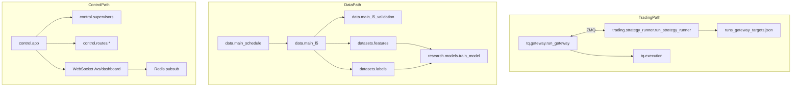

# Architecture Critical-Path Deep Dive

Last updated: 2026-02-23

## Scope

Focused deep audit on three critical chains:

- Trading chain: gateway <-> strategy <-> supervisors <-> locks
- Data chain: schedule -> ingest/main_l5 -> validation -> features/labels -> training inputs
- Control chain: FastAPI/WS/Redis/job orchestration/config APIs

Findings are prioritized as:

- `P0`: high-risk, immediate hardening required
- `P1`: near-term reliability and maintainability upgrades

## Runtime Flow (Current)

---

## P0 Findings (Immediate)

| ID | Chain | Finding | Evidence | Risk | Required action |
|---|---|---|---|---|---|
| `P0-T1` | Trading | Strategy process lock asymmetry (`strategy run` missing trade lock) | `src/ghtrader/cli_commands/runtime.py` (`gateway_run` has `_acquire_locks([trade:account=...])`; `strategy_run` does not) | Multiple strategy runners can target same account/gateway and issue conflicting targets | Add `_acquire_locks([f"trade:strategy:account={prof}", f"trade:account={prof}"])` to `strategy_run`; define lock key convention in PRD/ops docs |
| `P0-T2` | Trading | Risk kill state not durable across restart | `src/ghtrader/tq/gateway.py` local `risk_kill_active` variable; reset during reconnect path; no persisted flag in desired/state contract | Restart can unintentionally clear kill state and allow re-entry without explicit operator acknowledge | Persist `risk_kill_active`, `risk_kill_reason`, `risk_kill_at` in gateway state; require explicit operator reset command |
| `P0-D1` | Data | Schema evolution is best-effort and silently ignores failures | `src/ghtrader/questdb/serving_db.py` multiple `ALTER TABLE ... ADD COLUMN` wrapped in `except: pass` | Silent schema drift can surface later as data corruption or incomplete query columns | Introduce schema migration ledger table; fail-fast on required columns missing; make additive migration explicit and observable |
| `P0-D2` | Data | Label lookahead is structurally correct but boundary governance is still permissive in edge cases | `src/ghtrader/datasets/labels.py` uses `mid.shift(-horizon_n)` + best-effort `schedule_hash`/`segment_id` acquisition | Under incomplete provenance, subtle cross-segment leakage can pass unnoticed | Make provenance mandatory for `main_l5` label build (`segment_id` + `schedule_hash` required), fail build when missing |
| `P0-C1` | Control | Control app remains monolithic and operationally dense | `src/ghtrader/control/app.py` (large composition root: websocket manager + caches + route wiring + supervisor startup) | High coupling increases regression probability and slows reliable change | Continue PRD `10.4` modularization: extract ws manager, app factory wiring, and data-quality API composition modules |
| `P0-C2` | Control | CI workflow file currently includes duplicated workflow definitions | `.github/workflows/ci.yml` includes two `name/on/jobs` blocks | Ambiguous quality-gate behavior and maintenance risk | Normalize to one canonical CI workflow with explicit test matrix and coverage policy |

---

## P1 Findings (Near-Term)

| ID | Chain | Finding | Evidence | Risk | Recommended action |
|---|---|---|---|---|---|
| `P1-T1` | Trading | Command deduplication set grows unbounded | `src/ghtrader/tq/gateway.py` `seen_command_ids: set[str]` append-only usage | Long-running gateway memory growth | Use TTL/LRU bounded structure and persist cursor + dedupe watermark |
| `P1-T2` | Trading | Redis degradation path is silent | `src/ghtrader/tq/gateway.py`, `src/ghtrader/trading/strategy_runner.py` set `redis_client=None` on failure; `control/app.py` WS listener logs only | Operators may not see degraded warm path quickly | Add explicit `degraded_mode` state and UI badge when Redis/WS unavailable |
| `P1-T3` | Trading | ZMQ recovery policy is partial | `strategy_runner` recreates REQ socket on ack failure, but SUB path depends on polling timeout only | Prolonged IPC faults can cause oscillating safe-halt without robust reconnection telemetry | Add explicit ZMQ connection-health state machine and reconnect backoff strategy |
| `P1-T4` | Trading | State writes span ZMQ/Redis/file without transaction boundary | `GatewayWriter._write_state()` sends ZMQ/Redis then file write | Multi-sink partial success can create observer inconsistency | Define file state as source-of-truth snapshot; include monotonic revision id across sinks |
| `P1-D1` | Data | Ingest maintenance retries can hold workers for long periods | `src/ghtrader/tq/ingest.py` maintenance wait/retry loops with high max budget | Throughput collapse under provider instability | Add circuit-breaker mode and per-day skip ledger to keep pipeline progressing |
| `P1-D2` | Data | Feature lookback boundary fallback is permissive | `src/ghtrader/datasets/features.py` falls back from `segment_id` to `underlying_contract` comparison | Missing provenance can allow weak boundary checks | Add strict mode: if `segment_id` missing in `main_l5`, fail or quarantine day |
| `P1-D3` | Data | Training contract checks rely on manifests but lack hard schema-version gate in all paths | `research/models.py` validates manifests; broader pipeline paths can still rely on implicit shape assumptions | Latent mismatch bugs in advanced workflows | Add explicit schema-version compatibility matrix and enforce in pipeline entrypoints |
| `P1-C1` | Control | WebSocket broadcast errors are swallowed | `src/ghtrader/control/app.py` `ConnectionManager.broadcast()` catches and ignores exceptions | Dead clients and intermittent failures remain invisible | Track failed sockets and prune; surface broadcast error counters in observability |
| `P1-C2` | Control | Config env-only constraints not enforced at storage boundary | `src/ghtrader/config_service/store.py` accepts arbitrary keys; API route filters are stronger than backend | Non-UI paths can persist forbidden keys/secrets | Enforce env-only rejection in `ConfigStore.set_values()` and CLI `config set` |
| `P1-C3` | Control | Supervisor health model focuses on desired-state, not full process-health semantics | `src/ghtrader/control/supervisors.py` tick logic relies on active-job views | Crash/restart loops can be under-diagnosed | Add supervisor heartbeat + process liveness counters + restart reason attribution |

---

## Critical-Path Hardening Sequence

1. **Trading safety first**: `P0-T1`, `P0-T2`, `P1-T2`
2. **Data contract correctness**: `P0-D1`, `P0-D2`, `P1-D2`
3. **Control-plane reliability**: `P0-C1`, `P1-C1`, `P1-C3`
4. **Operational consistency**: `P0-C2`, `P1-C2`

## Verification Checklist (for implementation stage)

- Trading:
  - Start two strategy runners on same account -> second must fail lock acquisition
  - Trigger risk kill, restart gateway -> must remain killed until explicit reset
  - Simulate Redis outage -> UI exposes degraded mode and recovery event
- Data:
  - Remove/blank `segment_id` provenance in sample day -> labels/features build must fail in strict mode
  - Force missing required QuestDB column -> pipeline must fail-fast with actionable error
- Control:
  - WS client disconnect storm -> failed sockets pruned; error counters increase
  - Attempt `config set` of env-only key from CLI/API -> rejected uniformly at store boundary
  - CI workflow parse and run remains single-path and deterministic

